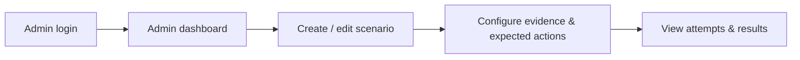

# 02 — Requirements

## 1. Actors

| Actor | Description |
|-------|-------------|
| Guest | Unauthenticated visitor; can register and log in. |
| Student (`STUDENT`) | Trains on scenarios, uses the AI assistant, sees own results and progress. |
| Administrator (`ADMIN`) | Manages scenarios and users, views all attempts and analytics. Can also train. |
| AI provider | External LLM (Claude API) or the built-in mock provider. Not trusted. |

## 2. Functional requirements

### Authentication & users
- **FR-1** A guest can register with e-mail, display name and password. New accounts always get the `STUDENT` role.
- **FR-2** A user can log in with e-mail and password and receives a JWT access token.
- **FR-3** Endpoints are protected by role: `/api/admin/**` requires `ADMIN`.
- **FR-4** An administrator can disable/enable user accounts; disabled users cannot log in.

### Scenarios
- **FR-5** A student sees the list of *active* scenarios with title, summary, difficulty, category and estimated time.
- **FR-6** A student sees a scenario briefing: description and learning objectives — but never the expected actions, points or solution.
- **FR-7** An admin can create, edit, activate and deactivate scenarios, including: difficulty, learning objectives, initial infrastructure (resources), incident timeline (logs/alerts), evidence markers, action catalogue (expected / neutral / destructive), points, prerequisites, hints, explanation and recommended solution.

### Simulation
- **FR-8** A student can start a simulation of an active scenario; a private copy of the scenario's resources is created.
- **FR-9** The simulation has a lifecycle `CREATED → RUNNING → INVESTIGATING → RESPONDING → COMPLETED` (or `ABANDONED`).
- **FR-10** The student sees resources, visible logs/alerts, the incident timeline and the catalogue of available actions.
- **FR-11** Investigation actions can reveal new log entries/evidence.
- **FR-12** Response actions change the simulated state of resources (e.g. VM → `ISOLATED`).
- **FR-13** Every action is stored with timestamp, user, action type, target resource, metadata and result.
- **FR-14** The student can finish the simulation and receives a score (0–100), a breakdown, the missed expected actions and the incident explanation.

### AI
- **FR-15** The student can request a contextual hint. The AI receives scenario, visible evidence, performed actions and state, and must not reveal the full solution. Hints may cost a small configurable penalty.
- **FR-16** The student can ask the AI assistant free-form questions about the current simulation.
- **FR-17** After completion the AI analyses correct actions, mistakes, missed evidence, order and unnecessary actions and generates feedback.
- **FR-18** The AI recommends learning topics based on the student's history.
- **FR-19** An admin can ask the AI to generate a variation of an existing scenario; the result is validated and stored as an *inactive draft* for review.
- **FR-20** If no API key is configured, or the AI call fails, the platform uses a deterministic mock/fallback implementation.

### Progress & analytics
- **FR-21** A student sees their simulation history and progress (attempts, average/best score, per-category results, recommendations).
- **FR-22** An admin sees all users, each user's progress, all simulation attempts with details, platform statistics and the most common mistakes.

## 3. Non-functional requirements

| ID | Requirement |
|----|-------------|
| NFR-1 Security | BCrypt password hashing, stateless JWT, role-based authorization, no secrets in the repository, no sensitive data in logs. |
| NFR-2 Safety | No functionality that attacks or connects to real external systems. AI cannot execute commands; it only produces text that the application validates. |
| NFR-3 Determinism | Given the same scenario and the same actions, the score is always the same. |
| NFR-4 Reliability | AI calls have timeouts and fall back to the mock implementation; the simulation never blocks on the AI. |
| NFR-5 Portability | Whole stack starts with `docker compose up` on a normal laptop. |
| NFR-6 Maintainability | Modular monolith, layered packages, DTO separation, database migrations, automated tests. |
| NFR-7 Usability | Professional dark "security operations centre" UI suitable for screenshots. |
| NFR-8 Documentation | Every significant decision documented as WHAT / WHY / HOW / ALTERNATIVES. |

## 4. MVP definition

The MVP is complete when both flows below work end-to-end against PostgreSQL:

```mermaid
flowchart LR
  A[Register / Login] --> B[Dashboard] --> C[Select scenario] --> D[Start simulation]
  D --> E[Investigate logs & evidence] --> F[Perform security actions] --> G[Use AI assistant]
  G --> H[Complete simulation] --> I[Score] --> J[AI feedback] --> K[Progress saved]
```

