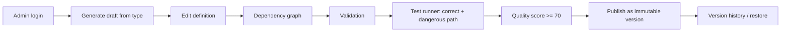

# 02 — Requirements

> **Scope note.** The original assignment (`requirement.txt`) covers two flows: a learner (student) flow and an
> administrator flow. The learner flow — registration, running simulations, AI tutoring, progress — was
> reassigned to another team member and lives in a separate module. **This repository implements the
> administrator flow only**: authoring, validating, testing, scoring, publishing and versioning incident
> scenarios. Requirements below are kept under their original numbers; items that moved to the learner module
> are marked **[learner module]** rather than deleted, so the mapping to the original assignment stays visible.
> See [17-admin-authoring-platform.md](17-admin-authoring-platform.md) for the full scope-change record.

## 1. Actors

| Actor | Description |
|-------|-------------|
| Administrator (`ADMIN`) | The only interactive role. Authors scenarios, runs validation and test paths, evaluates quality, publishes versions. Accounts are provisioned by the operator; there is no self-registration. |
| AI provider | External LLM (Claude API) or the built-in mock provider. Produces draft narrative, variations and on-demand translations. Not trusted: all output is validated. |
| Learner module (downstream) | The separate application built by the other team member. Consumes **published** scenario versions (`scenario_versions` rows); never reads drafts. |

## 2. Functional requirements

### Authentication & users
- **FR-1** ~~Guest self-registration~~ — **removed.** The platform has no public sign-up; `ADMIN` accounts are
  created by the operator (environment-driven `DemoDataInitializer`).
- **FR-2** An administrator can log in with e-mail and password and receives a JWT access token.
- **FR-3** Endpoints are protected by role: `/api/admin/**` requires `ADMIN`; everything else except login
  requires authentication.
- **FR-4** *View users / disable accounts* — **[learner module]** (it only existed to manage learners).

### Scenario authoring (original "Create / Edit / Activate / Configure" items)
- **FR-5** An administrator sees all scenarios with status (`DRAFT` / `PUBLISHED` / `ARCHIVED`), revision,
  published version, difficulty, category, counts and max score.
- **FR-6** An administrator can generate a draft from a scenario type (`SSH_BRUTE_FORCE`,
  `COMPROMISED_CREDENTIALS`, `PUBLIC_STORAGE_BUCKET`), overriding title, difficulty, primary asset, attacker IP
  and region, with optional AI narrative polish ("AI proposes, application decides").
- **FR-7** An administrator can create and edit scenarios in full: difficulty, learning objectives, initial
  infrastructure (resources), incident timeline (logs/alerts), evidence markers, progressive disclosure
  (`revealedByActionKey`), action catalogue (expected / neutral / harmful), points, prerequisites, hints,
  incident explanation and recommended solution. This realises the original "configure difficulty / incident
  information / expected actions / scoring rules" requirements.
- **FR-8** Every write (seed, generator, editor, AI variation, version restore) passes the same
  `ScenarioDefinitionValidator`; all problems are reported together as one 422 response.
- **FR-9** An administrator can view the scenario's dependency graph (start, actions, events, resources;
  prerequisite / reveals / targets / effect edges).
- **FR-10** An administrator can run a validation report (graph rules with ERROR / WARNING / INFO findings).
- **FR-11** An administrator can run the deterministic test runner: the **correct path** must reach 100 % with
  all evidence revealed, the **dangerous path** must stay penalised and unresolved.
- **FR-12** An administrator can compute a quality score (0–100: validity, tests, coverage, pedagogy,
  structure) with a grade and per-component justification, including live evaluation of unsaved edits.
- **FR-13** An administrator can publish a draft as an immutable version. Publishing is blocked server-side
  unless validation has no errors, both test paths pass and the quality score is ≥ 70. The original
  "activate / deactivate" requirement maps to **publish / archive**.
- **FR-14** An administrator can list versions, inspect a frozen version (definition + quality report), and
  restore one into the editable draft. Editing a published scenario reverts it to `DRAFT` without touching the
  published version.
- **FR-15** Only never-published drafts can be deleted; published scenarios are archived so their versions
  survive for the learner module.

### AI
- **FR-16** AI can polish a generated draft's narrative; the structure (keys, phases, outcomes, points,
  references) must stay identical and the result must pass the validator, otherwise the deterministic draft is
  kept and marked `FALLBACK`.
- **FR-17** AI can generate a variation of an existing scenario as a new draft, structure-checked against the
  original.
- **FR-18** Any signed-in user can translate one piece of displayed text on demand (`POST /api/ai/translate`);
  the result is shown beside the original and never stored.
- **FR-19** If no API key is configured, or the AI call fails or times out, the platform falls back to the
  deterministic mock provider; authoring is never blocked by the AI.
- **FR-20** Every AI call is audited in `ai_interactions` (task, provider, status, latency).
- *Student-facing AI (hints, free questions, feedback, learning recommendations)* — **[learner module]**.

### Simulation runtime, progress & analytics
- *Run simulations, lifecycle states, action execution, scoring of attempts, progress pages, attempt browsing,
  statistics, common-mistakes analytics* — **[learner module]**. The hand-over contract is the published
  `scenario_versions` row; the `ScoringEngine` kept in this repository is the same rule set the learner module
  applies, so the test runner predicts learner-side behaviour.

## 3. Non-functional requirements

| ID | Requirement |
|----|-------------|
| NFR-1 Security | BCrypt password hashing, stateless JWT, role-based authorization (`ADMIN`-only API), no secrets in the repository, no sensitive data in logs. |
| NFR-2 Safety | No functionality that attacks or connects to real external systems. AI cannot execute commands; it only produces text/JSON that the application validates. Test runs are in-memory and side-effect free. |
| NFR-3 Determinism | Generator templates, the test runner and the quality score are deterministic: the same definition always produces the same report. |
| NFR-4 Reliability | AI calls have timeouts and fall back to the mock implementation; publishing gates are recomputed server-side. |
| NFR-5 Portability | Whole stack starts with `docker compose up` on a normal laptop. |
| NFR-6 Maintainability | Modular monolith, layered packages, DTO separation, database migrations, automated tests (unit + Testcontainers integration). |
| NFR-7 Usability | Professional dark "security operations centre" UI suitable for thesis screenshots; English/Armenian interface with on-demand content translation. |
| NFR-8 Documentation | Every significant decision documented as WHAT / WHY / HOW / ALTERNATIVES. |

## 4. MVP definition

The MVP is complete when the authoring flow works end-to-end against PostgreSQL:

The learner-side MVP (register → simulate → score → feedback → progress) is specified and verified in the
learner module, against the versions published here.
