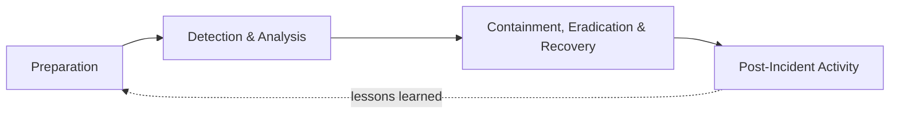

# 03 — Research of Technologies and Methods

This document is the basis for **Thesis Section 1**. Each technology is described with
WHAT it is, WHY it was chosen, and which ALTERNATIVES were considered.

> Scope: this repository is the **admin scenario-authoring platform**; the learner-facing runtime is a separate
> module (see [17-admin-authoring-platform.md](17-admin-authoring-platform.md)). The research below still covers
> the domain as a whole, because the authored scenarios encode the same incident-response concepts the learner
> module later trains.

## 1. Domain background: cloud incident response

### 1.1 Shared-responsibility model
Cloud providers secure the physical infrastructure; the customer is responsible for identities,
configuration, network rules and data. Most cloud incidents therefore come from the customer side:
weak or leaked credentials, excessive permissions, public storage, open network ports.

### 1.2 Incident response lifecycle
The platform follows the NIST SP 800-61 incident handling lifecycle, simplified for training:

How the authored scenarios encode it:

| NIST phase | In a CyberSim scenario definition |
|-----------|----------|
| Detection & Analysis | `INVESTIGATION`-phase actions (INSPECT / IDENTIFY) — inspecting log sources, identifying evidence and the compromised resource; evidence markers and progressive disclosure model the analysis |
| Containment, Eradication & Recovery | `RESPONSE`-phase actions (CONTAIN / ERADICATE / RECOVER / HARDEN) — isolating VMs, disabling credentials, rotating keys, blocking public access |
| Post-Incident Activity | the scenario's incident explanation and recommended solution; the learner module presents them after an attempt |

The authoring platform's **test runner** replays both an ideal and a harmful walk through this lifecycle before a
scenario may be published.

### 1.3 Typical cloud log sources (simulated)
| Source | Real-world equivalent | Used in scenario |
|--------|----------------------|------------------|
| `auth.log` / SSH log | Linux `sshd` logs | SSH brute-force |
| Audit trail | AWS CloudTrail, Azure Activity Log | Compromised credentials, exposed bucket |
| Identity provider sign-in log | AWS IAM Identity Center, Entra ID sign-ins | Suspicious login |
| Network flow log | VPC Flow Logs | Brute-force, data exfiltration indicators |
| Storage access log | S3 server access logs | Exposed bucket |
| Security alerts | GuardDuty, Defender for Cloud | All scenarios |

### 1.4 Training methods
- **Scenario-based learning / cyber ranges** — learners practise in a realistic but isolated
  environment. Full cyber ranges (virtual machines, real attacks) are expensive and complex.
- **Simulation with pre-authored telemetry** (chosen) — the environment is modelled as data:
  resources, log entries and the effects of actions. This is deterministic, cheap, safe and
  testable, and still trains the *decision-making* workflow, which is the main learning goal.
  It is also what makes an **authoring platform** possible: because a scenario is pure data, it can be
  generated from templates, graph-analysed, test-run and quality-scored before anyone trains on it.
- **Intelligent tutoring systems** — give adaptive hints and feedback. LLMs make this practical
  without hand-writing feedback for every possible combination of learner actions. The tutoring itself
  belongs to the learner module; this platform's contribution is content whose hints, explanations and
  scoring rules the tutor can rely on.

## 2. Backend technologies

| Technology | WHAT | WHY chosen | Alternatives considered |
|------------|------|-----------|------------------------|
| **Java 21 (LTS)** | Modern LTS Java: records, pattern matching, sealed types, virtual threads | Long-term support, strong typing, records are ideal for DTOs | Kotlin (less common in the curriculum), Node.js (weaker typing for domain logic) |
| **Spring Boot 4.1** | Opinionated framework for Spring applications | Industry standard for Java web backends, auto-configuration, huge ecosystem; version 4 is the current generation (Spring Framework 7, Jakarta EE 11) | Quarkus, Micronaut (smaller ecosystem, less teaching material) |
| **Spring Web MVC** | Servlet-based REST framework | Simple synchronous model, easy to test with MockMvc | Spring WebFlux (reactive — unnecessary complexity for this workload) |
| **Spring Security 7** | Authentication/authorization framework | Mature filter chain, method security, built-in JWT resource-server support | Hand-written filters (error-prone), Keycloak (extra server to run) |
| **OAuth2 Resource Server + Nimbus JOSE** | Spring's built-in JWT validation | Validates signature/expiry for us; no extra JWT library needed | `jjwt` library with a hand-written filter (more custom security code) |
| **Spring Data JPA / Hibernate 7** | ORM and repository abstraction | Removes boilerplate CRUD, supports JSON columns, transactions | jOOQ, plain JDBC (more code, fewer conventions) |
| **Bean Validation (Hibernate Validator)** | Declarative input validation | `@Valid` on DTOs gives consistent 400 responses | Manual checks in services |
| **Flyway** | Versioned SQL migrations | Plain SQL, easy to read in the thesis, repeatable schema | Liquibase (XML/YAML changelogs — more verbose) |
| **springdoc-openapi** | Generates OpenAPI 3 spec + Swagger UI | Live, always up-to-date API documentation | Hand-written API docs only |
| **Maven (wrapper)** | Build tool | Required by the assignment; wrapper means no global install | Gradle |

## 3. Database

**PostgreSQL 17** — open-source relational database.

- WHY: strong consistency, foreign keys, check constraints, and the `jsonb` type for the few
  genuinely flexible attributes (e.g. resource properties, event details). Runs easily in Docker.
- Alternatives: MySQL (weaker JSON support), MongoDB (schema-less — loses referential integrity,
  which matters for scenarios, their child rows and immutable versions), H2 (only for tests — but
  behaviour differs from PostgreSQL, so Testcontainers with real PostgreSQL is used instead).

## 4. Frontend

| Technology | WHY | Alternatives |
|------------|-----|-------------|
| **React 19 + TypeScript** | Most widely used SPA library; TypeScript catches API contract errors at compile time | Angular (heavier), Vue (fine, but less requested) |
| **Vite** | Fast dev server and build | Create React App (deprecated), Next.js (SSR not needed) |
| **React Router** | Client-side routing, protected routes | TanStack Router |
| **Axios** | HTTP client with interceptors (attach JWT, handle 401) | `fetch` (more boilerplate) |
| **MUI (Material UI)** | Complete component library with dark theme, data grids, dialogs — professional look quickly | Ant Design, Tailwind + headless components (more design work) |

## 5. Infrastructure

| Technology | WHY | Alternatives |
|------------|-----|-------------|
| **Docker / Docker Compose** | One command starts DB, backend and frontend identically on every machine | Manual installation; Kubernetes (far too heavy for a single-machine demo) |
| **Testcontainers** | Integration tests run against a real PostgreSQL container | H2 in-memory DB (different SQL dialect, no `jsonb`) |
| **LocalStack (optional profile)** | Emulates AWS APIs locally. Included as an *optional* Compose profile to demonstrate how simulated resources could be backed by AWS-compatible services | Real AWS account (cost, risk). Not required for the core platform — see 04-system-architecture, ADR-7 |

## 6. Artificial intelligence

### 6.1 Large language models for content authoring
LLMs can draft realistic incident narratives, vary existing content and translate text in natural
language. Their weaknesses — hallucination, non-determinism, prompt injection, cost and latency —
mean they must not be the source of truth for scenario structure, scoring rules or publishing
decisions.

### 6.2 Chosen provider: Claude API (Anthropic)
- Accessed over HTTPS with an API key provided via the `ANTHROPIC_API_KEY` environment variable.
- Model is configurable (`AI_MODEL`, default `claude-opus-5-5`; `claude-haiku-4-5` is a cheaper,
  faster option for narrative polish and translation).
- Alternatives: OpenAI API, local models through Ollama. Because the platform depends only on its
  own `AiProvider` interface, adding another provider is one new class.

### 6.3 Method: "AI proposes, application decides"
- The **generator templates, test runner and quality score are deterministic** and do not use AI —
  a publishing decision must be reproducible and explainable.
- AI produces **proposals**: a polished narrative for a generated draft (`GENERATION`), a variation
  of an existing scenario (`VARIATION`) and an on-demand translation of displayed text
  (`TRANSLATION`). Every proposal is parsed, structure-checked against the deterministic draft and
  passed through the normal scenario validator before it is accepted; otherwise the deterministic
  result is kept (`FALLBACK`).
- A **mock provider** produces rule-based output for the same tasks, so the platform is fully
  demonstrable offline and tests are deterministic.

### 6.4 Prompt engineering techniques used
- System prompt per task defining the role (training-content author / translator), the invariants
  (keys, phases, outcomes, points and references must stay identical) and the output format.
- Structured context: the scenario definition is provided as clearly delimited JSON; the
  administrator's free-text brief and the text to translate are delimited and marked as data, not
  instructions (prompt-injection mitigation).
- Structured output (JSON) for generation and variations, validated against the scenario schema;
  plain text with length limits for translation.
