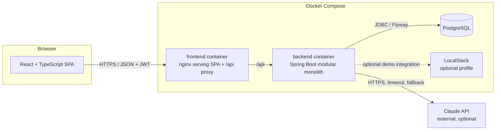
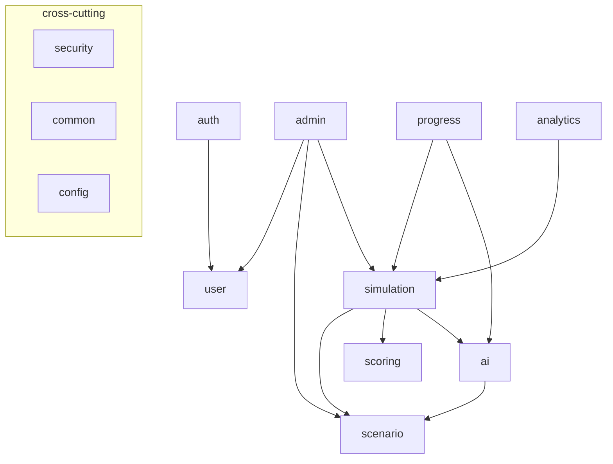
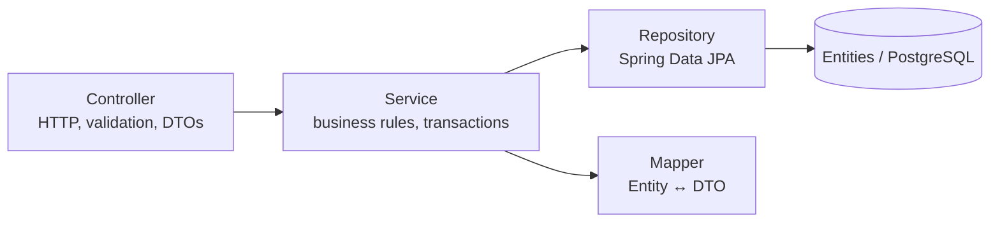
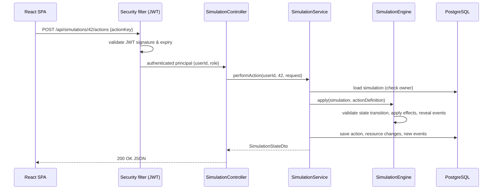

# 04 — System Architecture

## 1. High-level architecture

The backend is the only component that talks to the database and the AI provider.
The browser never sees the AI API key.

## 2. Architecture style: modular monolith

### ADR-1 — Modular monolith
- **Decision:** One Spring Boot application, internally split into feature modules (packages).
- **Why:** The application has several logical domains (auth, scenarios, simulations, AI, analytics)
  but the workload of a university project and the requirement to run on one laptop do not
  justify the operational cost of microservices.
- **How:** Each module is a top-level package with its own controller / service / repository /
  entity / dto / mapper classes. Modules call each other only through public service methods.
- **Alternative:** Microservices.
- **Reason rejected:** They would add service discovery, distributed transactions, inter-service
  authentication, several deployments and network failure modes without benefit at this scale.
  The modular structure keeps the option to extract a module (e.g. `ai`) later.

### ADR-2 — Package by feature, layered inside each feature
- **Decision:** `am.cybersim.<module>` with sub-packages `dto` and (where needed) `mapper`;
  controllers, services, repositories and entities live in the module package.
- **Why:** Everything about "simulations" is in one place; layered rules are still respected
  (controller → service → repository).
- **Alternative:** Package by layer (`controllers/`, `services/`, …). Rejected because changes to
  one feature touch many distant packages, and module boundaries disappear.

## 3. Modules

| Module | Responsibility |
|--------|---------------|
| `security` | Spring Security filter chain, JWT encoding/decoding, current-user resolution |
| `auth` | Registration, login, `me` endpoint |
| `user` | `User` entity, roles, user queries; admin user management |
| `scenario` | Scenario templates: resources, events, actions, hints, objectives; student catalogue + admin editor; JSON seed import |
| `simulation` | Simulation instances, state machine (engine), actions, events, results |
| `scoring` | Deterministic scoring engine, configurable rules |
| `ai` | `AiProvider` abstraction, Claude + mock providers, prompt building, output validation, interaction logging |
| `progress` | Student history, per-category progress, recommendations |
| `analytics` | Admin statistics and common mistakes |
| `admin` | Admin-only REST controllers delegating to the module services |
| `common` | Global exception handling, error response format, shared exceptions |
| `config` | OpenAPI, CORS, clock, application properties |

## 4. Layers

Rules:
- Controllers contain no business logic; they validate input, call one service method and return DTOs.
- Services own transactions (`@Transactional`) and enforce ownership/authorization rules that depend on data.
- Entities are never returned from controllers (ADR-3).

### ADR-3 — DTOs instead of entities in the API
- **Why:** Prevents leaking internal fields (password hash, expected actions, points), avoids lazy-loading
  problems during JSON serialisation and lets the API evolve independently of the schema.
- **How:** Java `record` DTOs, mapped by small hand-written mapper classes.
- **Alternative:** MapStruct. Rejected for now — the mappings are small, and hand-written mappers are
  easier to read in the thesis. Can be introduced later without API changes.

## 5. Key architecture decisions (summary)

| ADR | Decision | Main reason |
|-----|----------|-------------|
| ADR-1 | Modular monolith | Simplicity, runs on one machine |
| ADR-2 | Package by feature | Clear module boundaries |
| ADR-3 | DTO separation | Security, API stability |
| ADR-4 | Stateless JWT (Spring OAuth2 resource server, HS256) | SPA + REST without server sessions |
| ADR-5 | Scenarios are data (`ScenarioDefinition` JSON/relational), engine is generic | New scenarios without new code; AI variation possible |
| ADR-6 | Deterministic scoring; AI only explains | Reproducible grades, AI output untrusted |
| ADR-7 | Simulated cloud resources in PostgreSQL; LocalStack only optional | Determinism, safety, easy to run |
| ADR-8 | `AiProvider` interface with Claude and mock implementations | Runs without API key, testable |
| ADR-9 | Flyway SQL migrations | Readable, versioned schema |

### ADR-5 — Scenario-as-data
- **What:** A scenario is described by one `ScenarioDefinition` document (resources, events, actions,
  hints, …). The same structure is used for (1) seed files in `backend/src/main/resources/scenarios/*.json`,
  (2) the admin scenario editor API, and (3) AI-generated variations.
- **Why:** The simulation engine does not contain any scenario-specific `if` statements, so administrators
  can add scenarios without programming, and one validator protects all three entry points.
- **Alternative:** One Java class per scenario (strategy pattern). Rejected — every new scenario would
  require a developer and a redeployment, and AI variations would be impossible to validate generically.

### ADR-7 — Simulated resources instead of real cloud services
- **What:** Cloud resources (VMs, IAM users, buckets, security groups) are rows (`simulation_resources`)
  whose status is changed by actions (e.g. `RUNNING → ISOLATED`).
- **Why:** Deterministic (testable scoring), safe (nothing real is attacked or modified), fast and free.
- **LocalStack:** available as an optional Docker Compose profile (`--profile localstack`) for future
  extension (e.g. mirroring a scenario bucket into an emulated S3). The core platform does not depend on it,
  so a missing/slow LocalStack can never break a training session or the thesis demo.
- **Alternative:** Executing scenarios against LocalStack or a real AWS account. Rejected as the primary
  mechanism: real API calls make results non-deterministic, slower and harder to test, and real accounts
  cost money and carry risk.

## 6. Main request flow (example: perform an action)

