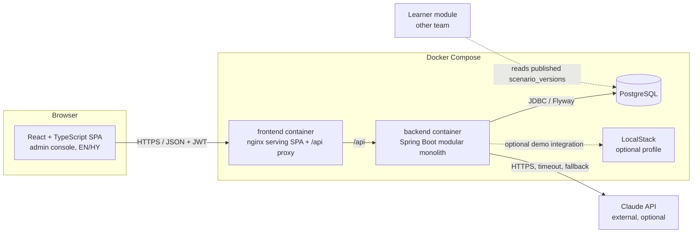
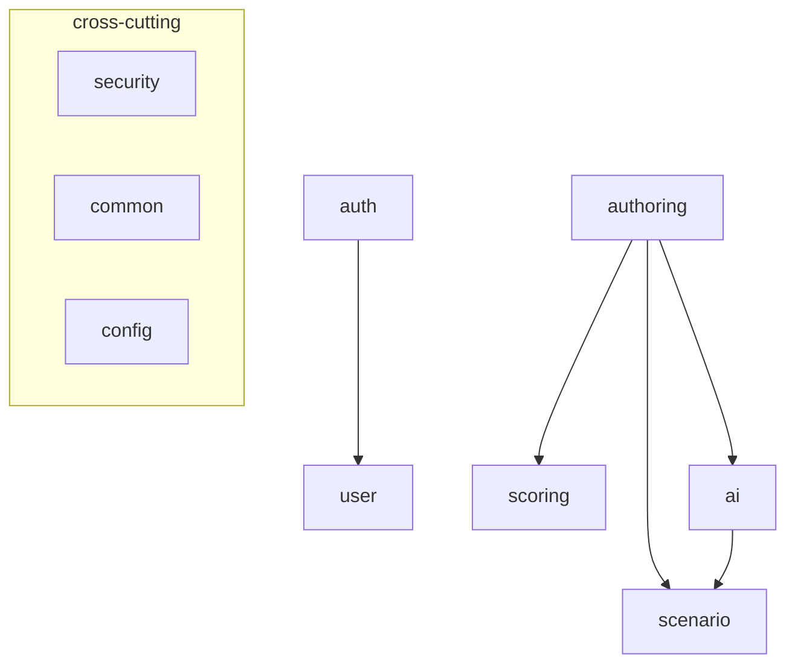
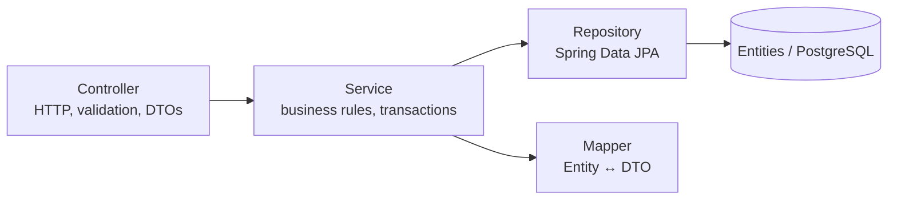
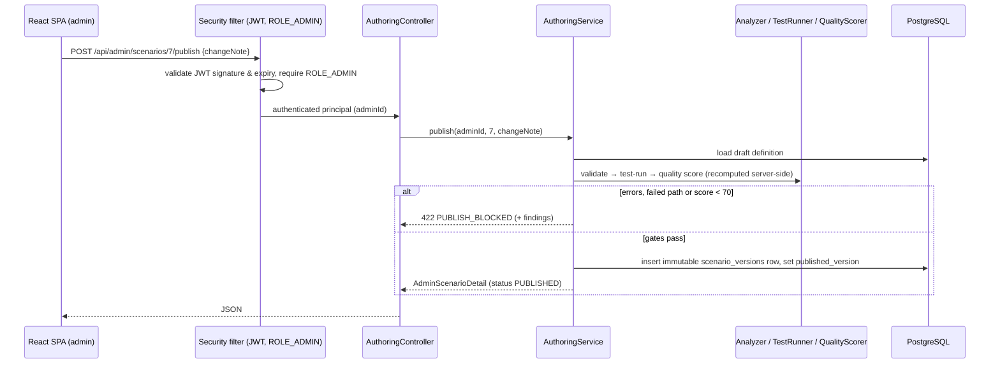

# 04 — System Architecture

> Scope: the **admin scenario-authoring platform** (see [17-admin-authoring-platform.md](17-admin-authoring-platform.md)).
> The learner-facing simulation runtime is developed in another team's module and is not part of this architecture.

## 1. High-level architecture

The backend is the only component that talks to the database and the AI provider; the browser never sees the
AI API key. The hand-over point to the learner module is the `scenario_versions` table: immutable, quality-gated
snapshots of published scenarios.

## 2. Architecture style: modular monolith

### ADR-1 — Modular monolith
- **Decision:** One Spring Boot application, internally split into feature modules (packages).
- **Why:** The application has several logical domains (auth, scenario data model, authoring pipeline, AI,
  scoring) but the workload of a university project and the requirement to run on one laptop do not justify the
  operational cost of microservices. The original requirement sketches the authoring pipeline as a separate
  service; here every pipeline step is a Spring component in one deployable — same responsibilities, no extra
  network hops or second database.
- **How:** Each module is a top-level package with its own controller / service / repository / entity / dto /
  mapper classes. Modules call each other only through public service methods.
- **Alternative:** Microservices (e.g. a separate generation/validation service).
- **Reason rejected:** They would add service discovery, distributed transactions, inter-service authentication,
  several deployments and network failure modes without benefit at this scale. The modular structure keeps the
  option to extract a module (e.g. `authoring`) later.

### ADR-2 — Package by feature, layered inside each feature
- **Decision:** `am.cybersim.<module>` with sub-packages `dto` and (where needed) `mapper`; controllers,
  services, repositories and entities live in the module package.
- **Why:** Everything about "authoring" is in one place; layered rules are still respected
  (controller → service → repository).
- **Alternative:** Package by layer (`controllers/`, `services/`, …). Rejected because changes to one feature
  touch many distant packages, and module boundaries disappear.

## 3. Modules

| Module | Responsibility |
|--------|---------------|
| `security` | Spring Security filter chain, JWT encoding/decoding, current-user resolution (`AuthUser`) |
| `auth` | Login and `me` endpoint (no self-registration — `ADMIN` accounts are provisioned by the operator) |
| `user` | `User` entity (role `ADMIN` only), demo-account initialiser |
| `scenario` | The scenario data model: `Scenario` + objectives/resources/events/actions/hints, `ScenarioDefinition` JSON, `ScenarioDefinitionValidator`, `ScenarioVersion` (immutable published snapshots), seed import |
| `authoring` | The authoring pipeline: `ScenarioGeneratorService`, `ScenarioGraph`, `ScenarioAnalyzer`, `ScenarioTestRunner`, `QualityScorer`, `AuthoringService` (lifecycle, publishing, versions), `AuthoringController` |
| `scoring` | Deterministic `ScoringEngine` + `ScoreResult`; used by the test runner, and the exact rules the learner module applies |
| `ai` | `AiProvider` abstraction, Claude + mock providers, prompt building, output validation, interaction audit log; `ScenarioVariationService`, `TranslationService`/`TranslationController` |
| `common` | Global exception handling, error response format, shared exceptions |
| `config` | OpenAPI, CORS, clock, application properties |

Three controllers expose the API: `AuthController` (`/api/auth`), `AuthoringController`
(`/api/admin/scenarios/**`, role `ADMIN`) and `TranslationController` (`/api/ai/translate`, any signed-in user).

## 4. Layers

Rules:
- Controllers contain no business logic; they validate input, call one service method and return DTOs.
- Services own transactions (`@Transactional`) and enforce lifecycle rules that depend on data
  (e.g. "a published scenario cannot be deleted").
- Entities are never returned from controllers (ADR-3).

### ADR-3 — DTOs instead of entities in the API
- **Why:** Prevents leaking internal fields (password hash), avoids lazy-loading problems during JSON
  serialisation and lets the API evolve independently of the schema.
- **How:** Java `record` DTOs, mapped by small hand-written mapper classes.
- **Alternative:** MapStruct. Rejected for now — the mappings are small, and hand-written mappers are easier to
  read in the thesis. Can be introduced later without API changes.

## 5. Key architecture decisions (summary)

| ADR | Decision | Main reason |
|-----|----------|-------------|
| ADR-1 | Modular monolith | Simplicity, runs on one machine |
| ADR-2 | Package by feature | Clear module boundaries |
| ADR-3 | DTO separation | Security, API stability |
| ADR-4 | Stateless JWT (Spring OAuth2 resource server, HS256) | SPA + REST without server sessions |
| ADR-5 | Scenarios are data (`ScenarioDefinition` JSON/relational) | New scenarios without new code; one validator for every entry point |
| ADR-6 | Deterministic scoring and quality gates; AI only proposes content | Reproducible results, AI output untrusted |
| ADR-7 | Simulated cloud resources as scenario data; LocalStack only optional | Determinism, safety, easy to run |
| ADR-8 | `AiProvider` interface with Claude and mock implementations | Runs without API key, testable |
| ADR-9 | Flyway SQL migrations | Readable, versioned schema |
| ADR-10 | Published scenarios are immutable `scenario_versions` rows | Safe hand-over contract to the learner module |
| ADR-13 | Learner module integrates over a service API with verified submissions | The claimed score is checked, never trusted |

### ADR-5 — Scenario-as-data
- **What:** A scenario is described by one `ScenarioDefinition` document (resources, events, actions, hints,
  objectives, scoring configuration). The same structure is used for (1) seed/template files in
  `backend/src/main/resources/scenarios/*.json`, (2) the generator, (3) the admin editor API, (4) AI-generated
  variations and (5) version restore.
- **Why:** No pipeline step contains scenario-specific `if` statements, so administrators add scenarios without
  programming, and one validator (`ScenarioDefinitionValidator`) protects all five entry points.
- **Alternative:** One Java class per scenario (strategy pattern). Rejected — every new scenario would require a
  developer and a redeployment, and generated/AI content would be impossible to validate generically.

### ADR-6 — Deterministic pipeline, AI only proposes
- **What:** Validation (`ScenarioAnalyzer`), test runs (`ScenarioTestRunner` on the deterministic
  `ScoringEngine`) and the quality score (`QualityScorer`) are pure functions of the scenario definition. AI is
  used only to draft content (generation polish, variations) and to translate displayed text; its output is
  parsed, structure-checked and re-validated, and a failure falls back to the deterministic draft.
- **Why:** Publishing decisions must be reproducible and explainable; an examiner (or the learner module) can
  re-derive every gate from the stored definition.

### ADR-7 — Simulated resources instead of real cloud services
- **What:** Cloud resources (VMs, IAM users, buckets, security groups) are rows of `scenario_resources`
  describing the *initial* incident state; actions declare their effect as data (`effect_status`).
- **Why:** Deterministic (testable), safe (nothing real is attacked or modified), fast and free.
- **LocalStack:** available as an optional Docker Compose profile (`--profile localstack`) for future extension.
  The core platform does not depend on it.
- **Alternative:** Authoring against a real AWS account. Rejected: non-deterministic, slower, costs money and
  carries risk.

### ADR-10 — Immutable published versions as the hand-over contract
- **What:** `publish` freezes the full definition plus its quality report into a `scenario_versions` row
  (JSONB); editing afterwards only changes the draft. The learner module consumes published versions, never
  drafts.
- **Why:** The two teams can work independently: a half-edited draft can never leak into training, every
  published version stays reproducible (grades can be re-derived later), and a bad edit is recoverable by
  restoring a version.
- **Alternative:** The learner module reading live `scenarios` rows. Rejected — a draft edit would change
  running trainings mid-flight and historical scores would lose their reference content.

### ADR-13 — Learner-module service API with server-side verification

- **What:** the learner module authenticates with a static service key (`X-API-Key`, env `LEARNER_API_KEY`,
  constant-time compared) on `/api/learner/**`: it reads the published catalogue and definitions, submits
  completed attempts and reads back results and reviews. On submission this platform **replays the submitted
  action sequence against the pinned published version** with the same deterministic rules the test runner uses
  and stores its own score; a claimed score is only compared (`scoreMatches`), never adopted.
- **Why a key, not JWT:** the learner module is a system with one fixed permission set — no interactive login,
  no user lifecycle. The two roles cannot cross: an admin JWT is rejected on `/api/learner/**` and the key is
  rejected on `/api/admin/**`.
- **Why verify server-side:** the grade reaches the thesis statistics and the AI review; trusting a
  client-computed number would make both meaningless. Verification is deterministic and reproducible.
- **Alternatives:** trusting the submitted score (rejected — unverifiable); a message queue (overkill for two
  modules on one network); mTLS (operationally heavy for a university project).

## 6. Main request flow (example: publish a scenario)

