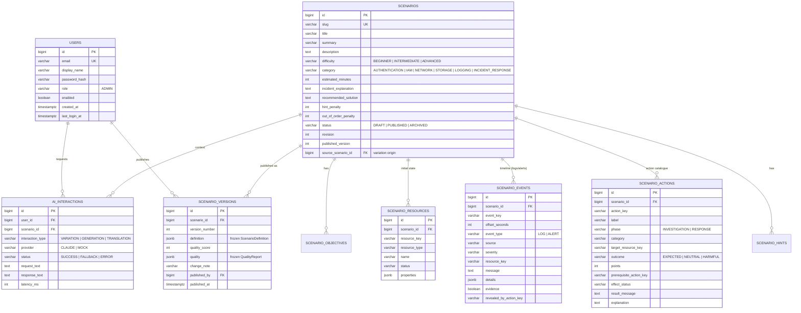

# 05 — Database Design

PostgreSQL 17, schema managed by Flyway (`backend/src/main/resources/db/migration`). There is a single
migration, `V1__initial_schema.sql`: the schema was rewritten for the admin-authoring scope
(see [17-admin-authoring-platform.md](17-admin-authoring-platform.md)), and until the first production release a
clean baseline is easier to review than a chain of pivot migrations. **Existing databases must be recreated**
(`docker compose down -v`). The learner-side tables (simulations, attempts, results, progress) moved to the
other team's module and are no longer part of this schema.

## 1. Design principles

| Principle | Application |
|-----------|-------------|
| Normalisation (3NF) for editable data | Users, scenarios and the five scenario child tables are separate tables with foreign keys. |
| Draft vs. publication | `scenarios` (+ children) is the **editable working copy**; `scenario_versions` holds **immutable published snapshots** as JSONB. |
| `jsonb` only for genuinely document-shaped data | Resource properties and event details (shape differs per type), and the frozen definition + quality report of a published version. Never for data we filter or join on. |
| Stable natural keys inside a scenario | `resource_key`, `event_key`, `action_key` (e.g. `vm-web-01`, `isolate-vm`) — readable in templates, prompts and the dependency graph; unique per scenario. |
| Database-enforced integrity | `NOT NULL`, `CHECK` constraints on enums and ranges (including "points sign matches outcome"), unique constraints, `ON DELETE CASCADE` only from parent to owned children. |
| Surrogate keys | `bigint GENERATED ALWAYS AS IDENTITY` primary keys. |

## 2. ER diagram

(The diagram shows the most important columns; the full definition is in `V1__initial_schema.sql`.)

## 3. Tables and decisions

### 3.1 `users`
- **Role as a column with a CHECK constraint**, currently allowing only `ADMIN`.
  - Why: this platform has exactly one kind of user. Widening the CHECK is a one-line migration if the
    learner module ever shares the table; a `roles` + `user_roles` many-to-many pair would add two joins
    for no functional gain.
- There is no self-registration: accounts are provisioned by the operator (`DemoDataInitializer` from
  environment variables). `enabled` allows locking an account without deleting its audit trail.
- `email` is stored lower-case (also enforced by `ck_users_email_lower`) and unique → case-insensitive login.
- Password stored only as a BCrypt hash.

### 3.2 Scenario draft tables
- `scenarios` holds descriptive data, scoring configuration (`hint_penalty`, `out_of_order_penalty`) and the
  **authoring lifecycle**: `status` (`DRAFT → PUBLISHED → ARCHIVED`), `revision` (incremented on every edit),
  `published_version` (number of the latest published snapshot, `NULL` for never-published drafts) and
  `source_scenario_id` (the original, when the scenario was created as an AI variation).
- `scenario_objectives` (ordered list) — learning objectives.
- `scenario_resources` — the **initial infrastructure state** (VMs, IAM users, buckets, security groups).
- `scenario_events` — the **incident timeline**: log lines and alerts with an `offset_seconds` relative to the
  incident start. `evidence = true` marks entries a trainee should find; `revealed_by_action_key = NULL` means
  visible from the start, otherwise the entry becomes visible when that investigation action is performed
  (progressive disclosure).
- `scenario_actions` — the **action catalogue** with the scoring rules. `outcome`:
  - `EXPECTED` — part of the correct solution (positive `points`),
  - `NEUTRAL` — harmless but unnecessary (0 points; a distractor),
  - `HARMFUL` — destructive/incorrect (negative `points`).
  The sign rule is enforced by `ck_scenario_actions_points` in the database, not only by the validator.
  `prerequisite_action_key` expresses the recommended order; `effect_status` is the new status of
  `target_resource_key` after the action.
- `scenario_hints` — static hints in increasing detail; content handed over to the learner module.
- Child rows are replaced together with their parent on every edit (aggregate semantics), so `position` plus the
  per-scenario unique keys fully describe an edit.

### 3.3 `scenario_versions`
- One row per publish: `version_number` (unique per scenario), the **frozen `ScenarioDefinition` as JSONB**, the
  quality score and the **frozen `QualityReport` as JSONB**, an optional change note, the publishing admin and
  the timestamp.
- Why JSONB snapshots instead of versioned relational rows: a published version is read as a whole document
  (by the admin UI for review/restore and by the learner module as the training content) and is never queried
  field-by-field; freezing it guarantees that later edits, or even schema evolution of the draft tables, cannot
  change what a version contained.
- `published_by` is `ON DELETE SET NULL` so removing an account never destroys published content.
- Deletion rule (enforced in `ScenarioService`): a scenario with a published version can only be archived, never
  deleted — versions are the hand-over contract and must survive.

### 3.4 `ai_interactions`
Audit log of every AI request: type (`VARIATION`, `GENERATION`, `TRANSLATION`), provider (`CLAUDE`/`MOCK`),
status (`SUCCESS`/`FALLBACK`/`ERROR`), request/response text, latency and token counts. Answers the thesis
questions "where exactly is AI used, and what did it return?" and makes the fallback behaviour observable.

### 3.5 `student_attempts` (ADR-13)

One row per completed exam the learner module submits over the service API. Three layers are kept apart:
what was *sent* (`actions` JSONB, `claimed_score`), what this platform *verified* (`verification` JSONB with the
replayed steps, and `verified_score` — the authoritative grade; `score_matches` flags a false claim), and what
the AI *said* on an administrator's request (`review` JSONB: advisory rating, message, strengths, mistakes,
recommendations, source). `external_id` is unique, so a retried submission cannot create a second row;
`student_ref` is an opaque identifier owned by the learner module — this platform stores no student accounts.
`scenario_version` pins the exact published version the attempt was played against.

## 4. Indexes

| Index | Purpose |
|-------|---------|
| `uq_users_email` unique | login lookup, uniqueness |
| `uq_scenarios_slug` unique | seed/template import idempotency |
| `ix_scenarios_status` | scenario list filtered by lifecycle status |
| `uq_scenario_*_key` unique (scenario_id, key) | reference integrity of natural keys inside one scenario |
| `uq_scenario_versions` unique (scenario_id, version_number) | version numbering, direct version lookup |
| `ix_ai_interactions_created` | audit log ordered by time |

Child-table foreign keys are covered by their composite unique indexes (`scenario_id` is the leading column),
so no separate FK indexes are needed at this scale.

## 5. Seed / demo data

- **Scenarios** are imported from `resources/scenarios/*.json` by `ScenarioSeeder` at start-up when the slug
  does not exist yet, validated like any admin input, and **published as version 1** — so a fresh database
  already demonstrates the full lifecycle and gives the generator its three vetted templates.
- **Admin account** is created by `DemoDataInitializer` only when `APP_DEMO_DATA_ENABLED=true` and the password
  environment variable is set; nothing is created otherwise.
