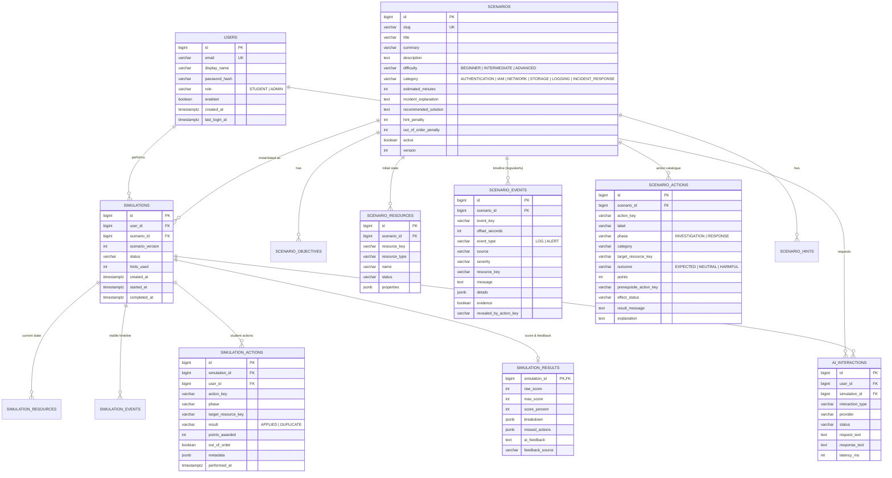

# 05 — Database Design

PostgreSQL 17, schema managed by Flyway (`backend/src/main/resources/db/migration`).

## 1. Design principles

| Principle | Application |
|-----------|-------------|
| Normalisation (3NF) for core data | Users, scenarios, scenario children, simulations, actions are separate tables with foreign keys. |
| Template vs. instance | `scenario_*` tables are the *template*. `simulation_*` tables are the *instance* for one student attempt (copy-on-start of resources). |
| `jsonb` only for genuinely flexible attributes | Resource properties (differ per resource type), event details, action metadata, score breakdown snapshot. Never for data we filter or join on. |
| Stable natural keys inside a scenario | `resource_key`, `event_key`, `action_key` (e.g. `vm-web-01`, `isolate-vm`) — readable in seed files, prompts and logs; unique per scenario. |
| Snapshot results | The score and breakdown are frozen in `simulation_results` so that later edits of a scenario do not change historical grades. |
| Database-enforced integrity | `NOT NULL`, `CHECK` constraints on enums and ranges, unique constraints, `ON DELETE CASCADE` only from parent to owned children. |
| Surrogate keys | `bigint GENERATED ALWAYS AS IDENTITY` primary keys. |

## 2. ER diagram

(The diagram shows the most important columns; the full definition is in `V1__initial_schema.sql`.)

## 3. Tables and decisions

### 3.1 `users`
- **Role as a column with a CHECK constraint** instead of a separate `roles` table.
  - Why: there are exactly two fixed roles and every user has exactly one. A `roles` +
    `user_roles` many-to-many table would add two joins for no functional gain.
  - Alternative: `roles` table. Would be preferred if roles became dynamic or users needed several roles.
- `email` is stored lower-case and has a unique index → case-insensitive login.
- Password stored only as a BCrypt hash.

### 3.2 Scenario template tables
- `scenarios` holds descriptive data and scoring configuration (`hint_penalty`, `out_of_order_penalty`).
- `scenario_objectives` (ordered list) — learning objectives.
- `scenario_resources` — the **initial infrastructure state** (VMs, IAM users, buckets, security groups).
- `scenario_events` — the **incident timeline**: log lines and alerts with an `offset_seconds` relative to
  the incident start. `evidence = true` marks entries that are evidence the student should find.
  `revealed_by_action_key` = `NULL` means visible from the start; otherwise the entry becomes visible when
  the student performs that investigation action (progressive disclosure).
- `scenario_actions` — the **action catalogue** shown to the student. `outcome`:
  - `EXPECTED` — part of the correct solution (positive `points`),
  - `NEUTRAL` — harmless but unnecessary (0 points; reported by the AI as unnecessary),
  - `HARMFUL` — destructive/incorrect (negative `points`).
  `prerequisite_action_key` expresses the recommended order (e.g. *identify* before *isolate*).
  `effect_status` is the new status of `target_resource_key` after the action.
- `scenario_hints` — static hints in increasing detail, used by the mock AI and as fallback.
- `version` is incremented on every edit; the simulation stores the version it was started with.

### 3.3 Simulation instance tables
- `simulations` — one attempt; `status` follows the state machine in 08-simulation-engine.
- `simulation_resources` — copied from `scenario_resources` on start; actions change `status`.
- `simulation_events` — events visible to *this* student, materialised when they become visible
  (initial events on start, revealed events after investigation actions, plus system events such as
  *"Analyst isolated vm-web-01"*). This is the student's incident timeline.
- `simulation_actions` — every action the student performed (FR-13), including duplicates and
  harmful actions, because the AI analysis and the admin "common mistakes" view need them.
- `simulation_results` — 1:1 with a completed simulation. Score breakdown and missed actions are
  stored as `jsonb` **snapshots**.
  - Why a snapshot: grades must not change if an admin later edits points.
  - Why `jsonb`: the breakdown is only displayed, never queried relationally.

### 3.4 `ai_interactions`
Audit log of every AI request: type (`HINT`, `QUESTION`, `FEEDBACK`, `RECOMMENDATION`, `VARIATION`),
provider (`CLAUDE`, `MOCK`), status (`SUCCESS`, `FALLBACK`, `ERROR`), latency, token counts, the
student's question and the AI answer. Used for hint penalties, the assistant chat history, and
analysis of AI reliability in the thesis. Prompts with full scenario context are **not** stored
(size, and they contain the solution).

## 4. Indexes

| Index | Purpose |
|-------|---------|
| `users(email)` unique | Login lookup |
| `scenarios(slug)` unique | Seed import idempotency |
| `scenarios(active)` | Student catalogue |
| `scenario_*(scenario_id, *_key)` unique | Key uniqueness inside a scenario + lookup |
| `simulations(user_id, created_at desc)` | Student history |
| `simulations(scenario_id, status)` | Admin attempts filter, analytics |
| `simulation_actions(simulation_id, performed_at)` | Ordered action list |
| `simulation_actions(action_key)` | Common mistakes statistics |
| `simulation_events(simulation_id, offset_seconds)` | Timeline |
| `ai_interactions(simulation_id, created_at)` | Chat history, hint count |

## 5. Seed / demo data
- **Scenarios** are seeded from JSON files (`resources/scenarios/*.json`) by `ScenarioSeeder` at start-up,
  only if a scenario with the same `slug` does not exist. Why not a SQL migration: scenario content is long
  structured text; JSON files are far easier to author and review, and they go through the same validator
  as the admin editor.
- **Demo users** (one admin, one student) are created by `DemoDataInitializer` when
  `APP_DEMO_DATA_ENABLED=true`, with passwords taken from environment variables — no credentials in SQL.
