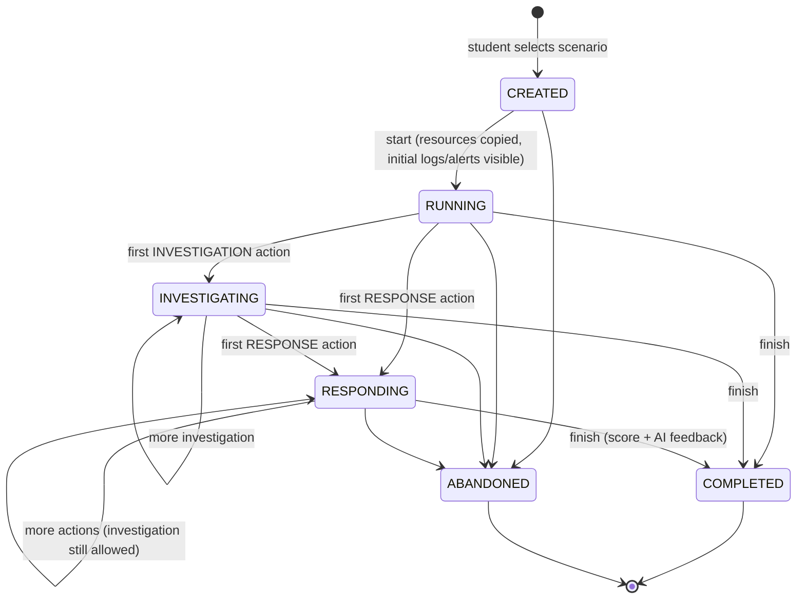
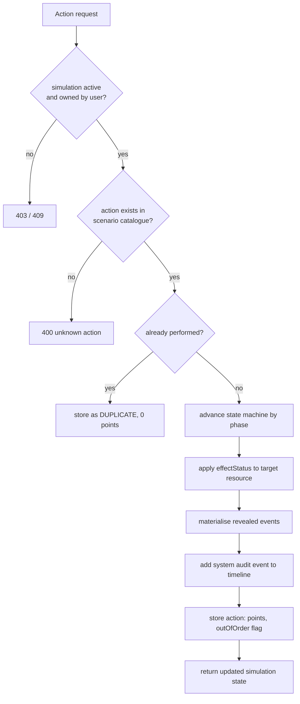

# 08 — Simulation Engine

## 1. Responsibilities

The simulation engine turns a **scenario template** into a **running, private simulation** for one
student, applies the student's actions to it and finally evaluates the result.
It is generic: it contains no scenario-specific code (ADR-5). All behaviour comes from scenario data.

| Component | Class | Responsibility |
|-----------|-------|---------------|
| State machine | `SimulationStatus`, `SimulationStateMachine` | Allowed lifecycle transitions |
| Engine | `SimulationEngine` | Start a simulation, apply an action (effects, revealed events), produce action results |
| Service | `SimulationService` | Transactions, ownership checks, persistence, orchestration with scoring and AI |
| Scoring | `ScoringEngine` | Deterministic score from performed actions + scoring rules |

## 2. Lifecycle



Design decisions:
- **States only move forward.** Going back to investigation while responding is allowed (real analysts
  do that), but the state stays `RESPONDING`. This keeps the state meaningful ("the student has started
  responding") and the transition table small.
- **`CREATED` and `RUNNING` are separate** so that the student first reads the briefing; the incident
  clock (`started_at`) starts only when they click *Begin*.
- **One active attempt per scenario per student.** Creating a simulation while one is active returns the
  existing one (resume) instead of creating parallel attempts.
- Invalid transitions (e.g. an action on a `COMPLETED` simulation) are rejected with **409 Conflict**.

## 3. Actions

Each scenario defines an **action catalogue**. The student only chooses from this catalogue; there is no
free-form command execution (safety requirement — nothing can be "executed").

| Field | Meaning |
|-------|---------|
| `actionKey` | Unique key, e.g. `inspect-auth-log`, `isolate-vm` |
| `phase` | `INVESTIGATION` or `RESPONSE` — drives the state machine |
| `category` | `INSPECT`, `IDENTIFY`, `CONTAIN`, `ERADICATE`, `RECOVER`, `HARDEN` — used in analytics |
| `targetResourceKey` | Resource the action applies to (optional) |
| `outcome` | `EXPECTED`, `NEUTRAL`, `HARMFUL` (hidden from the student) |
| `points` | Points for an expected action / penalty for a harmful one (hidden) |
| `prerequisiteActionKey` | Recommended previous action (order rule) |
| `effectStatus` | New status of the target resource, e.g. `ISOLATED`, `DISABLED`, `PRIVATE` |
| `revealed events` | Events whose `revealedByActionKey` equals this action become visible |
| `resultMessage` | Simulated console output shown to the student |

Applying an action (`SimulationEngine.apply`):



## 4. Events and timeline

- Scenario events have an `offsetSeconds` relative to the incident start.
- On start the engine computes `incidentStart = startedAt − (maxOffset + 60 s)` so that log timestamps
  look realistic ("the attack happened in the last minutes before you were paged").
- Events with `revealedByActionKey = null` are materialised immediately; the rest when the corresponding
  investigation action is performed. This models the real work of *looking into the right log source*.
- Response actions add a **system event** (source `analyst-console`) so the timeline shows both attacker
  and defender activity.

## 5. Scoring

`ScoringEngine` is a pure function `score(scenario rules, performed actions, hintsUsed) → ScoreResult`.
It does **not** use AI (ADR-6).

| Rule | Points (configurable per action / scenario) |
|------|--------------------------------------------|
| Expected action performed (first time) | `+points` of the action |
| Expected action performed before its prerequisite | `+points − outOfOrderPenalty` (min 0) |
| Neutral (unnecessary) action | 0 (listed as unnecessary) |
| Harmful action | `points` (negative, e.g. −10) |
| Duplicate action | 0 |
| AI hint used | `−hintPenalty` per hint |

```
maxScore     = Σ points of EXPECTED actions
rawScore     = Σ awarded points − hintsUsed × hintPenalty
scorePercent = clamp(round(rawScore × 100 / maxScore), 0, 100)
missed       = EXPECTED actions not performed
```

Why points live on actions: an administrator configures the scoring of a scenario in the same editor row as the
action itself. The example weighting from the requirements (identification +20, compromised resource +15,
log investigation +10, containment +20, credential rotation +10, permission review +10, destructive −10,
hint penalty) is reproduced in the seed scenarios.

## 6. Determinism and future AI variation

Given the same scenario version and the same sequence of actions, the engine always produces the same
state and score. AI variation (09-ai-integration, §5) changes only *content* (IP addresses, names,
timestamps, wording) of a **copy** of a scenario; the copy must pass the same validator, so the engine
and scoring remain deterministic for every variation.
