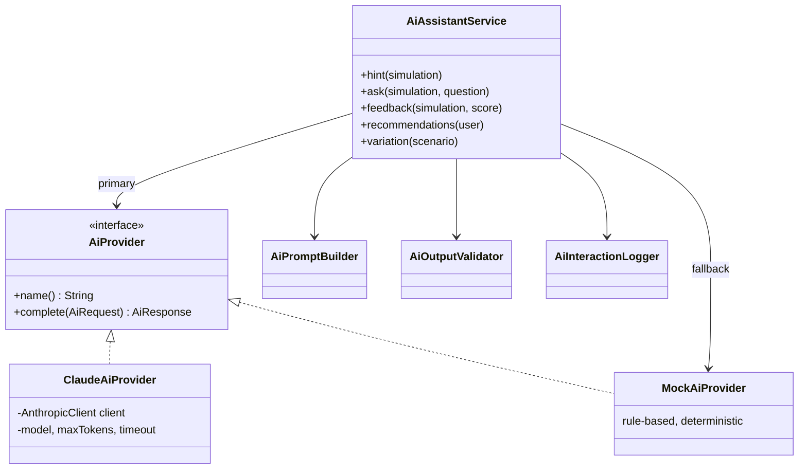
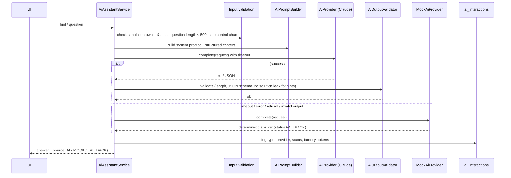

# 09 — AI Integration

## 1. Role of AI in the platform

AI is not a chatbot bolted onto the page. It has four concrete jobs, each fed with structured
simulation context:

| Capability | Trigger | Input context | Output | Affects state? |
|-----------|---------|---------------|--------|----------------|
| A. Contextual hint | Student clicks *Get hint* | scenario briefing, visible evidence, performed actions, state, hint number | Short hint (text) | Only increments `hints_used` (penalty) — decided by application code |
| A'. Assistant question | Student asks a question | same + the question | Answer (text) | No |
| B. Post-simulation analysis | Simulation completed | scenario, expected actions, performed actions with order/points, missed actions, score | Structured feedback: summary, strengths, improvements, missed evidence, order issues, unnecessary actions | Stored as feedback text only; **score is computed by the deterministic scoring engine, not by AI** |
| C. Scenario variation | Admin clicks *Generate variation* | Existing scenario definition | New `ScenarioDefinition` JSON | Saved only after validation, as an **inactive draft** |
| D. Learning recommendations | Student opens progress page | per-category results, missed action categories | List of recommended topics with reasons | No |

## 2. Provider abstraction



### ADR-8 — `AiProvider` interface with Claude and mock implementations
- **What:** A single small interface: `AiResponse complete(AiRequest request)` where the request carries
  the task type, a system prompt, the user content and the expected output format.
- **Why:** The rest of the application does not know which LLM is used. The mock provider makes the
  platform runnable without a paid key, and makes tests deterministic.
- **Selection:** `AI_PROVIDER=claude|mock` (default `mock`). If `claude` is selected but
  `ANTHROPIC_API_KEY` is empty, the application logs a warning and uses the mock provider.
- **Alternatives:** Spring AI (extra abstraction layer and version coupling with Spring Boot 4 milestones;
  the project needs only one call shape); calling the HTTP API directly with `RestClient`
  (the official SDK already handles retries, typed errors and model parameters).

### Claude provider
- Official **Anthropic Java SDK** (`com.anthropic:anthropic-java`).
- Default model **`claude-opus-5-5`**, configurable through `AI_MODEL`
  (e.g. `claude-sonnet-5-5` or `claude-haiku-4-5` for lower cost/latency).
- Effort is configurable (`AI_EFFORT`, default `low`): hints and feedback are short educational texts,
  so low effort keeps latency and cost down.
- Timeout `AI_TIMEOUT_SECONDS` (default 30 s), limited retries.
- If the model declines a request (`stop_reason = refusal`) the response is treated as a failure and
  the fallback is used.

### Mock provider
Deterministic, rule-based answers built from the scenario data:
- **Hint:** the next expected action that has not been performed yet (respecting prerequisites),
  rewritten as a *question/direction* using the scenario's static hints — never the action name itself
  for the first hint, more specific for later hints.
- **Feedback:** strengths = performed expected actions, improvements = missed expected actions
  (with their explanation), harmful and unnecessary actions, out-of-order actions.
- **Recommendations:** categories with the lowest average score / most missed actions.
- **Variation:** deterministic substitution of IP addresses and resource names.

## 3. Request flow with safety controls



## 4. AI safety and reliability (requirement §9)

| Control | Implementation |
|---------|---------------|
| Input validation | Bean Validation on question DTO (`@NotBlank`, `@Size(max=500)`); control characters removed; the question is placed in a delimited `<student_question>` block and the system prompt states that its content is data, not instructions. |
| Output validation | Length limits; JSON parsing + schema checks for feedback and variations; hint check rejects answers that list the exact labels of more than one remaining expected action (solution leak) → fallback. |
| Timeouts | SDK client timeout (`AI_TIMEOUT_SECONDS`) and small retry count. |
| Error handling | Any exception from the provider is caught in `AiAssistantService`; the student never sees a 500 because of AI. |
| Fallback behaviour | Mock provider answer, marked `FALLBACK` in the response and the log. |
| Logging | `ai_interactions` table + application log lines with type, provider, status, latency — no API keys, no full prompts. |
| Configurable provider | `AI_PROVIDER`, `AI_MODEL`, `AI_EFFORT`, `AI_TIMEOUT_SECONDS`, `ANTHROPIC_API_KEY`. |
| No command execution | The AI has no tools. Its output is text or JSON that the application parses; only the application can change state. |
| AI recommends, app decides | Score comes from `ScoringEngine`; variations become inactive drafts that an admin must review and activate. |

## 5. Scenario variation (validated AI content)

1. Admin requests a variation of scenario *S*.
2. AI receives the `ScenarioDefinition` JSON and instructions: keep all `*_key` values, phases,
   outcomes and points unchanged; change only names, IP addresses, usernames, timestamps offsets
   (±20 %), and narrative wording.
3. Output is parsed as `ScenarioDefinition` and validated by `ScenarioDefinitionValidator`
   (the same validator as the admin editor) **plus** a structural comparison with the original
   (same action keys, same outcomes and points, same evidence count).
4. If valid → stored as a new scenario with `active = false` and slug `<original>-var-<n>`.
   If invalid → 422 with the validation errors, nothing stored.

## 6. Prompts

Prompts are built by `AiPromptBuilder` (`backend/src/main/java/am/cybersim/ai/AiPromptBuilder.java`).
Structure of every prompt:

```
SYSTEM: role (cybersecurity instructor for a training platform) + rules + output format
USER:   <scenario> ... </scenario>
        <simulation_state> status, resources, visible evidence, performed actions </simulation_state>
        <task> hint #n | answer question | analyse attempt | recommend | vary </task>
        <student_question> (untrusted) </student_question>
```

Which context each task receives (least-information principle):

| Task | Scenario briefing | Visible logs / state | Action catalogue labels | Outcomes, points, explanations | Incident explanation & solution | Student text |
|------|:-:|:-:|:-:|:-:|:-:|:-:|
| Hint | ✓ | ✓ | ✓ | – | – | – |
| Question | ✓ | ✓ | ✓ | – | – | ✓ (delimited) |
| Feedback | ✓ | ✓ | ✓ | ✓ | ✓ | – |
| Recommendation | – | – | – | – | – | – (statistics only) |
| Variation | full definition (admin only) | | | | | |

## 7. Example request/response

### 7.1 Hint request (abridged user prompt, SSH scenario after one action)

```text
SYSTEM: You are an experienced cloud security incident responder acting as a tutor on CyberSim ...
        TASK: give the student ONE educational hint ... Never name more than one concrete action ...
        Maximum 3 sentences, plain text.
USER:   <scenario>
        Title: SSH Brute-Force Attack on a Cloud VM
        Category: NETWORK, difficulty: BEGINNER
        Briefing: You are the on-call security analyst ...
        </scenario>
        <simulation_state>
        Status: INVESTIGATING, hints used: 0
        Cloud resources:
        - web-prod-01 (VIRTUAL_MACHINE) status RUNNING
        ...
        Visible logs and alerts:
        - 10:41:15 [ALERT/HIGH] threat-detection: UnauthorizedAccess:EC2/SSHBruteForce — 1,284 failed SSH logins ...
        - 10:41:12 [LOG/CRITICAL] auth.log: sshd[3120]: Accepted password for admin from 203.0.113.45 ...
        Actions the student already performed:
        - Inspect SSH authentication log on web-prod-01
        Actions available in the console:
        - Inspect SSH authentication log on web-prod-01 (INVESTIGATION)
        - Isolate web-prod-01 (quarantine security group) (RESPONSE)
        ...
        </simulation_state>
        <instructor_notes> ...author's static hints... </instructor_notes>
        <task>Give hint number 1.</task>
```

Validated answer (offline tutor, captured from the running system):
> *"Once you know the host is compromised, contain it without destroying evidence, then deal with every account the
> attacker used or created."*

A Claude answer goes through the same validator; a hint that names two or more remaining expected actions verbatim is
rejected and replaced by the fallback (tested in `AiGatewayTest.hintThatRevealsTheSolutionIsRejected`).

### 7.2 Post-simulation feedback (structured output)

Audit row from `ai_interactions` (captured 2026-10-06, compromised-credentials scenario, score 6/100):
`FEEDBACK | MOCK | SUCCESS | 8 ms | Post-simulation analysis (score 6)` — response (abridged):

```json
{
  "summary": "… you scored 6/100. You completed 1 of 9 key response steps; review the improvements below.",
  "strengths": ["You performed \"Review sign-in log of maria.k\"."],
  "improvements": [
    "You missed \"Deactivate access key AKIA…7Q2X\": A password reset does NOT invalidate access keys — the key must be disabled separately.",
    "You missed \"Revoke all active sessions of maria.k\": Existing sessions stay valid after a password change; they must be revoked to kick the attacker out."
  ],
  "missedEvidence": [
    "Not flagged: Impossible travel: maria.k signed in from Yerevan, AM (18:05) and from Lagos, NG (03:12) — 5,100 km in 9 hours",
    "Never uncovered: CreateAccessKey by maria.k (source 102.89.33.17) → AKIA…7Q2X"
  ],
  "orderIssues": [],
  "unnecessaryActions": [],
  "nextSteps": ["Practise identify steps of the incident-response process."]
}
```

With `AI_PROVIDER=claude` the same JSON schema is enforced through structured outputs (the SDK derives the schema from
the `AiFeedback` record) and then validated again by `AiOutputValidator`. **Live Claude output: implemented but not
runtime-verified** (no API key in the development environment) — capture one for the thesis by setting
`ANTHROPIC_API_KEY` and reading *Admin → Attempts → Details → AI interactions*.
