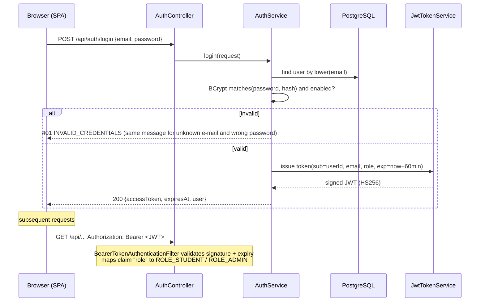

# 10 — Security

## 1. Authentication flow

### ADR-4 — Stateless JWT with Spring Security's OAuth2 resource server
- **What:** The backend issues HS256-signed JWTs (`NimbusJwtEncoder`) and validates them with
  Spring Security's built-in resource-server support (`NimbusJwtDecoder`).
- **Why:** The React SPA talks to a REST API; stateless tokens avoid server-side sessions and
  CSRF tokens, and the built-in decoder handles signature, expiry and error responses — less custom
  security code means fewer security bugs.
- **Alternatives:** (1) HTTP sessions + cookies — needs CSRF protection and sticky sessions;
  (2) hand-written JWT filter with `jjwt` — more code to get wrong; (3) Keycloak — a separate
  identity server is too heavy for this project.
- **Secret:** `JWT_SECRET` environment variable, at least 32 bytes; the application refuses to start
  with a shorter secret.
- **Limitations:** no refresh tokens and no server-side revocation in the MVP (short expiry instead).
  Disabling a user takes effect at their next login; a check of `enabled` on each request is
  documented as future work.

## 2. Authorization

| Layer | Rule |
|-------|------|
| URL rules (`SecurityConfig`) | `/api/auth/register`, `/api/auth/login`, Swagger, health → public; `/api/admin/**` → `ROLE_ADMIN`; everything else under `/api/**` → authenticated |
| Data ownership (services) | A student can only read/modify **their own** simulations; otherwise 404 (not 403, so IDs of other users' simulations are not disclosed) |
| DTO filtering | Student DTOs never contain `outcome`, `points`, explanations or the recommended solution before completion |

## 3. Passwords
BCrypt via `PasswordEncoderFactories.createDelegatingPasswordEncoder()` (stores `{bcrypt}` prefix, allows
future algorithm migration). Minimum length 8 characters.

## 4. Threat model (summary)

| Threat | Mitigation |
|--------|-----------|
| Credential stuffing / brute force on login | Generic error message; BCrypt cost; rate limiting is future work |
| Token theft | Short expiry, HTTPS in production, no tokens in logs |
| IDOR (accessing others' simulations) | Ownership check in every service method |
| Privilege escalation via registration | Role is never taken from the request; always `STUDENT` |
| Mass assignment | Separate request DTOs with only allowed fields |
| SQL injection | JPA parameter binding only |
| XSS | React escapes output; no raw HTML rendering of log messages or AI output |
| Prompt injection via assistant question | Question is delimited and treated as data; AI has no tools; output validated |
| Secret leakage | Secrets only in environment variables; `.env` git-ignored; logs exclude passwords, tokens, API keys |
| Real-world harm | No feature connects to external systems; simulated resources only |
