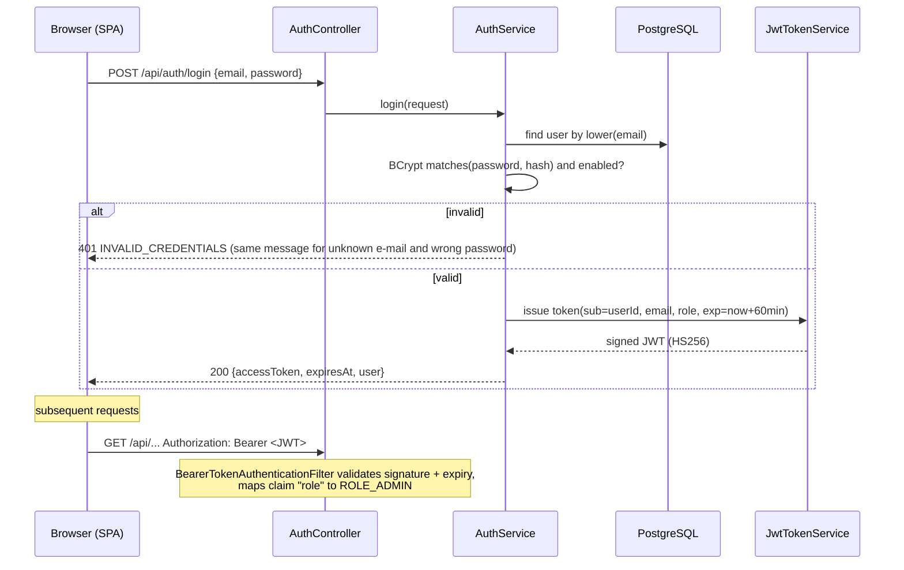

# 10 — Security

> Learner-side concerns (simulation ownership checks, hiding solution data from students) moved to the
> learner module together with the student flow; this document covers the admin authoring platform.

## 1. Authentication flow

There is **no self-registration**: `POST /api/auth/register` does not exist, `ADMIN` is the only role
(enforced by a database CHECK constraint), and accounts are provisioned by the operator through environment
variables (`DemoDataInitializer`). An account is created only when its password variable is set.

### ADR-4 — Stateless JWT with Spring Security's OAuth2 resource server
- **What:** The backend issues HS256-signed JWTs (`NimbusJwtEncoder`) and validates them with
  Spring Security's built-in resource-server support (`NimbusJwtDecoder`).
- **Why:** The React SPA talks to a REST API; stateless tokens avoid server-side sessions and
  CSRF tokens, and the built-in decoder handles signature, expiry and error responses — less custom
  security code means fewer security bugs.
- **Alternatives:** (1) HTTP sessions + cookies — needs CSRF protection and sticky sessions;
  (2) hand-written JWT filter with `jjwt` — more code to get wrong; (3) Keycloak — a separate
  identity server is too heavy for this project.
- **Secret:** `JWT_SECRET` environment variable, at least 32 bytes; the application refuses to start
  with a shorter secret. Without a secret (local development) a random key is generated at start-up,
  so no default secret can ever be committed.
- **Limitations:** no refresh tokens and no server-side revocation in the MVP (short expiry instead).
  Disabling an admin takes effect at their next login (covered by `disabledAdminCannotLogIn`);
  a per-request `enabled` check is documented as future work.

## 2. Authorization

| Layer | Rule |
|-------|------|
| URL rules (`SecurityConfig`) | Public: `/api/auth/login`, `/actuator/health/**`, `/actuator/info`, Swagger. `/api/admin/**` → `ROLE_ADMIN`. Everything else under `/api/**` → authenticated. **Anything else → `denyAll`.** |
| Method security | `@EnableMethodSecurity` is on; URL rules are the coarse first line, services stay the place for data rules. |
| Publishing gates | `publish` recomputes validation, both test paths and the quality score **on the server** from the stored draft — a client cannot publish a failing scenario by skipping UI checks (422 `PUBLISH_BLOCKED`). |
| Lifecycle rules | Archived scenarios cannot be published; only never-published drafts can be deleted; published versions are immutable rows. |
| Error format | 401/403 are written by the security layer in the same `ApiError` JSON as all other errors. |

## 3. Passwords
BCrypt via `PasswordEncoderFactories.createDelegatingPasswordEncoder()` (stores `{bcrypt}` prefix, allows
future algorithm migration). Minimum length 8 characters for provisioned accounts.

## 4. Threat model (summary)

| Threat | Mitigation |
|--------|-----------|
| Credential stuffing / brute force on login | Generic error message; BCrypt cost; rate limiting is future work |
| Token theft | Short expiry, HTTPS in production, no tokens in logs |
| Privilege escalation | No registration endpoint at all; the single role comes from the database, never from a request; unknown URLs are `denyAll` |
| Forged publish (bypassing UI gates) | Gates recomputed server-side on the stored draft; blockers listed in the 422 body |
| Mass assignment | Separate request DTOs with only allowed fields; scenario definitions pass one validator for every entry point (seed, generator, editor, AI variation, version restore) |
| SQL injection | JPA parameter binding only |
| XSS | React escapes output; no raw HTML rendering of scenario content or AI output |
| Prompt injection via admin brief or translated text | `<administrator_brief>` / `<source_text>` are delimited and declared data; AI has no tools; output is parsed, structure-checked and validated (see 09 §4) |
| Poisoned AI output | `requireSameStructure` + `ScenarioDefinitionValidator` reject structure or rule changes; on failure the deterministic draft is used |
| Secret leakage | Secrets only in environment variables; `.env` git-ignored; logs exclude passwords, tokens, API keys |
| Real-world harm | Scenario content is data; nothing executes commands or connects to external systems (except the optional AI API) |
