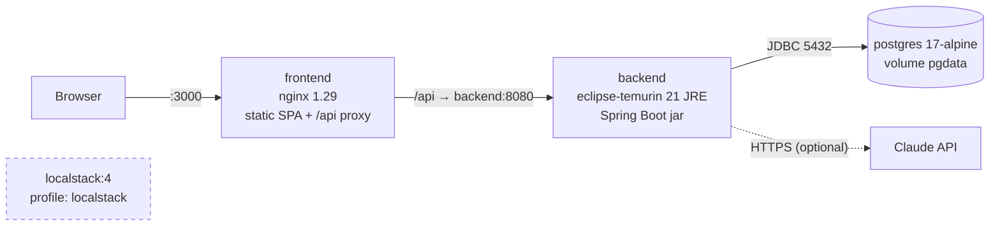

# 12 — Deployment and Local Environment

## 1. Container architecture

| Service | Image / build | Port | Notes |
|---------|---------------|------|-------|
| `postgres` | `postgres:17-alpine` | 5432 | health check `pg_isready`; data in volume `pgdata` |
| `backend` | `backend/Dockerfile` (multi-stage: JDK build → JRE runtime, non-root user) | 8080 | starts after the DB is healthy; Flyway migrates on start |
| `frontend` | `frontend/Dockerfile` (Node build → nginx) | 3000 | serves the SPA, proxies `/api` (same origin → no CORS needed) |
| `localstack` | `localstack/localstack:4` | 4566 | only with `--profile localstack`; not used by the core platform (ADR-7) |

### Decisions
- **Multi-stage Dockerfiles:** the runtime images contain no build tools or source code → smaller and safer.
- **nginx reverse proxy:** browser and API share one origin, so the JWT never has to cross origins, and the backend
  port need not be public in production.
- **Secrets only from `.env`:** `docker-compose.yml` uses `${VAR:?message}` for mandatory secrets
  (`POSTGRES_PASSWORD`, `JWT_SECRET`) — the stack refuses to start without them instead of using a default.

## 2. Environment variables

| Variable | Default | Purpose |
|----------|---------|---------|
| `POSTGRES_DB`, `POSTGRES_USER` | `cybersim` | database name / user |
| `POSTGRES_PASSWORD` | — (required) | database password |
| `JWT_SECRET` | — (required in Docker; random in local dev) | HS256 signing key, ≥ 32 characters |
| `JWT_EXPIRATION_MINUTES` | 60 | token lifetime |
| `CORS_ALLOWED_ORIGINS` | `http://localhost:3000` | for running the SPA dev server against the backend |
| `APP_DEMO_DATA_ENABLED` | `true` (Compose) / `false` (app) | create demo admin/student |
| `DEMO_ADMIN_EMAIL/PASSWORD`, `DEMO_STUDENT_EMAIL/PASSWORD` | e-mails preset, passwords empty | demo accounts are created only if the password is set |
| `AI_PROVIDER` | `mock` | `mock` or `claude` |
| `ANTHROPIC_API_KEY` | empty | Claude API key (never committed, never logged) |
| `AI_MODEL` | `claude-opus-5-5` | e.g. `claude-sonnet-5-5`, `claude-haiku-4-5` for lower cost |
| `AI_EFFORT` | `low` | `low`/`medium`/`high`/`xhigh`/`max` |
| `AI_TIMEOUT_SECONDS` | 30 | per-attempt timeout |
| `AI_SERVER_SIDE_FALLBACK` | `true` | ask the API to retry refused requests on a fallback model |

## 3. Commands

| Purpose | Command |
|---------|---------|
| First start | `cp .env.example .env` → edit secrets → `docker compose up --build` |
| Production-like start (detached) | `docker compose up --build -d` |
| Development: DB only | `docker compose up -d postgres`, then run backend (`./mvnw spring-boot:run`) and frontend (`npm run dev`) locally |
| Reset database | `docker compose down -v && docker compose up -d` (Flyway recreates the schema, seeder re-imports scenarios) |
| Tests | `cd backend && ./mvnw test` (Docker must be running) |
| With LocalStack | `docker compose --profile localstack up -d` |
| Logs | `docker compose logs -f backend` |
| Stop | `docker compose down` |

## 4. Verification status (2026-10-06)
- `docker compose up --build -d` — **VERIFIED**: all three containers start, Flyway migrates, 3 scenarios and 2 demo
  accounts are created, the end-to-end smoke test passes through nginx.
- LocalStack profile — **implemented but not runtime-verified** (optional, not used by application code).
- Real Claude provider inside Docker — **implemented but not runtime-verified** (no API key available).

## 5. Production notes (beyond the scope of the thesis demo)
- Terminate TLS in front of nginx (e.g. a cloud load balancer); set `CORS_ALLOWED_ORIGINS` to the real domain.
- Use a managed PostgreSQL with backups; keep `JWT_SECRET` and `ANTHROPIC_API_KEY` in a secret manager.
- Do not publish port 8080 and 5432; only the frontend needs to be reachable.
