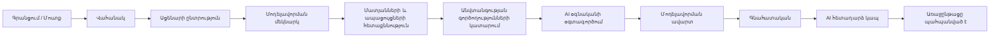
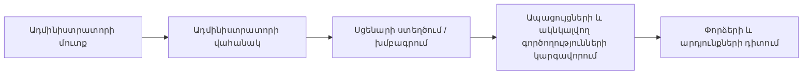

> Թարգմանություն՝ [English version](../en/02-requirements.md)

# 02 — Պահանջներ

## 1. Դերակատարներ

| Դերակատար | Նկարագրություն |
|-------|-------------|
| Հյուր | Չնույնականացված այցելու. կարող է գրանցվել և մուտք գործել։ |
| Ուսանող (`STUDENT`) | Վարժվում է սցենարների վրա, օգտագործում է AI օգնականը, տեսնում է սեփական արդյունքներն ու առաջընթացը։ |
| Ադմինիստրատոր (`ADMIN`) | Կառավարում է սցենարներն ու օգտատերերին, դիտում է բոլոր փորձերն ու վերլուծությունը։ Կարող է նաև վարժվել։ |
| AI մատակարար | Արտաքին մեծ լեզվական մոդել (LLM)՝ Claude API, կամ ներկառուցված կեղծ (mock) մատակարար։ Վստահելի չէ։ |

## 2. Ֆունկցիոնալ պահանջներ

### Նույնականացում և օգտատերեր
- **FR-1** Հյուրը կարող է գրանցվել էլ. փոստով, ցուցադրվող անունով և գաղտնաբառով։ Նոր հաշիվները միշտ ստանում են `STUDENT` դերը։
- **FR-2** Օգտատերը կարող է մուտք գործել էլ. փոստով և գաղտնաբառով և ստանում է JWT մուտքի թոքեն (access token)։
- **FR-3** Վերջնակետերը (endpoints) պաշտպանված են ըստ դերի. `/api/admin/**`-ը պահանջում է `ADMIN`։
- **FR-4** Ադմինիստրատորը կարող է անջատել/միացնել օգտատերերի հաշիվները. անջատված օգտատերերը չեն կարող մուտք գործել։

### Սցենարներ
- **FR-5** Ուսանողը տեսնում է *ակտիվ* սցենարների ցանկը՝ վերնագրով, ամփոփմամբ, բարդությամբ, կատեգորիայով և մոտավոր տևողությամբ։
- **FR-6** Ուսանողը տեսնում է սցենարի ներածական տեղեկանքը՝ նկարագրությունը և ուսուցման նպատակները, բայց երբեք՝ ակնկալվող գործողությունները, միավորները կամ լուծումը։
- **FR-7** Ադմինիստրատորը կարող է ստեղծել, խմբագրել, ակտիվացնել և ապաակտիվացնել սցենարներ, ներառյալ՝ բարդությունը, ուսուցման նպատակները, սկզբնական ենթակառուցվածքը (ռեսուրսները), միջադեպի ժամանակագրությունը (մատյաններ/ահազանգեր), ապացույցների նշիչները, գործողությունների կատալոգը (ակնկալվող / չեզոք / վնասակար), միավորները, նախապայմանները, հուշումները, բացատրությունը և առաջարկվող լուծումը։

### Մոդելավորում
- **FR-8** Ուսանողը կարող է սկսել ակտիվ սցենարի մոդելավորում. ստեղծվում է սցենարի ռեսուրսների անձնական պատճենը։
- **FR-9** Մոդելավորումն ունի կյանքի ցիկլ՝ `CREATED → RUNNING → INVESTIGATING → RESPONDING → COMPLETED` (կամ `ABANDONED`)։
- **FR-10** Ուսանողը տեսնում է ռեսուրսները, տեսանելի մատյաններն/ահազանգերը, միջադեպի ժամանակագրությունը և հասանելի գործողությունների կատալոգը։
- **FR-11** Հետաքննական գործողությունները կարող են բացահայտել նոր մատյանային գրառումներ/ապացույցներ։
- **FR-12** Արձագանքման գործողությունները փոխում են ռեսուրսների մոդելավորված վիճակը (օրինակ՝ վիրտուալ մեքենա → `ISOLATED`)։
- **FR-13** Յուրաքանչյուր գործողություն պահպանվում է ժամանակադրոշմով, օգտատիրոջով, գործողության տեսակով, թիրախային ռեսուրսով, մետատվյալներով և արդյունքով։
- **FR-14** Ուսանողը կարող է ավարտել մոդելավորումը և ստանում է գնահատական (0–100), դրա մանրամասն բաշխումը, բաց թողնված ակնկալվող գործողությունները և միջադեպի բացատրությունը։

### AI
- **FR-15** Ուսանողը կարող է խնդրել համատեքստային հուշում։ AI-ը ստանում է սցենարը, տեսանելի ապացույցները, կատարված գործողություններն ու վիճակը, և չպետք է բացահայտի ամբողջական լուծումը։ Հուշումները կարող են հանգեցնել փոքր, կարգավորելի տուգանքի։
- **FR-16** Ուսանողը կարող է AI օգնականին տալ ազատ ձևով հարցեր ընթացիկ մոդելավորման վերաբերյալ։
- **FR-17** Ավարտից հետո AI-ը վերլուծում է ճիշտ գործողությունները, սխալները, բաց թողնված ապացույցները, հերթականությունը և ավելորդ գործողությունները և ձևավորում է հետադարձ կապ։
- **FR-18** AI-ը առաջարկում է ուսումնական թեմաներ՝ հիմնվելով ուսանողի պատմության վրա։
- **FR-19** Ադմինիստրատորը կարող է AI-ին խնդրել ստեղծել առկա սցենարի տարբերակ. արդյունքը ստուգվում է և պահպանվում որպես *ոչ ակտիվ սևագիր*՝ վերանայման համար։
- **FR-20** Եթե API բանալի կարգավորված չէ կամ AI-ի կանչը ձախողվում է, հարթակն օգտագործում է դետերմինիստիկ կեղծ (mock)/պահուստային իրականացում։

### Առաջընթաց և վերլուծություն
- **FR-21** Ուսանողը տեսնում է իր մոդելավորումների պատմությունը և առաջընթացը (փորձեր, միջին/լավագույն գնահատական, արդյունքներ ըստ կատեգորիաների, առաջարկություններ)։
- **FR-22** Ադմինիստրատորը տեսնում է բոլոր օգտատերերին, յուրաքանչյուր օգտատիրոջ առաջընթացը, մոդելավորման բոլոր փորձերը՝ մանրամասներով, հարթակի վիճակագրությունը և ամենատարածված սխալները։

## 3. Ոչ ֆունկցիոնալ պահանջներ

| ID | Պահանջ |
|----|-------------|
| NFR-1 Անվտանգություն | Գաղտնաբառերի հեշավորում BCrypt-ով, առանց վիճակի (stateless) JWT, դերերի վրա հիմնված թույլտվությունների կառավարում, ռեպոզիտորիայում գաղտնիքների բացակայություն, մատյաններում զգայուն տվյալների բացակայություն։ |
| NFR-2 Անվնասություն | Իրական արտաքին համակարգերի վրա գրոհող կամ դրանց միացող որևէ ֆունկցիոնալության բացակայություն։ AI-ը չի կարող հրամաններ կատարել. այն միայն ստեղծում է տեքստ, որը ստուգում է հավելվածը։ |
| NFR-3 Դետերմինիզմ | Միևնույն սցենարի և միևնույն գործողությունների դեպքում գնահատականը միշտ նույնն է։ |
| NFR-4 Հուսալիություն | AI-ի կանչերն ունեն ժամանակային սահմանափակումներ և անցնում են կեղծ (mock) իրականացմանը. մոդելավորումը երբեք չի արգելափակվում AI-ի պատճառով։ |
| NFR-5 Տեղափոխելիություն | Ամբողջ համակարգը գործարկվում է `docker compose up` հրամանով սովորական նոութբուքի վրա։ |
| NFR-6 Սպասարկելիություն | Մոդուլային մոնոլիտ, շերտավորված փաթեթներ, DTO-ների առանձնացում, տվյալների բազայի միգրացիաներ, ավտոմատացված թեստեր։ |
| NFR-7 Օգտագործելիություն | Պրոֆեսիոնալ մուգ ինտերֆեյս՝ «անվտանգության գործառնական կենտրոնի» (SOC) ոճով, պիտանի էկրանապատկերների համար։ |
| NFR-8 Փաստաթղթավորում | Յուրաքանչյուր էական որոշում փաստաթղթավորված է ԻՆՉ / ԻՆՉՈՒ / ԻՆՉՊԵՍ / ԱՅԼԸՆՏՐԱՆՔՆԵՐ կառուցվածքով։ |

## 4. MVP-ի սահմանումը

MVP-ն ավարտված է, երբ ստորև ներկայացված երկու հոսքերն էլ ամբողջությամբ աշխատում են PostgreSQL-ի հետ.

