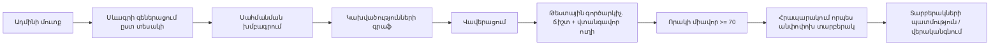

> Թարգմանություն՝ [English version](../en/02-requirements.md)

# 02 — Պահանջներ

> **Ծավալի նշում։** Սկզբնական առաջադրանքը (`requirement.txt`) ընդգրկում է երկու հոսք՝ սովորողի (ուսանողի) հոսքը և
> ադմինիստրատորի հոսքը։ Սովորողի հոսքը՝ գրանցում, սիմուլյացիաների կատարում, AI ուսուցում, առաջընթաց, հանձնվել է
> թիմի մյուս անդամին և գտնվում է առանձին մոդուլում։ **Այս պահոցն իրականացնում է միայն ադմինիստրատորի հոսքը**՝
> միջադեպային սցենարների ստեղծում, վավերացում, թեստավորում, գնահատում, հրապարակում և տարբերակների կառավարում։
> Ստորև պահանջները պահպանում են իրենց սկզբնական համարները. սովորողի մոդուլ տեղափոխված կետերը նշված են
> **[սովորողի մոդուլ]**՝ ջնջվելու փոխարեն, որպեսզի սկզբնական առաջադրանքի հետ համապատասխանությունը տեսանելի մնա։
> Ամբողջական փոփոխության արձանագրությունը՝ [17-admin-authoring-platform.md](17-admin-authoring-platform.md)։

## 1. Դերակատարներ

| Դերակատար | Նկարագրություն |
|-------|-------------|
| Ադմինիստրատոր (`ADMIN`) | Միակ ինտերակտիվ դերը։ Ստեղծում է սցենարներ, կատարում վավերացում և թեստային ուղիներ, գնահատում որակը, հրապարակում տարբերակներ։ Հաշիվները տրամադրում է օպերատորը. ինքնագրանցում չկա։ |
| AI մատակարար | Արտաքին LLM (Claude API) կամ ներկառուցված mock մատակարարը։ Արտադրում է սևագրի նարատիվ, վարիացիաներ և ըստ պահանջի թարգմանություններ։ Վստահելի չէ. ամբողջ ելքը վավերացվում է։ |
| Սովորողի մոդուլ (ներքևում) | Թիմի մյուս անդամի կառուցած առանձին հավելվածը։ Սպառում է **հրապարակված** սցենարային տարբերակները (`scenario_versions` տողերը). երբեք չի կարդում սևագրերը։ |

## 2. Ֆունկցիոնալ պահանջներ

### Նույնականացում և օգտատերեր
- **FR-1** ~~Հյուրի ինքնագրանցում~~ — **հեռացված է։** Հարթակը հանրային գրանցում չունի. `ADMIN` հաշիվները
  ստեղծում է օպերատորը (միջավայրի փոփոխականներով ղեկավարվող `DemoDataInitializer`)։
- **FR-2** Ադմինիստրատորը կարող է մուտք գործել էլ. փոստով և գաղտնաբառով և ստանում է JWT տոկեն։
- **FR-3** Վերջնակետերը պաշտպանված են ըստ դերի. `/api/admin/**`-ը պահանջում է `ADMIN`. մնացած ամեն ինչ, բացի
  մուտքից, պահանջում է նույնականացում։
- **FR-4** *Օգտատերերի դիտում / հաշիվների անջատում* — **[սովորողի մոդուլ]** (այն գոյություն ուներ միայն
  սովորողներին կառավարելու համար)։

### Սցենարների հեղինակում (սկզբնական «Ստեղծել / Խմբագրել / Ակտիվացնել / Կարգավորել» կետերը)
- **FR-5** Ադմինիստրատորը տեսնում է բոլոր սցենարները՝ կարգավիճակով (`DRAFT` / `PUBLISHED` / `ARCHIVED`),
  խմբագրման համարով, հրապարակված տարբերակով, բարդությամբ, կատեգորիայով, քանակներով և առավելագույն միավորով։
- **FR-6** Ադմինիստրատորը կարող է գեներացնել սևագիր՝ ըստ սցենարի տեսակի (`SSH_BRUTE_FORCE`,
  `COMPROMISED_CREDENTIALS`, `PUBLIC_STORAGE_BUCKET`)՝ փոխարինելով վերնագիրը, բարդությունը, հիմնական ակտիվը,
  հարձակվողի IP-ն և տարածաշրջանը, ցանկության դեպքում AI նարատիվային հղկումով («AI-ն առաջարկում է, հավելվածը
  որոշում է»)։
- **FR-7** Ադմինիստրատորը կարող է ամբողջությամբ ստեղծել և խմբագրել սցենարները՝ բարդություն, ուսումնական
  նպատակներ, սկզբնական ենթակառուցվածք (ռեսուրսներ), միջադեպի ժամանակագրություն (մատյաններ/ահազանգեր),
  ապացույցների նշաններ, աստիճանական բացահայտում (`revealedByActionKey`), գործողությունների կատալոգ
  (սպասվող / չեզոք / վնասակար), միավորներ, նախապայմաններ, հուշումներ, միջադեպի բացատրություն և խորհուրդ տրվող
  լուծում։ Սա իրականացնում է սկզբնական «կարգավորել բարդությունը / միջադեպի տվյալները / սպասվող
  գործողությունները / գնահատման կանոնները» պահանջները։
- **FR-8** Յուրաքանչյուր գրառում (seed, գեներատոր, խմբագրիչ, AI վարիացիա, տարբերակի վերականգնում) անցնում է
  նույն `ScenarioDefinitionValidator`-ով. բոլոր խնդիրները հաղորդվում են միասին՝ մեկ 422 պատասխանով։
- **FR-9** Ադմինիստրատորը կարող է դիտել սցենարի կախվածությունների գրաֆը (սկիզբ, գործողություններ,
  իրադարձություններ, ռեսուրսներ. նախապայման / բացահայտում / թիրախ / ազդեցություն կողեր)։
- **FR-10** Ադմինիստրատորը կարող է ստանալ վավերացման հաշվետվություն (գրաֆային կանոններ՝ ERROR / WARNING / INFO
  գտածոներով)։
- **FR-11** Ադմինիստրատորը կարող է գործարկել դետերմինիստիկ թեստային գործարկիչը. **ճիշտ ուղին** պետք է հասնի
  100 %-ի՝ բացահայտելով ամբողջ ապացույցը, **վտանգավոր ուղին** պետք է մնա տուգանված և չլուծված։
- **FR-12** Ադմինիստրատորը կարող է հաշվարկել որակի միավորը (0–100. վավերություն, թեստեր, ծածկույթ,
  մանկավարժություն, կառուցվածք)՝ գնահատականով և բաղադրիչ առ բաղադրիչ հիմնավորմամբ, ներառյալ չպահպանված
  խմբագրումների կենդանի գնահատումը։
- **FR-13** Ադմինիստրատորը կարող է հրապարակել սևագիրը որպես անփոփոխ տարբերակ։ Հրապարակումը սերվերի կողմից
  արգելափակվում է, քանի դեռ վավերացումը սխալներ ունի, թեստային ուղիներից որևէ մեկը ձախողվում է կամ որակի
  միավորը < 70 է։ Սկզբնական «ակտիվացնել / ապաակտիվացնել» պահանջը համապատասխանում է **հրապարակել /
  արխիվացնել**-ին։
- **FR-14** Ադմինիստրատորը կարող է դիտել տարբերակների ցանկը, ուսումնասիրել սառեցված տարբերակը (սահմանում +
  որակի հաշվետվություն) և վերականգնել այն խմբագրվող սևագրի մեջ։ Հրապարակված սցենարի խմբագրումը այն վերադարձնում
  է `DRAFT`-ի՝ չդիպչելով հրապարակված տարբերակին։
- **FR-15** Ջնջել կարելի է միայն երբեք չհրապարակված սևագրերը. հրապարակվածներն արխիվացվում են, որպեսզի նրանց
  տարբերակները պահպանվեն սովորողի մոդուլի համար։

### AI
- **FR-16** AI-ը կարող է հղկել գեներացված սևագրի նարատիվը. կառուցվածքը (բանալիներ, փուլեր, արդյունքներ,
  միավորներ, հղումներ) պետք է մնա նույնական, և արդյունքը պետք է անցնի վավերացումը, հակառակ դեպքում պահվում է
  դետերմինիստիկ սևագիրը՝ նշված `FALLBACK`։
- **FR-17** AI-ը կարող է գեներացնել գոյություն ունեցող սցենարի վարիացիա՝ որպես նոր սևագիր, կառուցվածքով
  ստուգված բնօրինակի դիմաց։
- **FR-18** Ցանկացած մուտք գործած օգտատեր կարող է ըստ պահանջի թարգմանել ցուցադրվող տեքստի մեկ հատված
  (`POST /api/ai/translate`). արդյունքը ցուցադրվում է բնօրինակի կողքին և երբեք չի պահպանվում։
- **FR-19** Եթե API բանալի կարգավորված չէ, կամ AI կանչը ձախողվում կամ ժամանակից դուրս է գալիս, հարթակը անցնում
  է դետերմինիստիկ mock մատակարարին. հեղինակումը երբեք չի արգելափակվում AI-ի պատճառով։
- **FR-20** Յուրաքանչյուր AI կանչ գրանցվում է `ai_interactions`-ում (խնդիր, մատակարար, կարգավիճակ, ուշացում)։
- *Ուսանողական AI (հուշումներ, ազատ հարցեր, հետադարձ կապ, ուսումնական առաջարկություններ)* —
  **[սովորողի մոդուլ]**։

### Սիմուլյացիայի միջավայր, առաջընթաց և վերլուծություն
- *Սիմուլյացիաների կատարում, կյանքի ցիկլի վիճակներ, գործողությունների կատարում, փորձերի գնահատում, առաջընթացի
  էջեր, փորձերի դիտում, վիճակագրություն, տարածված սխալների վերլուծություն* — **[սովորողի մոդուլ]**։ Հանձնման
  պայմանագիրը հրապարակված `scenario_versions` տողն է. այս պահոցում պահված `ScoringEngine`-ը նույն կանոնների
  հավաքածուն է, որը կիրառում է սովորողի մոդուլը, ուստի թեստային գործարկիչը կանխատեսում է սովորողի կողմի
  վարքագիծը։

## 3. Ոչ ֆունկցիոնալ պահանջներ

| ID | Պահանջ |
|----|-------------|
| NFR-1 Անվտանգություն | BCrypt գաղտնաբառերի հեշավորում, անվիճակ JWT, դերերի վրա հիմնված թույլտվություն (միայն `ADMIN` API), պահոցում գաղտնիքներ չկան, մատյաններում զգայուն տվյալներ չկան։ |
| NFR-2 Անվտանգ դիզայն | Չկա ֆունկցիոնալություն, որը հարձակվում կամ միանում է իրական արտաքին համակարգերին։ AI-ը չի կարող հրամաններ կատարել. այն արտադրում է միայն տեքստ/JSON, որը հավելվածը վավերացնում է։ Թեստային գործարկումները հիշողության մեջ են և կողմնակի ազդեցություն չունեն։ |
| NFR-3 Դետերմինիզմ | Գեներատորի ձևանմուշները, թեստային գործարկիչը և որակի միավորը դետերմինիստիկ են. նույն սահմանումը միշտ տալիս է նույն հաշվետվությունը։ |
| NFR-4 Հուսալիություն | AI կանչերը ունեն ժամանակի սահմանափակում և անցնում են mock իրականացմանը. հրապարակման դարպասները վերահաշվարկվում են սերվերի կողմից։ |
| NFR-5 Տեղափոխելիություն | Ամբողջ համակարգը գործարկվում է `docker compose up`-ով սովորական նոութբուքի վրա։ |
| NFR-6 Սպասարկելիություն | Մոդուլային մոնոլիտ, շերտավորված փաթեթներ, DTO տարանջատում, տվյալների բազայի միգրացիաներ, ավտոմատ թեստեր (միավորային + Testcontainers ինտեգրացիոն)։ |
| NFR-7 Օգտագործելիություն | Պրոֆեսիոնալ մուգ «անվտանգության օպերացիոն կենտրոն» ինտերֆեյս՝ հարմար թեզի էկրանապատկերների համար. անգլերեն/հայերեն ինտերֆեյս՝ բովանդակության ըստ պահանջի թարգմանությամբ։ |
| NFR-8 Փաստաթղթավորում | Յուրաքանչյուր էական որոշում փաստաթղթավորված է WHAT / WHY / HOW / ALTERNATIVES ձևով։ |

## 4. MVP-ի սահմանումը

MVP-ն ավարտված է, երբ հեղինակման հոսքն աշխատում է ամբողջությամբ PostgreSQL-ի դիմաց.

Սովորողի կողմի MVP-ն (գրանցում → սիմուլյացիա → միավոր → հետադարձ կապ → առաջընթաց) սահմանվում և ստուգվում է
սովորողի մոդուլում՝ այստեղ հրապարակված տարբերակների դիմաց։
