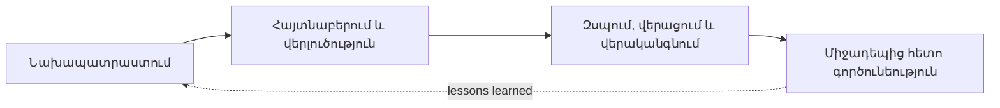

> Թարգմանություն՝ [English version](../en/03-technology-research.md)

# 03 — Տեխնոլոգիաների և մեթոդների հետազոտություն

Այս փաստաթուղթը **Թեզի 1-ին բաժնի** հիմքն է։ Յուրաքանչյուր տեխնոլոգիա նկարագրված է՝
ԻՆՉ է այն, ԻՆՉՈՒ է ընտրվել և ինչ ԱՅԼԸՆՏՐԱՆՔՆԵՐ են դիտարկվել։

> Ծավալ. այս պահոցը **ադմինիստրատորի սցենարների հեղինակման հարթակն է**. սովորողի միջավայրը առանձին մոդուլ է
> (տես [17-admin-authoring-platform.md](17-admin-authoring-platform.md))։ Ստորև հետազոտությունը դեռ ընդգրկում է
> ոլորտն ամբողջությամբ, քանի որ հեղինակված սցենարները կոդավորում են միջադեպերին արձագանքման այն նույն
> հասկացությունները, որոնք սովորողի մոդուլը հետագայում ուսուցանում է։

## 1. Առարկայական ոլորտի նախապատմություն. ամպային միջադեպերին արձագանքում

### 1.1 Համատեղ պատասխանատվության մոդել (shared-responsibility model)
Ամպային մատակարարներն ապահովում են ֆիզիկական ենթակառուցվածքի անվտանգությունը. հաճախորդը պատասխանատու է ինքնությունների,
կոնֆիգուրացիայի, ցանցային կանոնների և տվյալների համար։ Հետևաբար ամպային միջադեպերի մեծ մասն առաջանում է հաճախորդի կողմից՝
թույլ կամ արտահոսած հավատարմագրեր, ավելորդ իրավունքներ, հրապարակային պահոցներ, բաց ցանցային պորտեր։

### 1.2 Միջադեպերին արձագանքման կյանքի ցիկլ
Հարթակը հետևում է NIST SP 800-61 միջադեպերի մշակման կյանքի ցիկլին՝ պարզեցված ուսուցման համար.

Ինչպես են հեղինակված սցենարները կոդավորում այն.

| NIST փուլ | CyberSim սցենարի սահմանման մեջ |
|-----------|----------|
| Հայտնաբերում և վերլուծություն (Detection & Analysis) | `INVESTIGATION` փուլի գործողություններ (INSPECT / IDENTIFY) — մատյանների աղբյուրների ուսումնասիրում, ապացույցների և վտանգված ռեսուրսի նույնականացում. ապացույցի նշանները և աստիճանական բացահայտումը մոդելավորում են վերլուծությունը |
| Զսպում, վերացում և վերականգնում (Containment, Eradication & Recovery) | `RESPONSE` փուլի գործողություններ (CONTAIN / ERADICATE / RECOVER / HARDEN) — վիրտուալ մեքենաների մեկուսացում, հավատարմագրերի անջատում, բանալիների փոխարինում, հրապարակային հասանելիության արգելափակում |
| Միջադեպից հետո գործունեություն (Post-Incident Activity) | սցենարի միջադեպի բացատրությունը և խորհուրդ տրվող լուծումը. սովորողի մոդուլը դրանք ներկայացնում է փորձից հետո |

Հեղինակման հարթակի **թեստային գործարկիչը** մինչև սցենարի հրապարակումը վերարտադրում է այս ցիկլի և՛ իդեալական,
և՛ վնասակար անցումը։

### 1.3 Ամպային մատյանների բնորոշ աղբյուրներ (մոդելավորված)
| Աղբյուր | Իրական աշխարհի համարժեք | Օգտագործվում է սցենարում |
|--------|----------------------|------------------|
| `auth.log` / SSH մատյան | Linux `sshd` մատյաններ | SSH brute-force |
| Աուդիտի հետք (audit trail) | AWS CloudTrail, Azure Activity Log | Վտանգված հավատարմագրեր, հասանելի բաքեթ |
| Ինքնության մատակարարի մուտքերի մատյան | AWS IAM Identity Center, Entra ID sign-ins | Կասկածելի մուտք |
| Ցանցային հոսքերի մատյան | VPC Flow Logs | Brute-force, տվյալների արտահանման (exfiltration) ցուցիչներ |
| Պահոցի հասանելիության մատյան | S3 server access logs | Հասանելի բաքեթ |
| Անվտանգության ահազանգեր | GuardDuty, Defender for Cloud | Բոլոր սցենարները |

### 1.4 Ուսուցման մեթոդներ
- **Սցենարների վրա հիմնված ուսուցում / կիբեռպոլիգոններ (cyber ranges)** — սովորողները վարժվում են իրատեսական, բայց մեկուսացված
  միջավայրում։ Լիարժեք կիբեռպոլիգոնները (վիրտուալ մեքենաներ, իրական գրոհներ) թանկ են և բարդ։
- **Մոդելավորում նախապես կազմված հեռաչափական տվյալներով (telemetry)** (ընտրված) — միջավայրը մոդելավորվում է որպես տվյալներ՝
  ռեսուրսներ, մատյանային գրառումներ և գործողությունների հետևանքներ։ Սա դետերմինիստիկ է, էժան, անվտանգ և
  թեստավորելի, և միևնույն ժամանակ զարգացնում է *որոշումների կայացման* աշխատահոսքը, որը ուսուցման հիմնական նպատակն է։
  Հենց սա է հնարավոր դարձնում **հեղինակման հարթակը**. քանի որ սցենարը զուտ տվյալ է, այն կարելի է գեներացնել
  ձևանմուշներից, վերլուծել գրաֆով, թեստավորել և գնահատել որակով՝ նախքան որևէ մեկը դրանով կվարժվի։
- **Ինտելեկտուալ ուսուցողական համակարգեր (intelligent tutoring systems)** — տալիս են հարմարվող հուշումներ և հետադարձ կապ։ Մեծ լեզվական մոդելները (LLM) դա գործնականում հնարավոր են դարձնում
  առանց սովորողի գործողությունների յուրաքանչյուր հնարավոր համակցության համար ձեռքով հետադարձ կապ գրելու։
  Ուսուցումն ինքը սովորողի մոդուլի գործն է. այս հարթակի ներդրումը բովանդակությունն է, որի հուշումներին,
  բացատրություններին և գնահատման կանոններին ուսուցիչը կարող է վստահել։

## 2. Սերվերային մասի (backend) տեխնոլոգիաներ

| Տեխնոլոգիա | ԻՆՉ | ԻՆՉՈՒ է ընտրվել | Դիտարկված այլընտրանքներ |
|------------|------|-----------|------------------------|
| **Java 21 (LTS)** | Ժամանակակից LTS Java՝ records, նմուշների համընկնում (pattern matching), sealed տիպեր, վիրտուալ հոսքեր | Երկարաժամկետ աջակցություն, խիստ տիպավորում, records-ը իդեալական են DTO-ների համար | Kotlin (ուսումնական ծրագրում քիչ տարածված), Node.js (ավելի թույլ տիպավորում առարկայական տրամաբանության համար) |
| **Spring Boot 4.1** | Spring հավելվածների համար որոշակի սկզբունքներով կառուցված ֆրեյմվորք | Java վեբ backend-ների արդյունաբերական ստանդարտ, ավտոմատ կոնֆիգուրացիա, հսկայական էկոհամակարգ. 4-րդ տարբերակը ընթացիկ սերունդն է (Spring Framework 7, Jakarta EE 11) | Quarkus, Micronaut (ավելի փոքր էկոհամակարգ, ավելի քիչ ուսումնական նյութ) |
| **Spring Web MVC** | Servlet-ի վրա հիմնված REST ֆրեյմվորք | Պարզ սինխրոն մոդել, հեշտ թեստավորվում է MockMvc-ով | Spring WebFlux (ռեակտիվ՝ այս ծանրաբեռնվածության համար ավելորդ բարդություն) |
| **Spring Security 7** | Նույնականացման/թույլտվությունների կառավարման ֆրեյմվորք | Կայացած ֆիլտրերի շղթա, մեթոդների մակարդակի անվտանգություն, ներկառուցված JWT resource-server աջակցություն | Ձեռքով գրված ֆիլտրեր (սխալների հակված), Keycloak (լրացուցիչ սերվեր գործարկելու անհրաժեշտություն) |
| **OAuth2 Resource Server + Nimbus JOSE** | Spring-ի ներկառուցված JWT ստուգում | Ստուգում է ստորագրությունը/ժամկետը մեր փոխարեն. լրացուցիչ JWT գրադարանի կարիք չկա | `jjwt` գրադարան՝ ձեռքով գրված ֆիլտրով (ավելի շատ անհատական անվտանգության կոդ) |
| **Spring Data JPA / Hibernate 7** | ORM և ռեպոզիտորիայի աբստրակցիա | Վերացնում է կրկնվող CRUD կոդը, աջակցում է JSON սյունակներ, տրանզակցիաներ | jOOQ, մաքուր JDBC (ավելի շատ կոդ, ավելի քիչ պայմանավորվածություններ) |
| **Bean Validation (Hibernate Validator)** | Մուտքային տվյալների դեկլարատիվ ստուգում | DTO-ների վրա `@Valid`-ը տալիս է համահունչ 400 պատասխաններ | Ձեռքով ստուգումներ ծառայություններում |
| **Flyway** | Տարբերակավորված SQL միգրացիաներ | Մաքուր SQL, հեշտ ընթեռնելի թեզում, վերարտադրելի սխեմա | Liquibase (XML/YAML փոփոխությունների մատյաններ՝ ավելի ծավալուն) |
| **springdoc-openapi** | Ստեղծում է OpenAPI 3 սպեցիֆիկացիա + Swagger UI | Կենդանի, միշտ արդիական API փաստաթղթավորում | Միայն ձեռքով գրված API փաստաթղթեր |
| **Maven (wrapper)** | Կառուցման գործիք | Պահանջվում է առաջադրանքով. wrapper-ը նշանակում է, որ գլոբալ տեղադրում պետք չէ | Gradle |

## 3. Տվյալների բազա

**PostgreSQL 17** — բաց կոդով ռելյացիոն տվյալների բազա։

- ԻՆՉՈՒ. խիստ համաձայնեցվածություն, արտաքին բանալիներ, ստուգման սահմանափակումներ (check constraints) և `jsonb` տիպ այն սակավաթիվ
  իսկապես ճկուն ատրիբուտների համար (օրինակ՝ ռեսուրսների հատկություններ, իրադարձությունների մանրամասներ)։ Հեշտությամբ աշխատում է Docker-ում։
- Այլընտրանքներ. MySQL (ավելի թույլ JSON աջակցություն), MongoDB (առանց սխեմայի՝ կորցնում է հղումային ամբողջականությունը, որը կարևոր է սցենարների, դրանց ենթատողերի և անփոփոխ տարբերակների համար.
  որը կարևոր է օգտատերերի/մոդելավորումների/գործողությունների համար), H2 (միայն թեստերի համար, սակայն վարքագիծը տարբերվում է
  PostgreSQL-ից, ուստի դրա փոխարեն օգտագործվում է Testcontainers՝ իրական PostgreSQL-ով)։

## 4. Օգտատիրոջ մաս (frontend)

| Տեխնոլոգիա | ԻՆՉՈՒ | Այլընտրանքներ |
|------------|-----|-------------|
| **React 19 + TypeScript** | Ամենալայն կիրառվող SPA գրադարանը. TypeScript-ը կոմպիլյացիայի ժամանակ հայտնաբերում է API պայմանագրի սխալները | Angular (ավելի ծանր), Vue (լավն է, բայց ավելի քիչ պահանջված) |
| **Vite** | Արագ մշակման սերվեր և կառուցում | Create React App (հնացած), Next.js (SSR-ի կարիք չկա) |
| **React Router** | Հաճախորդի կողմի երթուղավորում, պաշտպանված երթուղիներ | TanStack Router |
| **Axios** | HTTP հաճախորդ ինտերսեպտորներով (JWT-ի կցում, 401-ի մշակում) | `fetch` (ավելի շատ կրկնվող կոդ) |
| **MUI (Material UI)** | Ամբողջական բաղադրիչների գրադարան՝ մուգ թեմայով, տվյալների ցանցերով (data grids), երկխոսության պատուհաններով. արագ պրոֆեսիոնալ տեսք | Ant Design, Tailwind + headless բաղադրիչներ (ավելի շատ դիզայներական աշխատանք) |

## 5. Ենթակառուցվածք

| Տեխնոլոգիա | ԻՆՉՈՒ | Այլընտրանքներ |
|------------|-----|-------------|
| **Docker / Docker Compose** | Մեկ հրամանը գործարկում է տվյալների բազան, backend-ը և frontend-ը նույնական կերպով յուրաքանչյուր մեքենայի վրա | Ձեռքով տեղադրում. Kubernetes (չափազանց ծանր մեկ մեքենայի ցուցադրության համար) |
| **Testcontainers** | Ինտեգրացիոն թեստերն աշխատում են իրական PostgreSQL կոնտեյների հետ | H2 հիշողության մեջ աշխատող տվյալների բազա (այլ SQL բարբառ, `jsonb`-ի բացակայություն) |
| **LocalStack (ընտրովի պրոֆիլ)** | Տեղայնորեն էմուլյացնում է AWS API-ները։ Ներառված է որպես *ընտրովի* Compose պրոֆիլ՝ ցուցադրելու համար, թե ինչպես կարող են մոդելավորված ռեսուրսները հենվել AWS-համատեղելի ծառայությունների վրա | Իրական AWS հաշիվ (ծախս, ռիսկ)։ Հիմնական հարթակի համար պարտադիր չէ — տե՛ս 04-system-architecture, ADR-7 |

## 6. Արհեստական բանականություն

### 6.1 Մեծ լեզվական մոդելները բովանդակության հեղինակման մեջ
Մեծ լեզվական մոդելները (LLM) կարող են բնական լեզվով շարադրել իրատեսական միջադեպային նարատիվներ, վարիացնել առկա
բովանդակությունը և թարգմանել տեքստ։ Դրանց թույլ կողմերը՝ հալյուցինացիաները, ոչ դետերմինիստիկությունը, հուշագրի
ներարկումը (prompt injection), արժեքը և ուշացումը, նշանակում են, որ դրանք չպետք է լինեն ճշմարտության աղբյուր
սցենարի կառուցվածքի, գնահատման կանոնների կամ հրապարակման որոշումների համար։

### 6.2 Ընտրված մատակարար. Claude API (Anthropic)
- Հասանելի է HTTPS-ով՝ API բանալիով, որը տրամադրվում է `ANTHROPIC_API_KEY` միջավայրի փոփոխականի միջոցով։
- Մոդելը կարգավորելի է (`AI_MODEL`, լռելյայն՝ `claude-opus-5-5`. `claude-haiku-4-5`-ը ավելի էժան և արագ
  տարբերակ է նարատիվի հղկման ու թարգմանության համար)։
- Այլընտրանքներ. OpenAI API, տեղային մոդելներ Ollama-ի միջոցով։ Քանի որ հարթակը կախված է միայն իր
  սեփական `AiProvider` ինտերֆեյսից, նոր մատակարարի ավելացումը պահանջում է ընդամենը մեկ նոր դաս։

### 6.3 Մեթոդ. «AI-ն առաջարկում է, հավելվածը որոշում է»
- **Գեներատորի ձևանմուշները, թեստային գործարկիչը և որակի միավորը դետերմինիստիկ են** և չեն օգտագործում AI.
  հրապարակման որոշումը պետք է լինի վերարտադրելի և բացատրելի։
- AI-ը ստեղծում է **առաջարկներ**՝ գեներացված սևագրի հղկված նարատիվ (`GENERATION`), առկա սցենարի վարիացիա
  (`VARIATION`) և ցուցադրվող տեքստի ըստ պահանջի թարգմանություն (`TRANSLATION`)։ Յուրաքանչյուր առաջարկ
  վերլուծվում է, կառուցվածքով համեմատվում դետերմինիստիկ սևագրի հետ և անցնում սցենարի սովորական վավերացումը.
  հակառակ դեպքում պահվում է դետերմինիստիկ արդյունքը (`FALLBACK`)։
- **Կեղծ (mock) մատակարարը** նույն խնդիրների համար ստեղծում է կանոնների վրա հիմնված արդյունք, ուստի հարթակը
  լիովին ցուցադրելի է առանց ցանցային կապի, իսկ թեստերը՝ դետերմինիստիկ։

### 6.4 Կիրառված հուշագրերի ճարտարագիտության (prompt engineering) տեխնիկաներ
- Համակարգային հուշագիր յուրաքանչյուր խնդրի համար, որը սահմանում է դերը (ուսումնական բովանդակության հեղինակ /
  թարգմանիչ), անփոփոխ պայմանները (բանալիները, փուլերը, արդյունքները, միավորները և հղումները պետք է մնան
  նույնական) և արդյունքի ձևաչափը։
- Կառուցվածքային համատեքստ. սցենարի սահմանումը տրամադրվում է որպես հստակ սահմանազատված JSON. ադմինիստրատորի
  ազատ տեքստով հակիրճ նկարագիրը և թարգմանվող տեքստը սահմանազատվում ու նշվում են որպես տվյալ, ոչ թե հրահանգ
  (հուշագրի ներարկման մեղմացում)։
- Կառուցվածքային արդյունք (JSON) գեներացման և վարիացիաների համար՝ ստուգված սցենարի սխեմայի համեմատ. պարզ
  տեքստ՝ երկարության սահմանափակումներով, թարգմանության համար։
