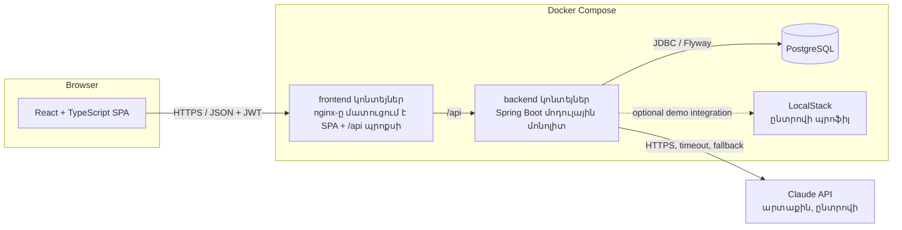
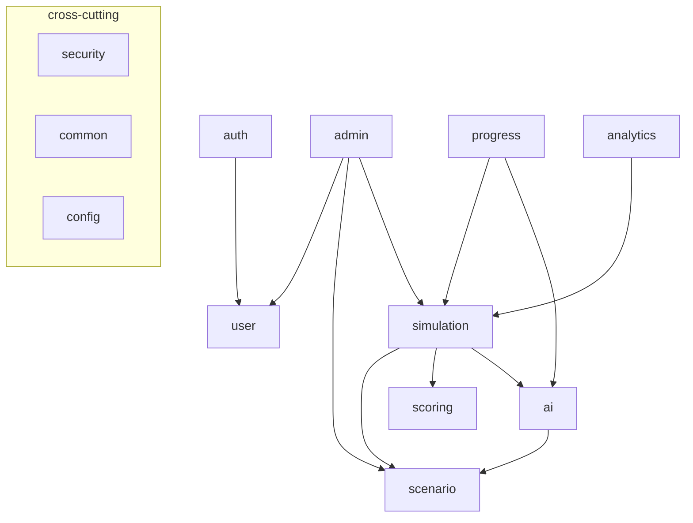
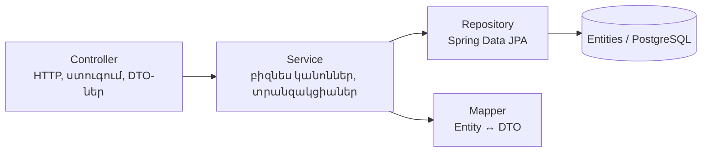
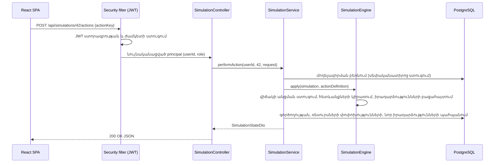

> Թարգմանություն՝ [English version](../en/04-system-architecture.md)

# 04 — Համակարգի ճարտարապետություն

## 1. Բարձր մակարդակի ճարտարապետություն

Backend-ը միակ բաղադրիչն է, որը հաղորդակցվում է տվյալների բազայի և AI մատակարարի հետ։
Դիտարկիչը երբեք չի տեսնում AI API բանալին։

## 2. Ճարտարապետական ոճ. մոդուլային մոնոլիտ (modular monolith)

### ADR-1 — Մոդուլային մոնոլիտ
- **Որոշում.** Մեկ Spring Boot հավելված՝ ներքուստ բաժանված ֆունկցիոնալ մոդուլների (փաթեթների)։
- **Ինչու.** Հավելվածն ունի մի քանի տրամաբանական տիրույթներ (նույնականացում, սցենարներ, մոդելավորումներ, AI, վերլուծություն),
  սակայն համալսարանական նախագծի ծանրաբեռնվածությունը և մեկ նոութբուքի վրա աշխատելու պահանջը չեն
  արդարացնում միկրոծառայությունների (microservices) շահագործման ծախսերը։
- **Ինչպես.** Յուրաքանչյուր մոդուլ վերին մակարդակի փաթեթ է՝ իր սեփական controller / service / repository /
  entity / dto / mapper դասերով։ Մոդուլները միմյանց կանչում են միայն հանրային ծառայողական մեթոդների միջոցով։
- **Այլընտրանք.** Միկրոծառայություններ։
- **Մերժման պատճառը.** Դրանք կավելացնեին ծառայությունների հայտնաբերում, բաշխված տրանզակցիաներ, ծառայությունների միջև
  նույնականացում, մի քանի տեղակայումներ և ցանցային խափանումների ռեժիմներ՝ առանց որևէ օգուտի այս մասշտաբում։
  Մոդուլային կառուցվածքը պահպանում է հետագայում մոդուլ (օրինակ՝ `ai`) առանձնացնելու հնարավորությունը։

### ADR-2 — Փաթեթավորում ըստ ֆունկցիոնալության, յուրաքանչյուրի ներսում՝ շերտավորված
- **Որոշում.** `am.cybersim.<module>`՝ `dto` և (անհրաժեշտության դեպքում) `mapper` ենթափաթեթներով.
  controller-ները, service-ները, repository-ները և entity-ները գտնվում են մոդուլի փաթեթում։
- **Ինչու.** «Մոդելավորումների» հետ կապված ամեն ինչ մեկ տեղում է. շերտավորման կանոնները դեռևս պահպանվում են
  (controller → service → repository)։
- **Այլընտրանք.** Փաթեթավորում ըստ շերտերի (`controllers/`, `services/`, …)։ Մերժվել է, քանի որ մեկ
  ֆունկցիոնալության փոփոխությունները շոշափում են բազմաթիվ հեռավոր փաթեթներ, և մոդուլների սահմանները վերանում են։

## 3. Մոդուլներ

| Մոդուլ | Պատասխանատվություն |
|--------|---------------|
| `security` | Spring Security ֆիլտրերի շղթա, JWT-ի կոդավորում/վերծանում, ընթացիկ օգտատիրոջ որոշում |
| `auth` | Գրանցում, մուտք, `me` վերջնակետ |
| `user` | `User` entity, դերեր, օգտատերերի հարցումներ. օգտատերերի կառավարում ադմինիստրատորի կողմից |
| `scenario` | Սցենարների ձևանմուշներ՝ ռեսուրսներ, իրադարձություններ, գործողություններ, հուշումներ, նպատակներ. ուսանողական կատալոգ + ադմինիստրատորի խմբագրիչ. JSON սկզբնական տվյալների ներմուծում |
| `simulation` | Մոդելավորման նմուշներ, վիճակների մեքենա (շարժիչ), գործողություններ, իրադարձություններ, արդյունքներ |
| `scoring` | Դետերմինիստիկ գնահատման շարժիչ, կարգավորելի կանոններ |
| `ai` | `AiProvider` աբստրակցիա, Claude + կեղծ (mock) մատակարարներ, հուշագրերի կառուցում, արդյունքի ստուգում, փոխազդեցությունների մատյանավորում |
| `progress` | Ուսանողի պատմություն, առաջընթաց ըստ կատեգորիաների, առաջարկություններ |
| `analytics` | Ադմինիստրատորի վիճակագրություն և տարածված սխալներ |
| `admin` | Միայն ադմինիստրատորի համար նախատեսված REST controller-ներ, որոնք պատվիրակում են մոդուլների ծառայություններին |
| `common` | Բացառությունների գլոբալ մշակում, սխալի պատասխանի ձևաչափ, ընդհանուր բացառություններ |
| `config` | OpenAPI, CORS, ժամացույց, հավելվածի հատկություններ |

## 4. Շերտեր

Կանոններ.
- Controller-ները բիզնես տրամաբանություն չեն պարունակում. դրանք ստուգում են մուտքային տվյալները, կանչում են մեկ ծառայողական մեթոդ և վերադարձնում DTO-ներ։
- Service-ները տիրապետում են տրանզակցիաներին (`@Transactional`) և կիրառում են տվյալներից կախված սեփականության/թույլտվության կանոնները։
- Entity-ները երբեք չեն վերադարձվում controller-ներից (ADR-3)։

### ADR-3 — DTO-ներ API-ում entity-ների փոխարեն
- **Ինչու.** Կանխում է ներքին դաշտերի արտահոսքը (գաղտնաբառի հեշ, ակնկալվող գործողություններ, միավորներ), խուսափում է ծույլ բեռնման (lazy-loading)
  խնդիրներից JSON սերիալիզացիայի ժամանակ և թույլ է տալիս API-ին զարգանալ սխեմայից անկախ։
- **Ինչպես.** Java `record` DTO-ներ, որոնք արտապատկերվում են ձեռքով գրված փոքր mapper դասերով։
- **Այլընտրանք.** MapStruct։ Առայժմ մերժված է. արտապատկերումները փոքր են, իսկ ձեռքով գրված mapper-ները
  ավելի հեշտ են ընթերցվում թեզում։ Կարող է ներդրվել ավելի ուշ՝ առանց API-ի փոփոխությունների։

## 5. Հիմնական ճարտարապետական որոշումներ (ամփոփում)

| ADR | Որոշում | Հիմնական պատճառ |
|-----|----------|-------------|
| ADR-1 | Մոդուլային մոնոլիտ | Պարզություն, աշխատում է մեկ մեքենայի վրա |
| ADR-2 | Փաթեթավորում ըստ ֆունկցիոնալության | Մոդուլների հստակ սահմաններ |
| ADR-3 | DTO-ների առանձնացում | Անվտանգություն, API-ի կայունություն |
| ADR-4 | Առանց վիճակի JWT (Spring OAuth2 resource server, HS256) | SPA + REST՝ առանց սերվերային սեսիաների |
| ADR-5 | Սցենարները տվյալներ են (`ScenarioDefinition` JSON/ռելյացիոն), շարժիչը՝ ընդհանրական | Նոր սցենարներ՝ առանց նոր կոդի. AI տարբերակների հնարավորություն |
| ADR-6 | Դետերմինիստիկ գնահատում. AI-ը միայն բացատրում է | Վերարտադրելի գնահատականներ, AI-ի արդյունքը ոչ վստահելի է |
| ADR-7 | Մոդելավորված ամպային ռեսուրսներ PostgreSQL-ում. LocalStack-ը՝ միայն ընտրովի | Դետերմինիզմ, անվտանգություն, գործարկման հեշտություն |
| ADR-8 | `AiProvider` ինտերֆեյս՝ Claude և կեղծ (mock) իրականացումներով | Աշխատում է առանց API բանալու, թեստավորելի է |
| ADR-9 | Flyway SQL միգրացիաներ | Ընթեռնելի, տարբերակավորված սխեմա |

### ADR-5 — Սցենարը որպես տվյալ (scenario-as-data)
- **Ինչ.** Սցենարը նկարագրվում է մեկ `ScenarioDefinition` փաստաթղթով (ռեսուրսներ, իրադարձություններ, գործողություններ,
  հուշումներ, …)։ Նույն կառուցվածքն օգտագործվում է (1) `backend/src/main/resources/scenarios/*.json` սկզբնական տվյալների ֆայլերի,
  (2) ադմինիստրատորի սցենարների խմբագրիչի API-ի և (3) AI-ի ստեղծած տարբերակների համար։
- **Ինչու.** Մոդելավորման շարժիչը չի պարունակում սցենարին հատուկ որևէ `if` պայման, ուստի ադմինիստրատորները
  կարող են ավելացնել սցենարներ առանց ծրագրավորման, իսկ մեկ ստուգիչը պաշտպանում է մուտքի բոլոր երեք կետերը։
- **Այլընտրանք.** Մեկ Java դաս յուրաքանչյուր սցենարի համար (strategy ձևանմուշ)։ Մերժվել է. յուրաքանչյուր նոր սցենար
  կպահանջեր ծրագրավորող և վերատեղակայում, իսկ AI տարբերակներն անհնար կլիներ ընդհանրական կերպով ստուգել։

### ADR-7 — Մոդելավորված ռեսուրսներ իրական ամպային ծառայությունների փոխարեն
- **Ինչ.** Ամպային ռեսուրսները (վիրտուալ մեքենաներ, IAM օգտատերեր, բաքեթներ, անվտանգության խմբեր) տողեր են (`simulation_resources`),
  որոնց կարգավիճակը փոխվում է գործողությունների միջոցով (օրինակ՝ `RUNNING → ISOLATED`)։
- **Ինչու.** Դետերմինիստիկ է (թեստավորելի գնահատում), անվտանգ (իրական ոչինչ չի գրոհվում կամ փոփոխվում), արագ և անվճար։
- **LocalStack.** հասանելի է որպես ընտրովի Docker Compose պրոֆիլ (`--profile localstack`)՝ հետագա
  ընդլայնման համար (օրինակ՝ սցենարի բաքեթի արտացոլում էմուլյացված S3-ում)։ Հիմնական հարթակը կախված չէ դրանից,
  ուստի բացակայող/դանդաղ LocalStack-ը երբեք չի կարող խափանել ուսուցման սեսիան կամ թեզի ցուցադրությունը։
- **Այլընտրանք.** Սցենարների կատարում LocalStack-ի կամ իրական AWS հաշվի վրա։ Մերժվել է որպես հիմնական
  մեխանիզմ. իրական API կանչերը արդյունքները դարձնում են ոչ դետերմինիստիկ, ավելի դանդաղ և դժվար թեստավորելի, իսկ իրական հաշիվները
  արժեն գումար և ռիսկ են պարունակում։

## 6. Հարցման հիմնական հոսքը (օրինակ՝ գործողության կատարում)

