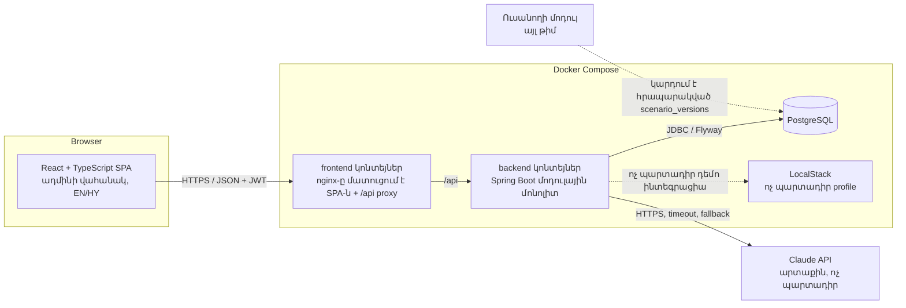
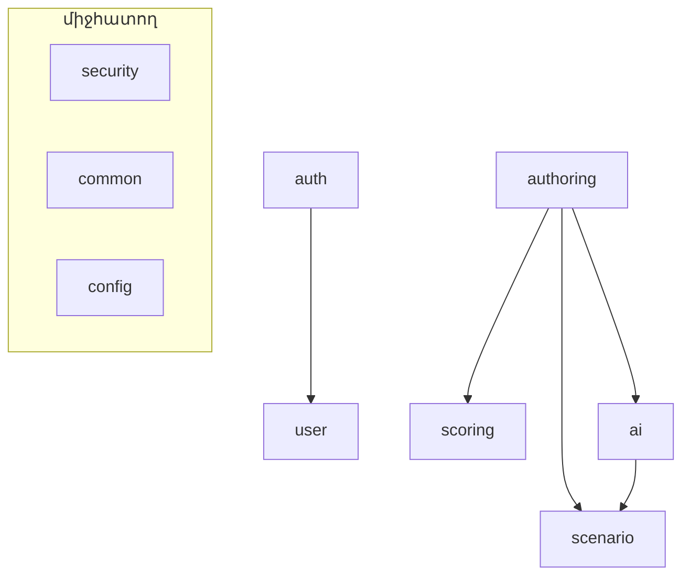
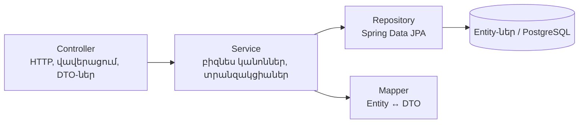
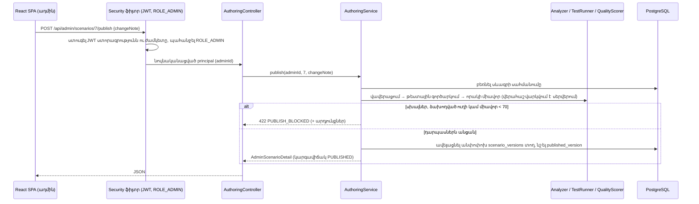

> Թարգմանություն՝ [English version](../en/04-system-architecture.md)

# 04 — Համակարգի ճարտարապետություն

> Ծավալ. **ադմինիստրատորի սցենարների հեղինակման հարթակը** (տե՛ս [17-admin-authoring-platform.md](17-admin-authoring-platform.md))։
> Ուսանողին ուղղված սիմուլյացիայի միջավայրը մշակվում է թիմի մյուս անդամի մոդուլում և այս ճարտարապետության մաս չէ։

## 1. Բարձր մակարդակի ճարտարապետություն

Backend-ը միակ բաղադրիչն է, որը խոսում է տվյալների բազայի և AI մատակարարի հետ. դիտարկիչը երբեք չի տեսնում AI
API բանալին։ Ուսանողի մոդուլին հանձնման կետը `scenario_versions` աղյուսակն է՝ հրապարակված սցենարների անփոփոխ,
որակի դարպասներով անցած պատճենները։

## 2. Ճարտարապետական ոճ. մոդուլային մոնոլիտ

### ADR-1 — Մոդուլային մոնոլիտ
- **Որոշում.** Մեկ Spring Boot հավելված՝ ներսում բաժանված ֆունկցիոնալ մոդուլների (փաթեթների)։
- **Ինչու.** Հավելվածն ունի մի քանի տրամաբանական տիրույթ (նույնականացում, սցենարի տվյալների մոդել, հեղինակման
  փուլաշար, AI, գնահատում), բայց համալսարանական նախագծի ծավալը և մեկ նոթբուքի վրա աշխատելու պահանջը չեն
  արդարացնում միկրոսերվիսների գործառնական ծախսը։ Սկզբնական պահանջը հեղինակման փուլաշարը նկարագրում է որպես
  առանձին ծառայություն. այստեղ փուլաշարի յուրաքանչյուր քայլ Spring բաղադրիչ է մեկ տեղակայվող միավորի մեջ՝ նույն
  պատասխանատվությունները, առանց լրացուցիչ ցանցային կանչերի կամ երկրորդ տվյալների բազայի։
- **Ինչպես.** Յուրաքանչյուր մոդուլ վերին մակարդակի փաթեթ է՝ իր controller / service / repository / entity /
  dto / mapper դասերով։ Մոդուլները միմյանց կանչում են միայն հանրային service մեթոդներով։
- **Այլընտրանք.** Միկրոսերվիսներ (օրինակ՝ առանձին գեներացման/վավերացման ծառայություն)։
- **Մերժման պատճառ.** Դրանք կավելացնեին service discovery, բաշխված տրանզակցիաներ, միջսերվիսային նույնականացում,
  մի քանի տեղակայում և ցանցային ձախողման ռեժիմներ՝ առանց օգուտի այս մասշտաբում։ Մոդուլային կառուցվածքը պահում է
  հնարավորությունը հետագայում առանձնացնել մոդուլ (օրինակ՝ `authoring`)։

### ADR-2 — Փաթեթավորում ըստ ֆունկցիայի, շերտավորում յուրաքանչյուր ֆունկցիայի ներսում
- **Որոշում.** `am.cybersim.<module>`՝ `dto` և (անհրաժեշտության դեպքում) `mapper` ենթափաթեթներով.
  controller-ները, service-ները, repository-ներն ու entity-ները գտնվում են մոդուլի փաթեթում։
- **Ինչու.** «Հեղինակման» մասին ամեն ինչ մեկ տեղում է. շերտային կանոնները շարունակում են պահպանվել
  (controller → service → repository)։
- **Այլընտրանք.** Փաթեթավորում ըստ շերտի (`controllers/`, `services/`, …)։ Մերժվել է, քանի որ մեկ ֆունկցիայի
  փոփոխությունը դիպչում է բազմաթիվ հեռավոր փաթեթների, և մոդուլների սահմաններն անհետանում են։

## 3. Մոդուլներ

| Մոդուլ | Պատասխանատվություն |
|--------|---------------|
| `security` | Spring Security ֆիլտրերի շղթա, JWT կոդավորում/ապակոդավորում, ընթացիկ օգտատիրոջ որոշում (`AuthUser`) |
| `auth` | Մուտք և `me` վերջնակետ (ինքնագրանցում չկա — `ADMIN` հաշիվները ստեղծում է օպերատորը) |
| `user` | `User` entity (միայն `ADMIN` դեր), դեմո հաշվի սկզբնավորիչ |
| `scenario` | Սցենարի տվյալների մոդելը. `Scenario` + նպատակներ/ռեսուրսներ/իրադարձություններ/գործողություններ/հուշումներ, `ScenarioDefinition` JSON, `ScenarioDefinitionValidator`, `ScenarioVersion` (հրապարակված անփոփոխ պատճեններ), seed ներմուծում |
| `authoring` | Հեղինակման փուլաշարը. `ScenarioGeneratorService`, `ScenarioGraph`, `ScenarioAnalyzer`, `ScenarioTestRunner`, `QualityScorer`, `AuthoringService` (կյանքի ցիկլ, հրապարակում, տարբերակներ), `AuthoringController` |
| `scoring` | Դետերմինիստիկ `ScoringEngine` + `ScoreResult`. օգտագործվում է թեստային գործարկչի կողմից, և հենց այն կանոններն են, որոնք կիրառում է ուսանողի մոդուլը |
| `ai` | `AiProvider` աբստրակցիա, Claude + mock մատակարարներ, հուշագրերի կառուցում, ելքի վավերացում, փոխազդեցությունների աուդիտ. `ScenarioVariationService`, `TranslationService`/`TranslationController` |
| `common` | Սխալների գլոբալ մշակում, սխալի պատասխանի ձևաչափ, ընդհանուր բացառություններ |
| `config` | OpenAPI, CORS, ժամացույց, հավելվածի հատկություններ |

API-ն բացում են երեք controller-ներ. `AuthController` (`/api/auth`), `AuthoringController`
(`/api/admin/scenarios/**`, `ADMIN` դեր) և `TranslationController` (`/api/ai/translate`, ցանկացած մուտք գործած
օգտատեր)։

## 4. Շերտեր

Կանոններ.
- Controller-ները բիզնես տրամաբանություն չեն պարունակում. վավերացնում են մուտքը, կանչում մեկ service մեթոդ և
  վերադարձնում DTO-ներ։
- Service-ները տնօրինում են տրանզակցիաները (`@Transactional`) և պարտադրում տվյալներից կախված կյանքի ցիկլի
  կանոնները (օրինակ՝ «հրապարակված սցենարը չի կարող ջնջվել»)։
- Entity-ները երբեք չեն վերադարձվում controller-ներից (ADR-3)։

### ADR-3 — DTO-ներ՝ entity-ների փոխարեն API-ում
- **Ինչու.** Կանխում է ներքին դաշտերի արտահոսքը (գաղտնաբառի հեշ), խուսափում է lazy-loading խնդիրներից JSON
  սերիալիզացիայի ժամանակ և թույլ է տալիս API-ին զարգանալ սխեմայից անկախ։
- **Ինչպես.** Java `record` DTO-ներ՝ քարտեզագրված փոքր, ձեռքով գրված mapper դասերով։
- **Այլընտրանք.** MapStruct։ Առայժմ մերժված է — քարտեզագրումները փոքր են, և ձեռքով գրված mapper-ներն ավելի
  ընթեռնելի են թեզում։ Հետագայում կարելի է ներմուծել առանց API փոփոխության։

## 5. Հիմնական ճարտարապետական որոշումներ (ամփոփում)

| ADR | Որոշում | Հիմնական պատճառ |
|-----|----------|-------------|
| ADR-1 | Մոդուլային մոնոլիտ | Պարզություն, աշխատում է մեկ մեքենայի վրա |
| ADR-2 | Փաթեթավորում ըստ ֆունկցիայի | Մոդուլների հստակ սահմաններ |
| ADR-3 | DTO տարանջատում | Անվտանգություն, API-ի կայունություն |
| ADR-4 | Stateless JWT (Spring OAuth2 resource server, HS256) | SPA + REST՝ առանց սերվերային սեսիաների |
| ADR-5 | Սցենարները տվյալ են (`ScenarioDefinition` JSON/ռելացիոն) | Նոր սցենարներ՝ առանց նոր կոդի. մեկ վավերացնող բոլոր մուտքի կետերի համար |
| ADR-6 | Դետերմինիստիկ գնահատում և որակի դարպասներ. AI-ն միայն բովանդակություն է առաջարկում | Վերարտադրելի արդյունքներ, AI-ի ելքը անվստահելի է |
| ADR-7 | Սիմուլյացված ամպային ռեսուրսներ՝ որպես սցենարի տվյալ. LocalStack-ը միայն ոչ պարտադիր | Դետերմինիզմ, անվտանգություն, հեշտ գործարկում |
| ADR-8 | `AiProvider` ինտերֆեյս՝ Claude և mock իրականացումներով | Աշխատում է առանց API բանալու, թեստավորելի |
| ADR-9 | Flyway SQL միգրացիաներ | Ընթեռնելի, տարբերակավորված սխեմա |
| ADR-10 | Հրապարակված սցենարները անփոփոխ `scenario_versions` տողեր են | Անվտանգ հանձնման պայմանագիր ուսանողի մոդուլին |
| ADR-13 | Սովորողի մոդուլը ինտեգրվում է ծառայական API-ով՝ ստուգվող ուղարկումներով | Հայտարարված միավորը ստուգվում է, երբեք չի վստահվում |

### ADR-5 — Սցենարը որպես տվյալ
- **Ինչ.** Սցենարը նկարագրվում է մեկ `ScenarioDefinition` փաստաթղթով (ռեսուրսներ, իրադարձություններ,
  գործողություններ, հուշումներ, նպատակներ, գնահատման կարգավորում)։ Նույն կառուցվածքը օգտագործվում է (1)
  seed/կաղապարային ֆայլերի (`backend/src/main/resources/scenarios/*.json`), (2) գեներատորի, (3) ադմինի խմբագրիչի
  API-ի, (4) AI վարիացիաների և (5) տարբերակի վերականգնման համար։
- **Ինչու.** Փուլաշարի ոչ մի քայլ սցենարին հատուկ `if` չի պարունակում, ուստի ադմինիստրատորները սցենարներ են
  ավելացնում առանց ծրագրավորման, իսկ մեկ վավերացնողը (`ScenarioDefinitionValidator`) պաշտպանում է բոլոր հինգ
  մուտքի կետերը։
- **Այլընտրանք.** Մեկ Java դաս յուրաքանչյուր սցենարի համար (strategy pattern)։ Մերժված է — ամեն նոր սցենար
  կպահանջեր ծրագրավորող և վերատեղակայում, իսկ գեներացված/AI բովանդակությունը հնարավոր չէր լինի ընդհանուր ձևով
  վավերացնել։

### ADR-6 — Դետերմինիստիկ փուլաշար, AI-ն միայն առաջարկում է
- **Ինչ.** Վավերացումը (`ScenarioAnalyzer`), թեստային գործարկումները (`ScenarioTestRunner`՝ դետերմինիստիկ
  `ScoringEngine`-ի վրա) և որակի միավորը (`QualityScorer`) սցենարի սահմանման մաքուր ֆունկցիաներ են։ AI-ն
  օգտագործվում է միայն բովանդակության նախագծման (գեներացիայի հղկում, վարիացիաներ) և ցուցադրվող տեքստի
  թարգմանության համար. նրա ելքը վերլուծվում, կառուցվածքով ստուգվում և նորից վավերացվում է, իսկ ձախողումը
  վերադառնում է դետերմինիստիկ նախագծին։
- **Ինչու.** Հրապարակման որոշումները պետք է լինեն վերարտադրելի և բացատրելի. քննողը (կամ ուսանողի մոդուլը) կարող
  է պահված սահմանումից նորից դուրս բերել յուրաքանչյուր դարպաս։

### ADR-7 — Սիմուլյացված ռեսուրսներ՝ իրական ամպային ծառայությունների փոխարեն
- **Ինչ.** Ամպային ռեսուրսները (VM-ներ, IAM օգտատերեր, պահեստներ, անվտանգության խմբեր) `scenario_resources`
  տողեր են, որոնք նկարագրում են միջադեպի *սկզբնական* վիճակը. գործողությունները իրենց ազդեցությունը հայտարարում
  են որպես տվյալ (`effect_status`)։
- **Ինչու.** Դետերմինիստիկ (թեստավորելի), անվտանգ (ոչինչ իրական չի հարձակվում կամ փոփոխվում), արագ և անվճար։
- **LocalStack.** հասանելի է որպես Docker Compose-ի ոչ պարտադիր profile (`--profile localstack`) ապագա
  ընդլայնման համար։ Հիմնական հարթակը դրանից կախված չէ։
- **Այլընտրանք.** Հեղինակում իրական AWS հաշվի վրա։ Մերժված է. ոչ դետերմինիստիկ, ավելի դանդաղ, արժե գումար և
  կրում է ռիսկ։

### ADR-10 — Անփոփոխ հրապարակված տարբերակները՝ որպես հանձնման պայմանագիր
- **Ինչ.** `publish`-ը սառեցնում է ամբողջական սահմանումը և նրա որակի հաշվետվությունը `scenario_versions` տողում
  (JSONB). դրանից հետո խմբագրումը փոխում է միայն սևագիրը։ Ուսանողի մոդուլը սպառում է հրապարակված տարբերակները,
  երբեք՝ սևագրերը։
- **Ինչու.** Երկու թիմերը կարող են աշխատել անկախ. կիսատ խմբագրված սևագիրը երբեք չի կարող հայտնվել ուսուցման
  մեջ, յուրաքանչյուր հրապարակված տարբերակ մնում է վերարտադրելի (գնահատականները հետագայում կարելի է նորից դուրս
  բերել), իսկ վատ խմբագրումը վերականգնելի է տարբերակի վերականգնմամբ։
- **Այլընտրանք.** Ուսանողի մոդուլը կարդում է կենդանի `scenarios` տողերը։ Մերժված է — սևագրի խմբագրումը կփոխեր
  ընթացիկ ուսուցումները հենց ընթացքում, իսկ պատմական միավորները կկորցնեին իրենց հղումային բովանդակությունը։

### ADR-13 — Սովորողի մոդուլի ծառայական API՝ սերվերային ստուգմամբ

- **Ինչ.** սովորողի մոդուլը `/api/learner/**`-ում նույնականանում է ստատիկ ծառայական բանալիով (`X-API-Key`,
  միջավայրի `LEARNER_API_KEY`, հաստատուն ժամանակով համեմատություն). կարդում է հրապարակված կատալոգը և
  սահմանումները, ուղարկում ավարտված փորձերը և հետ կարդում արդյունքներն ու գնահատումները։ Ուղարկման պահին
  հարթակը **վերարտադրում է ուղարկված գործողությունների հաջորդականությունը ամրագրված հրապարակված տարբերակի
  վրա** թեստային գործարկիչի նույն դետերմինիստիկ կանոններով և պահպանում իր սեփական միավորը. հայտարարված
  միավորը միայն համեմատվում է (`scoreMatches`), երբեք չի ընդունվում։
- **Ինչու բանալի, ոչ JWT.** սովորողի մոդուլը համակարգ է՝ մեկ ֆիքսված թույլտվությամբ, առանց ինտերակտիվ մուտքի
  և օգտատիրոջ կյանքի ցիկլի։ Երկու դերերը չեն կարող խաչվել. ադմինի JWT-ն մերժվում է `/api/learner/**`-ում,
  իսկ բանալին՝ `/api/admin/**`-ում։
- **Ինչու ստուգել սերվերում.** գնահատականը հասնում է թեզի վիճակագրությանը և AI գնահատմանը. հաճախորդի
  հաշվարկած թվին վստահելը երկուսն էլ կդարձներ անիմաստ։ Ստուգումը դետերմինիստիկ է և վերարտադրելի։
- **Այլընտրանքներ.** ուղարկված միավորին վստահելը (մերժված՝ անստուգելի է). հաղորդագրությունների հերթ
  (ավելորդ երկու մոդուլի համար մեկ ցանցում). mTLS (չափազանց ծանր համալսարանական նախագծի համար)։

## 6. Հիմնական հարցման հոսք (օրինակ՝ սցենարի հրապարակում)

