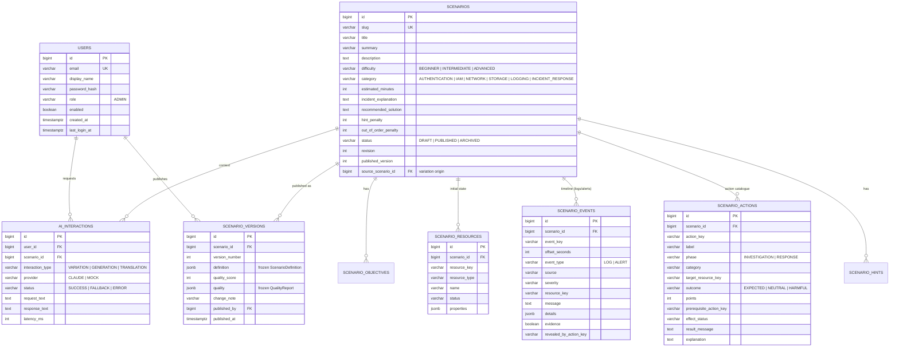

> Թարգմանություն՝ [English version](../en/05-database-design.md)

# 05 — Տվյալների բազայի նախագծում

PostgreSQL 17, սխեման կառավարվում է Flyway-ով (`backend/src/main/resources/db/migration`)։ Կա մեկ միգրացիա՝
`V1__initial_schema.sql`. սխեման վերաշարադրվել է ադմինիստրատորի հեղինակման ծավալի համար
(տե՛ս [17-admin-authoring-platform.md](17-admin-authoring-platform.md)), և մինչև առաջին արտադրական թողարկումը
մաքուր ելակետը ավելի հեշտ է վերանայել, քան պտույտի միգրացիաների շղթան։ **Գոյություն ունեցող բազաները պետք է
վերստեղծվեն** (`docker compose down -v`)։ Ուսանողի կողմի աղյուսակները (սիմուլյացիաներ, փորձեր, արդյունքներ,
առաջընթաց) տեղափոխվել են թիմի մյուս անդամի մոդուլ և այլևս այս սխեմայի մաս չեն։

## 1. Նախագծման սկզբունքներ

| Սկզբունք | Կիրառում |
|-----------|-------------|
| Նորմալացում (3NF) խմբագրվող տվյալների համար | Օգտատերերը, սցենարները և սցենարի հինգ ենթաաղյուսակները առանձին աղյուսակներ են՝ արտաքին բանալիներով։ |
| Սևագիր ընդդեմ հրապարակման | `scenarios`-ը (+ ենթաաղյուսակներ) **խմբագրվող աշխատանքային պատճենն** է. `scenario_versions`-ը պահում է **անփոփոխ հրապարակված պատճենները** որպես JSONB։ |
| `jsonb` միայն իսկապես փաստաթղթաձև տվյալների համար | Ռեսուրսների հատկությունները և իրադարձությունների մանրամասները (ձևը տարբեր է ըստ տեսակի), ինչպես նաև հրապարակված տարբերակի սառեցված սահմանումն ու որակի հաշվետվությունը։ Երբեք այն տվյալների համար, որոնցով զտում կամ միացնում ենք։ |
| Կայուն բնական բանալիներ սցենարի ներսում | `resource_key`, `event_key`, `action_key` (օր.՝ `vm-web-01`, `isolate-vm`) — ընթեռնելի կաղապարներում, հուշագրերում և կախվածությունների գրաֆում. եզակի են մեկ սցենարի սահմաններում։ |
| Ամբողջականությունը պարտադրում է բազան | `NOT NULL`, `CHECK` սահմանափակումներ enum-ների և միջակայքերի վրա (ներառյալ «միավորների նշանը համապատասխանում է արդյունքին»), եզակիության սահմանափակումներ, `ON DELETE CASCADE` միայն ծնողից դեպի իր զավակները։ |
| Սուռոգատ բանալիներ | `bigint GENERATED ALWAYS AS IDENTITY` հիմնական բանալիներ։ |

## 2. ER դիագրամ

(Դիագրամը ցույց է տալիս ամենակարևոր սյունակները. ամբողջական սահմանումը՝ `V1__initial_schema.sql`-ում։)

## 3. Աղյուսակներ և որոշումներ

### 3.1 `users`
- **Դերը որպես սյունակ՝ CHECK սահմանափակումով**, որը ներկայումս թույլատրում է միայն `ADMIN`։
  - Ինչու. այս հարթակն ունի օգտատիրոջ ուղիղ մեկ տեսակ։ CHECK-ի ընդլայնումը մեկ տողանոց միգրացիա է, եթե
    ուսանողի մոդուլը երբևէ կիսի այս աղյուսակը. `roles` + `user_roles` շատ-շատին զույգը կավելացներ երկու join՝
    առանց ֆունկցիոնալ օգուտի։
- Ինքնագրանցում չկա. հաշիվները ստեղծում է օպերատորը (`DemoDataInitializer`՝ միջավայրի փոփոխականներից)։
  `enabled`-ը թույլ է տալիս արգելափակել հաշիվը՝ առանց նրա աուդիտի հետքը ջնջելու։
- `email`-ը պահվում է փոքրատառ (պարտադրվում է նաև `ck_users_email_lower`-ով) և եզակի է → մեծատառերից անկախ
  մուտք։
- Գաղտնաբառը պահվում է միայն որպես BCrypt հեշ։

### 3.2 Սցենարի սևագրի աղյուսակներ
- `scenarios`-ը պահում է նկարագրական տվյալները, գնահատման կարգավորումը (`hint_penalty`,
  `out_of_order_penalty`) և **հեղինակման կյանքի ցիկլը**. `status` (`DRAFT → PUBLISHED → ARCHIVED`), `revision`
  (աճում է ամեն խմբագրման հետ), `published_version` (վերջին հրապարակված պատճենի համարը, `NULL`՝ երբեք
  չհրապարակված սևագրերի համար) և `source_scenario_id` (բնօրինակը, երբ սցենարը ստեղծվել է որպես AI վարիացիա)։
- `scenario_objectives` (կարգավորված ցանկ) — ուսումնական նպատակներ։
- `scenario_resources` — **ենթակառուցվածքի սկզբնական վիճակը** (VM-ներ, IAM օգտատերեր, պահեստներ, անվտանգության
  խմբեր)։
- `scenario_events` — **միջադեպի ժամանակագրությունը**. մատյանի տողեր և ահազանգեր՝ միջադեպի սկզբի նկատմամբ
  `offset_seconds`-ով։ `evidence = true`-ը նշում է գրառումները, որոնք ուսանողը պետք է գտնի.
  `revealed_by_action_key = NULL` նշանակում է տեսանելի է սկզբից, հակառակ դեպքում գրառումը տեսանելի է դառնում,
  երբ կատարվում է այդ հետաքննական գործողությունը (աստիճանական բացահայտում)։
- `scenario_actions` — **գործողությունների կատալոգը** գնահատման կանոններով։ `outcome`.
  - `EXPECTED` — ճիշտ լուծման մաս (դրական `points`),
  - `NEUTRAL` — անվնաս, բայց ավելորդ (0 միավոր. շեղող տարբերակ),
  - `HARMFUL` — կործանարար/սխալ (բացասական `points`)։
  Նշանի կանոնը պարտադրվում է `ck_scenario_actions_points`-ով հենց բազայում, ոչ միայն վավերացնողում։
  `prerequisite_action_key`-ն արտահայտում է խորհուրդ տրվող հերթականությունը. `effect_status`-ը
  `target_resource_key`-ի նոր կարգավիճակն է գործողությունից հետո։
- `scenario_hints` — ստատիկ հուշումներ՝ աճող մանրամասնությամբ. բովանդակություն, որը հանձնվում է ուսանողի
  մոդուլին։
- Ենթատողերը փոխարինվում են իրենց ծնողի հետ միասին ամեն խմբագրման ժամանակ (ագրեգատի իմաստաբանություն), ուստի
  `position`-ը գումարած սցենարի ներսում եզակի բանալիները լիովին նկարագրում են խմբագրումը։

### 3.3 `scenario_versions`
- Մեկ տող յուրաքանչյուր հրապարակման համար. `version_number` (եզակի ըստ սցենարի), **սառեցված
  `ScenarioDefinition`-ը որպես JSONB**, որակի միավորը և **սառեցված `QualityReport`-ը որպես JSONB**, ոչ պարտադիր
  փոփոխության նշում, հրապարակող ադմինը և ժամանակակնիքը։
- Ինչու JSONB պատճեններ՝ տարբերակավորված ռելացիոն տողերի փոխարեն. հրապարակված տարբերակը կարդացվում է որպես
  ամբողջական փաստաթուղթ (ադմինի UI-ի կողմից՝ վերանայման/վերականգնման համար, և ուսանողի մոդուլի կողմից՝ որպես
  ուսումնական բովանդակություն) և երբեք չի հարցվում դաշտ առ դաշտ. սառեցումը երաշխավորում է, որ հետագա
  խմբագրումները, նույնիսկ սևագրի աղյուսակների սխեմայի էվոլյուցիան, չեն կարող փոխել տարբերակի պարունակությունը։
- `published_by`-ը `ON DELETE SET NULL` է, ուստի հաշվի հեռացումը երբեք չի ոչնչացնում հրապարակված
  բովանդակությունը։
- Ջնջման կանոն (պարտադրվում է `ScenarioService`-ում). հրապարակված տարբերակ ունեցող սցենարը կարող է միայն
  արխիվացվել, երբեք՝ ջնջվել. տարբերակները հանձնման պայմանագիրն են և պետք է պահպանվեն։

### 3.4 `ai_interactions`
Յուրաքանչյուր AI հարցման աուդիտի մատյան. տեսակ (`VARIATION`, `GENERATION`, `TRANSLATION`), մատակարար
(`CLAUDE`/`MOCK`), կարգավիճակ (`SUCCESS`/`FALLBACK`/`ERROR`), հարցման/պատասխանի տեքստ, ուշացում և տոկենների
քանակ։ Պատասխանում է թեզի «կոնկրետ որտե՞ղ է օգտագործվում AI-ը, և ի՞նչ է այն վերադարձրել» հարցերին և դարձնում
պահուստային (fallback) վարքագիծը դիտարկելի։

### 3.5 `student_attempts` (ADR-13)

Մեկ տող՝ սովորողի մոդուլի ծառայական API-ով ուղարկած յուրաքանչյուր ավարտված քննության համար։ Երեք շերտերը
պահվում են առանձին. ինչ *ուղարկվել է* (`actions` JSONB, `claimed_score`), ինչ *ստուգել է* այս հարթակը
(`verification` JSONB՝ վերարտադրված քայլերով, և `verified_score`-ը՝ հեղինակային գնահատականը.
`score_matches`-ը նշում է կեղծ հայտարարությունը), և ինչ *ասել է* AI-ն ադմինիստրատորի պահանջով (`review`
JSONB՝ խորհրդատվական գնահատական, հաղորդագրություն, ուժեղ կողմեր, սխալներ, առաջարկություններ, աղբյուր)։
`external_id`-ը եզակի է, ուստի կրկնված ուղարկումը երկրորդ տող չի ստեղծում. `student_ref`-ը սովորողի մոդուլին
պատկանող անթափանց իդենտիֆիկատոր է — այս հարթակը ուսանողական հաշիվներ չի պահում։ `scenario_version`-ն
ամրագրում է ճշգրիտ հրապարակված տարբերակը, որի վրա խաղացվել է փորձը։

## 4. Ինդեքսներ

| Ինդեքս | Նշանակություն |
|-------|---------|
| `uq_users_email` եզակի | մուտքի որոնում, եզակիություն |
| `uq_scenarios_slug` եզակի | seed/կաղապարի ներմուծման idempotent լինելը |
| `ix_scenarios_status` | սցենարների ցանկ՝ զտված ըստ կյանքի ցիկլի կարգավիճակի |
| `uq_scenario_*_key` եզակի (scenario_id, key) | բնական բանալիների հղումային ամբողջականությունը մեկ սցենարի ներսում |
| `uq_scenario_versions` եզակի (scenario_id, version_number) | տարբերակների համարակալում, տարբերակի ուղիղ որոնում |
| `ix_ai_interactions_created` | աուդիտի մատյան՝ ըստ ժամանակի |

Ենթաաղյուսակների արտաքին բանալիները ծածկված են իրենց բաղադրյալ եզակի ինդեքսներով (`scenario_id`-ն առաջատար
սյունակն է), ուստի այս մասշտաբում առանձին FK ինդեքսներ պետք չեն։

## 5. Seed / դեմո տվյալներ

- **Սցենարները** գործարկման ժամանակ ներմուծվում են `resources/scenarios/*.json`-ից `ScenarioSeeder`-ի կողմից,
  երբ slug-ը դեռ գոյություն չունի, վավերացվում են ինչպես ցանկացած ադմինի մուտք և **հրապարակվում որպես
  տարբերակ 1** — այսպիսով թարմ բազան արդեն ցուցադրում է ամբողջ կյանքի ցիկլը և գեներատորին տալիս է նրա երեք
  ստուգված կաղապարները։
- **Ադմինի հաշիվը** ստեղծում է `DemoDataInitializer`-ը միայն երբ `APP_DEMO_DATA_ENABLED=true` է և գաղտնաբառի
  միջավայրի փոփոխականը նշված է. հակառակ դեպքում ոչինչ չի ստեղծվում։
