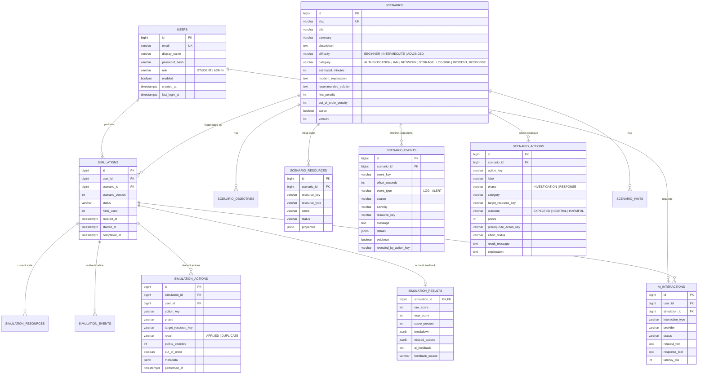

> Թարգմանություն՝ [English version](../en/05-database-design.md)

# 05 — Տվյալների բազայի նախագծում

PostgreSQL 17, սխեման կառավարվում է Flyway-ով (`backend/src/main/resources/db/migration`)։

## 1. Նախագծման սկզբունքներ

| Սկզբունք | Կիրառում |
|-----------|-------------|
| Նորմալացում (3NF) հիմնական տվյալների համար | Օգտատերերը, սցենարները, սցենարների ենթատվյալները, մոդելավորումները, գործողությունները առանձին աղյուսակներ են՝ արտաքին բանալիներով։ |
| Ձևանմուշ ընդդեմ նմուշի | `scenario_*` աղյուսակները *ձևանմուշն* են։ `simulation_*` աղյուսակները ուսանողի մեկ փորձի *նմուշն* են (ռեսուրսների պատճենում մեկնարկի պահին)։ |
| `jsonb`՝ միայն իսկապես ճկուն ատրիբուտների համար | Ռեսուրսների հատկություններ (տարբեր են ըստ ռեսուրսի տեսակի), իրադարձությունների մանրամասներ, գործողությունների մետատվյալներ, գնահատականի բաշխման պատկերահան (snapshot)։ Երբեք՝ այն տվյալների համար, որոնցով ֆիլտրում կամ միացում (join) ենք կատարում։ |
| Կայուն բնական բանալիներ սցենարի ներսում | `resource_key`, `event_key`, `action_key` (օրինակ՝ `vm-web-01`, `isolate-vm`)՝ ընթեռնելի սկզբնական տվյալների ֆայլերում, հուշագրերում և մատյաններում. եզակի են յուրաքանչյուր սցենարի սահմաններում։ |
| Արդյունքների պատկերահաններ | Գնահատականը և դրա բաշխումը սառեցվում են `simulation_results`-ում, որպեսզի սցենարի հետագա խմբագրումները չփոխեն պատմական գնահատականները։ |
| Տվյալների բազայի կողմից ապահովվող ամբողջականություն | `NOT NULL`, `CHECK` սահմանափակումներ թվարկումների (enum) և միջակայքերի վրա, եզակիության սահմանափակումներ, `ON DELETE CASCADE`՝ միայն ծնողից դեպի իրեն պատկանող զավակներ։ |
| Փոխարինող բանալիներ (surrogate keys) | `bigint GENERATED ALWAYS AS IDENTITY` առաջնային բանալիներ։ |

## 2. ER դիագրամ

(Դիագրամը ցույց է տալիս ամենակարևոր սյունակները. ամբողջական սահմանումը գտնվում է `V1__initial_schema.sql`-ում։)

## 3. Աղյուսակներ և որոշումներ

### 3.1 `users`
- **Դերը որպես սյունակ՝ CHECK սահմանափակմամբ**, առանձին `roles` աղյուսակի փոխարեն։
  - Ինչու. գոյություն ունի ճիշտ երկու ֆիքսված դեր, և յուրաքանչյուր օգտատեր ունի ճիշտ մեկ դեր։ `roles` +
    `user_roles` «շատ-շատին» աղյուսակը կավելացներ երկու միացում (join)՝ առանց ֆունկցիոնալ օգուտի։
  - Այլընտրանք. `roles` աղյուսակ։ Նախընտրելի կլիներ, եթե դերերը դառնային դինամիկ կամ օգտատերերին անհրաժեշտ լինեին մի քանի դերեր։
- `email`-ը պահվում է փոքրատառերով և ունի եզակի ինդեքս → մուտքը մեծատառ/փոքրատառից անկախ է։
- Գաղտնաբառը պահվում է միայն որպես BCrypt հեշ։

### 3.2 Սցենարի ձևանմուշի աղյուսակներ
- `scenarios`-ը պահում է նկարագրական տվյալներ և գնահատման կոնֆիգուրացիա (`hint_penalty`, `out_of_order_penalty`)։
- `scenario_objectives` (կարգավորված ցուցակ) — ուսուցման նպատակներ։
- `scenario_resources` — **ենթակառուցվածքի սկզբնական վիճակը** (վիրտուալ մեքենաներ, IAM օգտատերեր, բաքեթներ, անվտանգության խմբեր)։
- `scenario_events` — **միջադեպի ժամանակագրությունը**. մատյանային տողեր և ահազանգեր՝ միջադեպի սկզբի նկատմամբ
  `offset_seconds` շեղումով։ `evidence = true`-ն նշում է այն գրառումները, որոնք ապացույցներ են, և որոնք ուսանողը պետք է գտնի։
  `revealed_by_action_key` = `NULL` նշանակում է, որ գրառումը տեսանելի է սկզբից. հակառակ դեպքում գրառումը տեսանելի է դառնում, երբ
  ուսանողը կատարում է այդ հետաքննական գործողությունը (աստիճանական բացահայտում, progressive disclosure)։
- `scenario_actions` — ուսանողին ցուցադրվող **գործողությունների կատալոգը**։ `outcome`.
  - `EXPECTED` — ճիշտ լուծման մաս (դրական `points`),
  - `NEUTRAL` — անվնաս, բայց ավելորդ (0 միավոր. AI-ը նշում է որպես ավելորդ),
  - `HARMFUL` — կործանարար/սխալ (բացասական `points`)։
  `prerequisite_action_key`-ն արտահայտում է առաջարկվող հերթականությունը (օրինակ՝ *նույնականացնել*՝ *մեկուսացնելուց* առաջ)։
  `effect_status`-ը `target_resource_key`-ի նոր կարգավիճակն է գործողությունից հետո։
- `scenario_hints` — ստատիկ հուշումներ՝ աճող մանրամասնությամբ, որոնք օգտագործվում են կեղծ (mock) AI-ի կողմից և որպես պահուստային տարբերակ։
- `version`-ը մեծանում է յուրաքանչյուր խմբագրման ժամանակ. մոդելավորումը պահպանում է այն տարբերակը, որով այն սկսվել է։

### 3.3 Մոդելավորման նմուշի աղյուսակներ
- `simulations` — մեկ փորձ. `status`-ը հետևում է 08-simulation-engine-ում նկարագրված վիճակների մեքենային։
- `simulation_resources` — պատճենվում է `scenario_resources`-ից մեկնարկի պահին. գործողությունները փոխում են `status`-ը։
- `simulation_events` — *տվյալ* ուսանողին տեսանելի իրադարձությունները, որոնք նյութականացվում են տեսանելի դառնալու պահին
  (սկզբնական իրադարձությունները՝ մեկնարկի պահին, բացահայտված իրադարձությունները՝ հետաքննական գործողություններից հետո, գումարած համակարգային իրադարձություններ, ինչպես օրինակ
  *«Analyst isolated vm-web-01»*)։ Սա ուսանողի միջադեպի ժամանակագրությունն է։
- `simulation_actions` — ուսանողի կատարած յուրաքանչյուր գործողություն (FR-13), ներառյալ կրկնօրինակները և
  վնասակար գործողությունները, քանի որ դրանք անհրաժեշտ են AI վերլուծության և ադմինիստրատորի «տարածված սխալներ» տեսքի համար։
- `simulation_results` — 1:1 հարաբերություն ավարտված մոդելավորման հետ։ Գնահատականի բաշխումը և բաց թողնված գործողությունները
  պահվում են որպես `jsonb` **պատկերահաններ**։
  - Ինչու պատկերահան. գնահատականները չպետք է փոխվեն, եթե ադմինիստրատորը հետագայում խմբագրի միավորները։
  - Ինչու `jsonb`. բաշխումը միայն ցուցադրվում է և երբեք ռելյացիոն եղանակով հարցման չի ենթարկվում։

### 3.4 `ai_interactions`
AI-ի յուրաքանչյուր հարցման աուդիտի մատյան՝ տեսակ (`HINT`, `QUESTION`, `FEEDBACK`, `RECOMMENDATION`, `VARIATION`, `TRANSLATION`),
մատակարար (`CLAUDE`, `MOCK`), կարգավիճակ (`SUCCESS`, `FALLBACK`, `ERROR`), ուշացում, թոքենների քանակ,
ուսանողի հարցը և AI-ի պատասխանը։ Օգտագործվում է հուշումների տուգանքների, օգնականի զրույցի պատմության և
թեզում AI-ի հուսալիության վերլուծության համար։ Սցենարի ամբողջական համատեքստով հուշագրերը **չեն** պահպանվում
(չափի պատճառով, և քանի որ դրանք պարունակում են լուծումը)։

## 4. Ինդեքսներ

| Ինդեքս | Նպատակ |
|-------|---------|
| `users(email)` եզակի | Որոնում մուտքի ժամանակ |
| `scenarios(slug)` եզակի | Սկզբնական տվյալների ներմուծման իդեմպոտենտություն |
| `scenarios(active)` | Ուսանողական կատալոգ |
| `scenario_*(scenario_id, *_key)` եզակի | Բանալիների եզակիություն սցենարի ներսում + որոնում |
| `simulations(user_id, created_at desc)` | Ուսանողի պատմություն |
| `simulations(scenario_id, status)` | Ադմինիստրատորի փորձերի ֆիլտր, վերլուծություն |
| `simulation_actions(simulation_id, performed_at)` | Գործողությունների կարգավորված ցուցակ |
| `simulation_actions(action_key)` | Տարածված սխալների վիճակագրություն |
| `simulation_events(simulation_id, offset_seconds)` | Ժամանակագրություն |
| `ai_interactions(simulation_id, created_at)` | Զրույցի պատմություն, հուշումների քանակ |

## 5. Սկզբնական / ցուցադրական տվյալներ
- **Սցենարները** բեռնվում են JSON ֆայլերից (`resources/scenarios/*.json`) `ScenarioSeeder`-ի կողմից գործարկման ժամանակ,
  միայն եթե նույն `slug`-ով սցենար գոյություն չունի։ Ինչու ոչ SQL միգրացիա. սցենարի բովանդակությունը երկար
  կառուցվածքային տեքստ է. JSON ֆայլերը շատ ավելի հեշտ է կազմել և վերանայել, և դրանք անցնում են նույն ստուգիչով,
  ինչ ադմինիստրատորի խմբագրիչը։
- **Ցուցադրական օգտատերերը** (մեկ ադմինիստրատոր, մեկ ուսանող) ստեղծվում են `DemoDataInitializer`-ի կողմից, երբ
  `APP_DEMO_DATA_ENABLED=true`, միջավայրի փոփոխականներից վերցված գաղտնաբառերով. SQL-ում հավատարմագրեր չկան։
