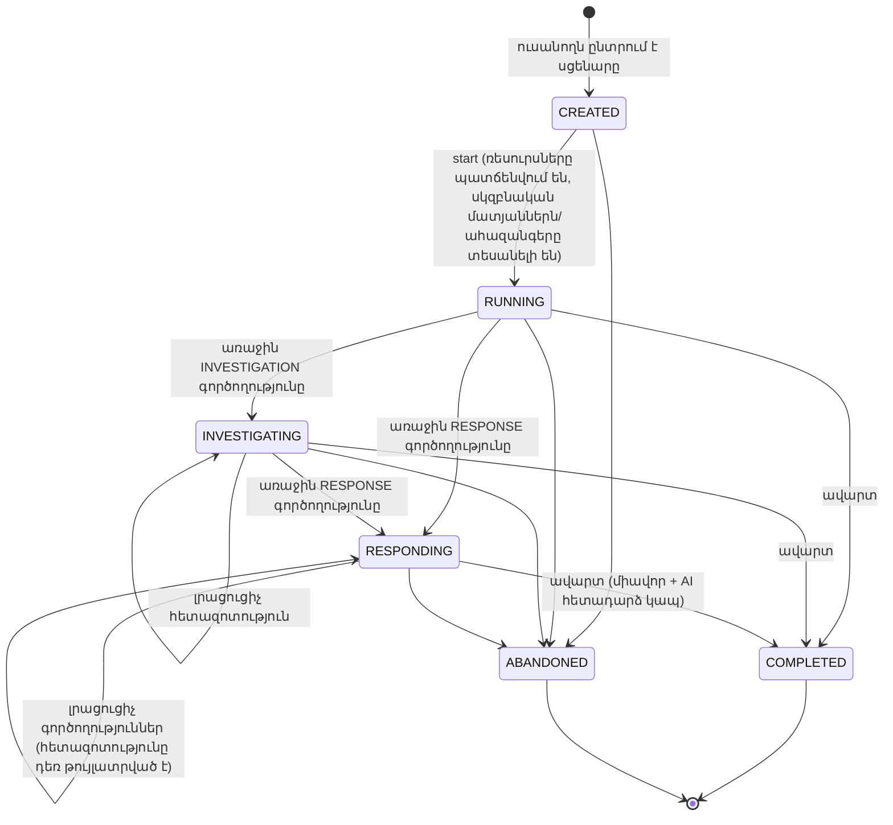
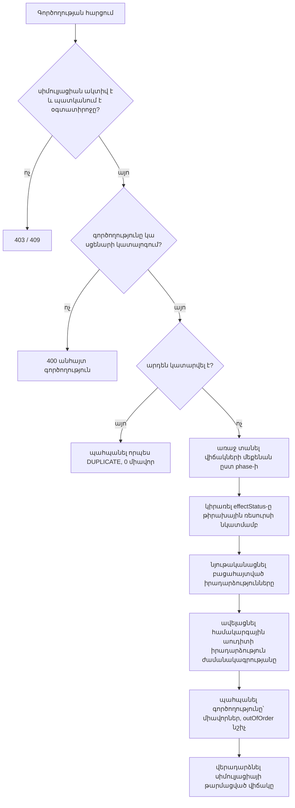

> Թարգմանություն՝ [English version](../en/08-simulation-engine.md)

# 08 — Սիմուլյացիայի շարժիչ

## 1. Պատասխանատվություններ

Սիմուլյացիայի շարժիչը **սցենարի ձևանմուշը** վերածում է մեկ ուսանողի համար նախատեսված **գործող, անձնական սիմուլյացիայի**,
կիրառում է դրա նկատմամբ ուսանողի գործողությունները և վերջում գնահատում արդյունքը։
Այն ընդհանրական է. չի պարունակում որևէ սցենարին հատուկ կոդ (ADR-5)։ Ամբողջ վարքագիծը ստացվում է սցենարի տվյալներից։

| Բաղադրիչ | Դաս | Պատասխանատվություն |
|-----------|-------|---------------|
| Վիճակների մեքենա (state machine) | `SimulationStatus`, `SimulationStateMachine` | Կյանքի ցիկլի թույլատրելի անցումներ |
| Շարժիչ | `SimulationEngine` | Սիմուլյացիայի մեկնարկ, գործողության կիրառում (էֆեկտներ, բացահայտված իրադարձություններ), գործողությունների արդյունքների ձևավորում |
| Սերվիս | `SimulationService` | Տրանզակցիաներ, սեփականության ստուգումներ, պահպանում, գնահատման և AI-ի հետ համակարգում (orchestration) |
| Գնահատում | `ScoringEngine` | Դետերմինիստիկ միավոր՝ կատարված գործողություններից + գնահատման կանոններից |

## 2. Կյանքի ցիկլ



Նախագծային որոշումներ.
- **Վիճակները շարժվում են միայն առաջ։** Արձագանքման ընթացքում հետազոտությանը վերադառնալը թույլատրված է (իրական վերլուծաբաններն
  այդպես են անում), սակայն վիճակը մնում է `RESPONDING`։ Դա պահպանում է վիճակի իմաստը («ուսանողն սկսել է
  արձագանքել») և անցումների աղյուսակը փոքր է պահում։
- **`CREATED`-ը և `RUNNING`-ը առանձին են**, որպեսզի ուսանողը նախ կարդա ներածական տեղեկանքը (briefing). միջադեպի
  ժամացույցը (`started_at`) սկսում է աշխատել միայն այն ժամանակ, երբ նա սեղմում է *Begin*։
- **Յուրաքանչյուր ուսանողի համար՝ մեկ ակտիվ փորձ յուրաքանչյուր սցենարում։** Ակտիվ սիմուլյացիայի առկայության դեպքում նորի ստեղծումը վերադարձնում է
  գոյություն ունեցողը (վերսկսում)՝ զուգահեռ փորձեր ստեղծելու փոխարեն։
- Անվավեր անցումները (օրինակ՝ գործողություն `COMPLETED` սիմուլյացիայի վրա) մերժվում են **409 Conflict** պատասխանով։

## 3. Գործողություններ

Յուրաքանչյուր սցենար սահմանում է **գործողությունների կատալոգ**։ Ուսանողն ընտրում է միայն այս կատալոգից. ազատ ձևի
հրամանների կատարում չկա (անվտանգության պահանջ — ոչինչ չի կարող «կատարվել»)։

| Դաշտ | Նշանակություն |
|-------|---------|
| `actionKey` | Եզակի բանալի, օրինակ՝ `inspect-auth-log`, `isolate-vm` |
| `phase` | `INVESTIGATION` կամ `RESPONSE` — ղեկավարում է վիճակների մեքենան |
| `category` | `INSPECT`, `IDENTIFY`, `CONTAIN`, `ERADICATE`, `RECOVER`, `HARDEN` — օգտագործվում է վերլուծության մեջ |
| `targetResourceKey` | Ռեսուրսը, որի նկատմամբ կիրառվում է գործողությունը (ոչ պարտադիր) |
| `outcome` | `EXPECTED`, `NEUTRAL`, `HARMFUL` (թաքցված է ուսանողից) |
| `points` | Միավորներ սպասվող գործողության համար / տուգանք վնասակար գործողության համար (թաքցված) |
| `prerequisiteActionKey` | Առաջարկվող նախորդ գործողությունը (հերթականության կանոն) |
| `effectStatus` | Թիրախային ռեսուրսի նոր կարգավիճակը, օրինակ՝ `ISOLATED`, `DISABLED`, `PRIVATE` |
| `revealed events` | Այն իրադարձությունները, որոնց `revealedByActionKey`-ը հավասար է այս գործողությանը, դառնում են տեսանելի |
| `resultMessage` | Սիմուլյացված վահանակային ելք, որը ցուցադրվում է ուսանողին |

Գործողության կիրառում (`SimulationEngine.apply`).



## 4. Իրադարձություններ և ժամանակագրություն

- Սցենարի իրադարձություններն ունեն `offsetSeconds`՝ միջադեպի սկզբի նկատմամբ։
- Մեկնարկի ժամանակ շարժիչը հաշվում է `incidentStart = startedAt − (maxOffset + 60 s)`, որպեսզի մատյանների ժամանակադրոշմները
  իրատեսական տեսք ունենան («հարձակումը տեղի է ունեցել ձեզ կանչելուց առաջ վերջին րոպեներին»)։
- `revealedByActionKey = null` ունեցող իրադարձությունները նյութականացվում են անմիջապես, մնացածները՝ երբ կատարվում է համապատասխան
  հետազոտական գործողությունը։ Սա մոդելավորում է *ճիշտ մատյանային աղբյուրն ուսումնասիրելու* իրական աշխատանքը։
- Արձագանքման գործողություններն ավելացնում են **համակարգային իրադարձություն** (աղբյուր՝ `analyst-console`), որպեսզի ժամանակագրությունը ցույց տա և՛ հարձակվողի,
  և՛ պաշտպանի գործունեությունը։

## 5. Գնահատում

`ScoringEngine`-ը մաքուր ֆունկցիա է՝ `score(scenario rules, performed actions, hintsUsed) → ScoreResult`։
Այն **չի** օգտագործում AI (ADR-6)։

| Կանոն | Միավորներ (կարգավորելի ըստ գործողության / սցենարի) |
|------|--------------------------------------------|
| Սպասվող գործողությունը կատարված է (առաջին անգամ) | գործողության `+points` |
| Սպասվող գործողությունը կատարված է իր նախապայմանից առաջ | `+points − outOfOrderPenalty` (նվազագույնը 0) |
| Չեզոք (ոչ անհրաժեշտ) գործողություն | 0 (նշվում է որպես ոչ անհրաժեշտ) |
| Վնասակար գործողություն | `points` (բացասական, օրինակ՝ −10) |
| Կրկնվող գործողություն | 0 |
| Օգտագործված AI հուշում | `−hintPenalty` յուրաքանչյուր հուշման համար |

```
maxScore     = Σ points of EXPECTED actions
rawScore     = Σ awarded points − hintsUsed × hintPenalty
scorePercent = clamp(round(rawScore × 100 / maxScore), 0, 100)
missed       = EXPECTED actions not performed
```

Ինչու են միավորները պահվում գործողությունների վրա. ադմինիստրատորը կարգավորում է սցենարի գնահատումը խմբագրիչի նույն տողում, որտեղ
սահմանվում է հենց գործողությունը։ Պահանջներում բերված կշռավորման օրինակը (նույնականացում +20, վտանգված ռեսուրս +15,
մատյանների հետազոտում +10, զսպում +20, հավատարմագրերի ռոտացիա +10, թույլտվությունների վերանայում +10, քայքայիչ −10,
հուշման տուգանք) վերարտադրված է սկզբնական սցենարներում։

## 6. Դետերմինիզմ և ապագա AI վարիացիա

Նույն սցենարի տարբերակի և գործողությունների նույն հաջորդականության դեպքում շարժիչը միշտ ստանում է նույն
վիճակը և միավորը։ AI վարիացիան (09-ai-integration, §5) փոխում է միայն սցենարի **պատճենի** *բովանդակությունը* (IP հասցեներ, անուններ,
ժամանակադրոշմներ, ձևակերպումներ). պատճենը պետք է անցնի նույն վավերացնողով, ուստի շարժիչը
և գնահատումը մնում են դետերմինիստիկ յուրաքանչյուր վարիացիայի համար։
