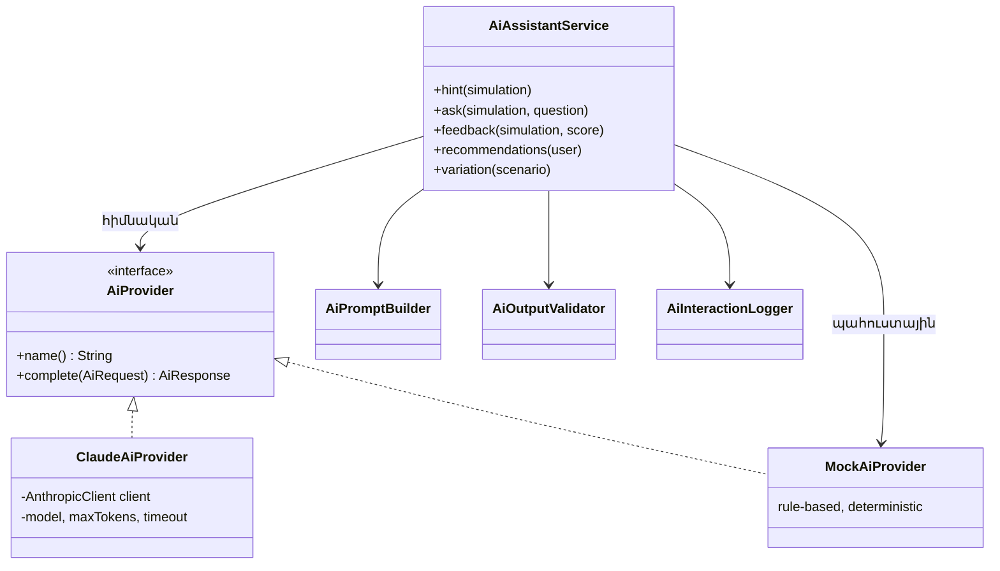
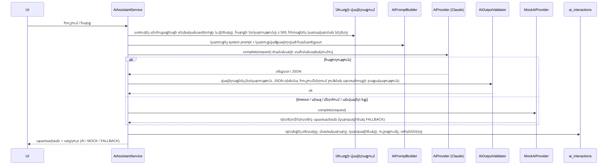

> Թարգմանություն՝ [English version](../en/09-ai-integration.md)

# 09 — AI-ի ինտեգրում

## 1. AI-ի դերը հարթակում

AI-ը էջին կցված չաթբոտ չէ։ Այն ունի չորս կոնկրետ խնդիր, որոնցից յուրաքանչյուրը սնվում է սիմուլյացիայի
կառուցվածքավորված համատեքստով.

| Հնարավորություն | Գործարկիչ | Մուտքային համատեքստ | Ելք | Ազդո՞ւմ է վիճակի վրա |
|-----------|---------|---------------|--------|----------------|
| A. Համատեքստային հուշում | Ուսանողը սեղմում է *Get hint* | սցենարի ներածական տեղեկանք, տեսանելի ապացույցներ, կատարված գործողություններ, վիճակ, հուշման համար | Կարճ հուշում (տեքստ) | Միայն ավելացնում է `hints_used`-ը (տուգանք) — որոշումը կայացնում է հավելվածի կոդը |
| A'. Հարց օգնականին | Ուսանողը հարց է տալիս | նույնը + հարցը | Պատասխան (տեքստ) | Ոչ |
| B. Սիմուլյացիայից հետո վերլուծություն | Սիմուլյացիան ավարտված է | սցենար, սպասվող գործողություններ, կատարված գործողություններ՝ հերթականությամբ/միավորներով, բաց թողնված գործողություններ, միավոր | Կառուցվածքավորված հետադարձ կապ՝ ամփոփում, ուժեղ կողմեր, բարելավումներ, բաց թողնված ապացույցներ, հերթականության խնդիրներ, ոչ անհրաժեշտ գործողություններ | Պահպանվում է միայն որպես հետադարձ կապի տեքստ. **միավորը հաշվարկվում է դետերմինիստիկ գնահատման շարժիչով, ոչ թե AI-ով** |
| C. Սցենարի վարիացիա | Ադմինիստրատորը սեղմում է *Generate variation* | Գոյություն ունեցող սցենարի սահմանում | Նոր `ScenarioDefinition` JSON | Պահպանվում է միայն վավերացումից հետո՝ որպես **ոչ ակտիվ սևագիր** |
| D. Ուսուցման առաջարկություններ | Ուսանողը բացում է առաջընթացի էջը | արդյունքներ ըստ կատեգորիաների, բաց թողնված գործողությունների կատեգորիաներ | Առաջարկվող թեմաների ցանկ՝ պատճառաբանությամբ | Ոչ |

## 2. Մատակարարի աբստրակցիա



### ADR-8 — `AiProvider` ինտերֆեյս՝ Claude և mock իրականացումներով
- **Ինչ.** Մեկ փոքր ինտերֆեյս՝ `AiResponse complete(AiRequest request)`, որտեղ հարցումը կրում է
  խնդրի տեսակը, համակարգային հուշագիրը (system prompt), օգտատիրոջ բովանդակությունը և ելքի սպասվող ձևաչափը։
- **Ինչու.** Հավելվածի մնացած մասը չգիտի, թե որ LLM-ն է օգտագործվում։ Mock մատակարարը հնարավորություն է տալիս
  գործարկել հարթակն առանց վճարովի բանալու և թեստերը դարձնում է դետերմինիստիկ։
- **Ընտրություն.** `AI_PROVIDER=claude|mock` (լռելյայն՝ `mock`)։ Եթե ընտրված է `claude`, բայց
  `ANTHROPIC_API_KEY`-ը դատարկ է, հավելվածը մատյանում գրանցում է նախազգուշացում և օգտագործում mock մատակարարը։
- **Այլընտրանքներ.** Spring AI (լրացուցիչ աբստրակցիայի շերտ և տարբերակային կախվածություն Spring Boot 4-ի milestone տարբերակներից.
  նախագծին անհրաժեշտ է կանչի միայն մեկ ձև). HTTP API-ի ուղղակի կանչ `RestClient`-ով
  (պաշտոնական SDK-ն արդեն մշակում է կրկնափորձերը, տիպավորված սխալները և մոդելի պարամետրերը)։

### Claude մատակարար
- Պաշտոնական **Anthropic Java SDK** (`com.anthropic:anthropic-java`)։
- Լռելյայն մոդել՝ **`claude-opus-5-5`**, կարգավորելի `AI_MODEL`-ի միջոցով
  (օրինակ՝ `claude-sonnet-5-5` կամ `claude-haiku-4-5`՝ ավելի ցածր արժեքի/ուշացման համար)։
- Ջանքի մակարդակը (effort) կարգավորելի է (`AI_EFFORT`, լռելյայն՝ `low`). հուշումները և հետադարձ կապը կարճ ուսուցողական տեքստեր են,
  ուստի ցածր ջանքը նվազեցնում է ուշացումը և արժեքը։
- Ժամանակի սահմանափակում՝ `AI_TIMEOUT_SECONDS` (լռելյայն՝ 30 վ), կրկնափորձերի սահմանափակ քանակ։
- Եթե մոդելը մերժում է հարցումը (`stop_reason = refusal`), պատասխանը դիտարկվում է որպես ձախողում, և
  օգտագործվում է պահուստային (fallback) մեխանիզմը։

### Mock մատակարար
Դետերմինիստիկ, կանոնների վրա հիմնված պատասխաններ՝ կառուցված սցենարի տվյալներից.
- **Հուշում.** հաջորդ սպասվող գործողությունը, որը դեռ չի կատարվել (նախապայմանների պահպանմամբ),
  վերաձևակերպված որպես *հարց/ուղղորդում*՝ օգտագործելով սցենարի ստատիկ հուշումները — առաջին հուշման դեպքում երբեք չի նշվում
  գործողության անվանումը, հաջորդ հուշումներն ավելի կոնկրետ են։
- **Հետադարձ կապ.** ուժեղ կողմեր = կատարված սպասվող գործողություններ, բարելավումներ = բաց թողնված սպասվող գործողություններ
  (դրանց բացատրությամբ), վնասակար և ոչ անհրաժեշտ գործողություններ, հերթականությունից դուրս կատարված գործողություններ։
- **Առաջարկություններ.** ամենացածր միջին միավորով / ամենաշատ բաց թողնված գործողություններով կատեգորիաները։
- **Վարիացիա.** IP հասցեների և ռեսուրսների անունների դետերմինիստիկ փոխարինում։

## 3. Հարցման հոսքը՝ անվտանգության վերահսկումներով



## 4. AI-ի անվտանգություն և հուսալիություն (պահանջ §9)

| Վերահսկում | Իրականացում |
|---------|---------------|
| Մուտքային տվյալների վավերացում | Bean Validation հարցի DTO-ի վրա (`@NotBlank`, `@Size(max=500)`). կառավարման նիշերը հեռացվում են. հարցը տեղադրվում է սահմանազատված `<student_question>` բլոկում, և համակարգային հուշագիրը նշում է, որ դրա բովանդակությունը տվյալ է, ոչ թե հրահանգ։ |
| Ելքային տվյալների վավերացում | Երկարության սահմանափակումներ. JSON վերլուծություն + սխեմայի ստուգումներ հետադարձ կապի և վարիացիաների համար. հուշման ստուգումը մերժում է այն պատասխանները, որոնք թվարկում են մեկից ավելի մնացած սպասվող գործողությունների ճշգրիտ պիտակները (լուծման արտահոսք) → պահուստային մեխանիզմ։ |
| Ժամանակի սահմանափակումներ | SDK հաճախորդի timeout (`AI_TIMEOUT_SECONDS`) և կրկնափորձերի փոքր քանակ։ |
| Սխալների մշակում | Մատակարարից ցանկացած բացառություն որսվում է `AiAssistantService`-ում. ուսանողը երբեք չի տեսնում 500՝ AI-ի պատճառով։ |
| Պահուստային վարքագիծ | Mock մատակարարի պատասխան՝ պատասխանում և մատյանում նշված որպես `FALLBACK`։ |
| Մատյանավորում (logging) | `ai_interactions` աղյուսակ + հավելվածի մատյանի տողեր՝ տեսակով, մատակարարով, կարգավիճակով, ուշացմամբ — առանց API բանալիների, առանց ամբողջական հուշագրերի։ |
| Կարգավորելի մատակարար | `AI_PROVIDER`, `AI_MODEL`, `AI_EFFORT`, `AI_TIMEOUT_SECONDS`, `ANTHROPIC_API_KEY`։ |
| Հրամանների կատարման բացակայություն | AI-ը գործիքներ (tools) չունի։ Դրա ելքը տեքստ կամ JSON է, որը վերլուծում է հավելվածը. միայն հավելվածը կարող է փոխել վիճակը։ |
| AI-ն առաջարկում է, հավելվածը՝ որոշում | Միավորը ստացվում է `ScoringEngine`-ից. վարիացիաները դառնում են ոչ ակտիվ սևագրեր, որոնք ադմինիստրատորը պետք է վերանայի և ակտիվացնի։ |

## 5. Սցենարի վարիացիա (վավերացված AI բովանդակություն)

1. Ադմինիստրատորը պահանջում է *S* սցենարի վարիացիա։
2. AI-ը ստանում է `ScenarioDefinition` JSON-ը և հրահանգներ՝ պահպանել բոլոր `*_key` արժեքները, փուլերը,
   ելքերը (outcomes) և միավորներն անփոփոխ. փոխել միայն անունները, IP հասցեները, օգտատերերի անունները, ժամանակային շեղումները
   (±20 %) և պատմողական ձևակերպումները։
3. Ելքը վերլուծվում է որպես `ScenarioDefinition` և վավերացվում `ScenarioDefinitionValidator`-ով
   (նույն վավերացնողը, ինչ ադմինիստրատորի խմբագրիչում) **գումարած** կառուցվածքային համեմատություն բնօրինակի հետ
   (նույն գործողությունների բանալիները, նույն ելքերն ու միավորները, ապացույցների նույն քանակը)։
4. Վավեր լինելու դեպքում → պահպանվում է որպես նոր սցենար՝ `active = false` արժեքով և `<original>-var-<n>` slug-ով։
   Անվավեր լինելու դեպքում → 422՝ վավերացման սխալներով, ոչինչ չի պահպանվում։

## 6. Հուշագրեր (prompts)

Հուշագրերը կառուցվում են `AiPromptBuilder`-ի կողմից (`backend/src/main/java/am/cybersim/ai/AiPromptBuilder.java`)։
Յուրաքանչյուր հուշագրի կառուցվածքը.

```
SYSTEM: role (cybersecurity instructor for a training platform) + rules + output format
USER:   <scenario> ... </scenario>
        <simulation_state> status, resources, visible evidence, performed actions </simulation_state>
        <task> hint #n | answer question | analyse attempt | recommend | vary </task>
        <student_question> (untrusted) </student_question>
```

Որ համատեքստն է ստանում յուրաքանչյուր խնդիր (նվազագույն տեղեկատվության սկզբունք).

| Խնդիր | Սցենարի ներածական տեղեկանք | Տեսանելի մատյաններ / վիճակ | Գործողությունների կատալոգի պիտակներ | Ելքեր, միավորներ, բացատրություններ | Միջադեպի բացատրություն և լուծում | Ուսանողի տեքստ |
|------|:-:|:-:|:-:|:-:|:-:|:-:|
| Հուշում | ✓ | ✓ | ✓ | – | – | – |
| Հարց | ✓ | ✓ | ✓ | – | – | ✓ (սահմանազատված) |
| Հետադարձ կապ | ✓ | ✓ | ✓ | ✓ | ✓ | – |
| Առաջարկություն | – | – | – | – | – | – (միայն վիճակագրություն) |
| Վարիացիա | ամբողջական սահմանում (միայն ադմինիստրատոր) | | | | | |

## 7. Հարցման/պատասխանի օրինակ

### 7.1 Հուշման հարցում (կրճատված օգտատիրոջ հուշագիր, SSH սցենար՝ մեկ գործողությունից հետո)

```text
SYSTEM: You are an experienced cloud security incident responder acting as a tutor on CyberSim ...
        TASK: give the student ONE educational hint ... Never name more than one concrete action ...
        Maximum 3 sentences, plain text.
USER:   <scenario>
        Title: SSH Brute-Force Attack on a Cloud VM
        Category: NETWORK, difficulty: BEGINNER
        Briefing: You are the on-call security analyst ...
        </scenario>
        <simulation_state>
        Status: INVESTIGATING, hints used: 0
        Cloud resources:
        - web-prod-01 (VIRTUAL_MACHINE) status RUNNING
        ...
        Visible logs and alerts:
        - 10:41:15 [ALERT/HIGH] threat-detection: UnauthorizedAccess:EC2/SSHBruteForce — 1,284 failed SSH logins ...
        - 10:41:12 [LOG/CRITICAL] auth.log: sshd[3120]: Accepted password for admin from 203.0.113.45 ...
        Actions the student already performed:
        - Inspect SSH authentication log on web-prod-01
        Actions available in the console:
        - Inspect SSH authentication log on web-prod-01 (INVESTIGATION)
        - Isolate web-prod-01 (quarantine security group) (RESPONSE)
        ...
        </simulation_state>
        <instructor_notes> ...author's static hints... </instructor_notes>
        <task>Give hint number 1.</task>
```

Վավերացված պատասխան (օֆլայն ուսուցիչ, վերցված գործող համակարգից).
> *"Once you know the host is compromised, contain it without destroying evidence, then deal with every account the
> attacker used or created."*
>
> (Թարգմանություն՝ «Երբ իմանաք, որ հոսթը վտանգված է, զսպեք այն՝ առանց ապացույցները ոչնչացնելու, ապա զբաղվեք այն բոլոր հաշիվներով,
> որոնք հարձակվողն օգտագործել կամ ստեղծել է»։)

Claude-ի պատասխանն անցնում է նույն վավերացնողով. այն հուշումը, որը բառացիորեն նշում է երկու կամ ավելի մնացած սպասվող գործողություններ,
մերժվում է և փոխարինվում պահուստային պատասխանով (թեստավորված է `AiGatewayTest.hintThatRevealsTheSolutionIsRejected`-ում)։

### 7.2 Սիմուլյացիայից հետո հետադարձ կապ (կառուցվածքավորված ելք)

Աուդիտի տող `ai_interactions`-ից (գրանցված 2026-10-06, վտանգված հավատարմագրերի սցենար, միավոր՝ 6/100).
`FEEDBACK | MOCK | SUCCESS | 8 ms | Post-simulation analysis (score 6)` — պատասխան (կրճատված).

```json
{
  "summary": "… you scored 6/100. You completed 1 of 9 key response steps; review the improvements below.",
  "strengths": ["You performed \"Review sign-in log of maria.k\"."],
  "improvements": [
    "You missed \"Deactivate access key AKIA…7Q2X\": A password reset does NOT invalidate access keys — the key must be disabled separately.",
    "You missed \"Revoke all active sessions of maria.k\": Existing sessions stay valid after a password change; they must be revoked to kick the attacker out."
  ],
  "missedEvidence": [
    "Not flagged: Impossible travel: maria.k signed in from Yerevan, AM (18:05) and from Lagos, NG (03:12) — 5,100 km in 9 hours",
    "Never uncovered: CreateAccessKey by maria.k (source 102.89.33.17) → AKIA…7Q2X"
  ],
  "orderIssues": [],
  "unnecessaryActions": [],
  "nextSteps": ["Practise identify steps of the incident-response process."]
}
```

`AI_PROVIDER=claude` դեպքում նույն JSON սխեման պարտադրվում է կառուցվածքավորված ելքերի (structured outputs) միջոցով (SDK-ն սխեման ստանում է
`AiFeedback` record-ից), այնուհետև կրկին վավերացվում `AiOutputValidator`-ով։ **Claude-ի կենդանի ելք՝ իրականացված է, բայց
գործարկման ժամանակ ստուգված չէ** (մշակման միջավայրում API բանալի չկա) — թեզի համար այդպիսի ելք ստանալու համար անհրաժեշտ է սահմանել
`ANTHROPIC_API_KEY`-ը և դիտել *Admin → Attempts → Details → AI interactions* բաժինը։
