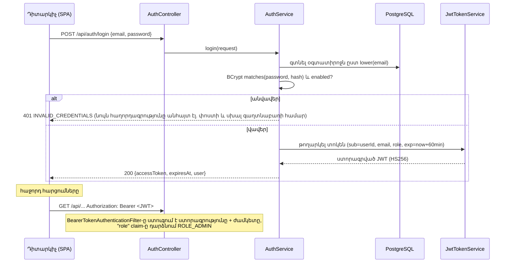

> Թարգմանություն՝ [English version](../en/10-security.md)

# 10 — Անվտանգություն

> Ուսանողական կողմի խնդիրները (սիմուլյացիաների սեփականության ստուգում, լուծման տվյալների թաքցնում
> ուսանողներից) ուսանողական հոսքի հետ միասին տեղափոխվել են ուսումնառուի մոդուլ. այս փաստաթուղթը վերաբերում է
> ադմինիստրատորի հեղինակման հարթակին։

## 1. Նույնականացման (authentication) հոսքը

**Ինքնագրանցում չկա**. `POST /api/auth/register` գոյություն չունի, `ADMIN`-ը միակ դերն է (պարտադրված
տվյալների բազայի CHECK սահմանափակումով), իսկ հաշիվները տրամադրվում են օպերատորի կողմից՝ միջավայրի
փոփոխականներով (`DemoDataInitializer`)։ Հաշիվը ստեղծվում է միայն այն դեպքում, երբ դրա գաղտնաբառի
փոփոխականը սահմանված է։

### ADR-4 — Stateless JWT՝ Spring Security-ի OAuth2 resource server-ով
- **Ինչ.** Backend-ը թողարկում է HS256-ով ստորագրված JWT-ներ (`NimbusJwtEncoder`) և վավերացնում դրանք
  Spring Security-ի ներկառուցված resource-server աջակցությամբ (`NimbusJwtDecoder`)։
- **Ինչու.** React SPA-ն խոսում է REST API-ի հետ. stateless տոկենները բացառում են սերվերային սեսիաները և
  CSRF տոկենները, իսկ ներկառուցված decoder-ը մշակում է ստորագրությունը, ժամկետը և սխալների պատասխանները —
  ավելի քիչ սեփական անվտանգության կոդ նշանակում է ավելի քիչ անվտանգության սխալներ։
- **Այլընտրանքներ.** (1) HTTP սեսիաներ + cookie-ներ — պահանջում են CSRF պաշտպանություն և sticky սեսիաներ.
  (2) ձեռքով գրված JWT ֆիլտր `jjwt`-ով — ավելի շատ կոդ, որտեղ կարելի է սխալվել. (3) Keycloak — առանձին
  ինքնության սերվերը չափազանց ծանր է այս նախագծի համար։
- **Գաղտնիք.** `JWT_SECRET` միջավայրի փոփոխական, առնվազն 32 բայթ. ավելի կարճ գաղտնիքով հավելվածը հրաժարվում
  է գործարկվել։ Առանց գաղտնիքի (տեղային մշակում) գործարկման պահին գեներացվում է պատահական բանալի, ուստի
  լռելյայն գաղտնիք երբեք չի կարող կոմիտ արվել։
- **Սահմանափակումներ.** MVP-ում չկան refresh տոկեններ և սերվերային չեղարկում (փոխարենը՝ կարճ ժամկետ)։
  Ադմինի անջատումը ուժի մեջ է մտնում նրա հաջորդ մուտքի պահին (ծածկված է `disabledAdminCannotLogIn`
  թեստով). յուրաքանչյուր հարցման ժամանակ `enabled`-ի ստուգումը փաստաթղթավորված է որպես ապագա աշխատանք։

## 2. Լիազորում (authorization)

| Շերտ | Կանոն |
|-------|------|
| URL կանոններ (`SecurityConfig`) | Հանրային՝ `/api/auth/login`, `/actuator/health/**`, `/actuator/info`, Swagger։ `/api/admin/**` → `ROLE_ADMIN`։ Մնացած ամեն ինչ `/api/**`-ի տակ → նույնականացված։ **Ցանկացած այլ բան → `denyAll`։** |
| Մեթոդային անվտանգություն | `@EnableMethodSecurity`-ը միացված է. URL կանոնները կոպիտ առաջին գիծն են, տվյալների կանոնների տեղը մնում են սերվիսները։ |
| Հրապարակման շեմեր | `publish`-ը պահված սևագրի վրա **սերվերի կողմում** վերահաշվարկում է վավերացումը, երկու թեստային ուղիները և որակի միավորը — հաճախորդը չի կարող ձախողվող սցենար հրապարակել՝ շրջանցելով UI-ի ստուգումները (422 `PUBLISH_BLOCKED`)։ |
| Կյանքի ցիկլի կանոններ | Արխիվացված սցենարները չեն կարող հրապարակվել. ջնջել կարելի է միայն երբեք չհրապարակված սևագրերը. հրապարակված տարբերակները անփոփոխ տողեր են։ |
| Սխալների ձևաչափ | 401/403-ը անվտանգության շերտը գրում է նույն `ApiError` JSON-ով, ինչ մյուս բոլոր սխալները։ |

## 3. Գաղտնաբառեր
BCrypt՝ `PasswordEncoderFactories.createDelegatingPasswordEncoder()`-ի միջոցով (պահում է `{bcrypt}` նախածանցը,
թույլ է տալիս ապագայում ալգորիթմի միգրացիա)։ Տրամադրվող հաշիվների նվազագույն երկարությունը՝ 8 նիշ։

## 4. Սպառնալիքների մոդել (ամփոփում)

| Սպառնալիք | Մեղմացում |
|--------|-----------|
| Credential stuffing / brute force մուտքի վրա | Ընդհանրական սխալի հաղորդագրություն. BCrypt-ի արժեք. արագության սահմանափակումը ապագա աշխատանք է |
| Տոկենի գողություն | Կարճ ժամկետ, HTTPS արտադրությունում, տոկեններ մատյաններում չկան |
| Արտոնությունների բարձրացում | Գրանցման վերջնակետ ընդհանրապես չկա. միակ դերը գալիս է տվյալների բազայից, երբեք՝ հարցումից. անհայտ URL-ները `denyAll` են |
| Կեղծ հրապարակում (UI շեմերի շրջանցում) | Շեմերը վերահաշվարկվում են սերվերի կողմում պահված սևագրի վրա. արգելափակիչները թվարկվում են 422 մարմնում |
| Mass assignment | Առանձին հարցման DTO-ներ միայն թույլատրված դաշտերով. սցենարի սահմանումները բոլոր մուտքակետերի համար անցնում են մեկ վավերացնողով (seed, գեներատոր, խմբագրիչ, AI վարիացիա, տարբերակի վերականգնում) |
| SQL ներարկում | Միայն JPA պարամետրային կապակցում |
| XSS | React-ը էսկեյպ է անում ելքը. սցենարի բովանդակության կամ AI ելքի հում HTML ցուցադրում չկա |
| Հուշագրային ներարկում ադմինի հանձնարարականով կամ թարգմանվող տեքստով | `<administrator_brief>` / `<source_text>`-ը սահմանազատված են և հայտարարված տվյալ. AI-ը գործիքներ չունի. ելքը վերլուծվում, կառուցվածքով ստուգվում և վավերացվում է (տես 09 §4) |
| Թունավորված AI ելք | `requireSameStructure` + `ScenarioDefinitionValidator`-ը մերժում են կառուցվածքի կամ կանոնների փոփոխությունները. ձախողման դեպքում օգտագործվում է դետերմինիստիկ սևագիրը |
| Գաղտնիքների արտահոսք | Գաղտնիքները միայն միջավայրի փոփոխականներում. `.env`-ը git-ից անտեսված է. մատյանները չեն պարունակում գաղտնաբառեր, տոկեններ, API բանալիներ |
| Իրական աշխարհի վնաս | Սցենարի բովանդակությունը տվյալ է. ոչինչ հրամաններ չի կատարում և արտաքին համակարգերի չի միանում (բացի ընտրովի AI API-ից) |
