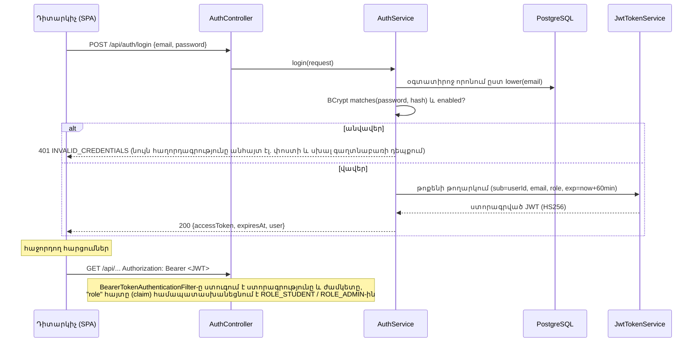

> Թարգմանություն՝ [English version](../en/10-security.md)

# 10 — Անվտանգություն

## 1. Նույնականացման (authentication) հոսքը

### ADR-4 — Վիճակազուրկ (stateless) JWT՝ Spring Security-ի OAuth2 resource server-ի միջոցով
- **Ինչ:** Backend-ը թողարկում է HS256 ալգորիթմով ստորագրված JWT-ներ (`NimbusJwtEncoder`) և ստուգում դրանք
  Spring Security-ի ներկառուցված resource server-ի աջակցությամբ (`NimbusJwtDecoder`)։
- **Ինչու:** React SPA-ն աշխատում է REST API-ի հետ. վիճակազուրկ թոքենները բացառում են սերվերային սեսիաների և
  CSRF թոքենների անհրաժեշտությունը, իսկ ներկառուցված ապակոդավորիչը մշակում է ստորագրությունը, ժամկետը և սխալի
  պատասխանները. որքան քիչ է սեփական անվտանգության կոդը, այնքան քիչ են անվտանգության սխալները։
- **Այլընտրանքներ:** (1) HTTP սեսիաներ + cookie-ներ — պահանջում են CSRF պաշտպանություն և «կպչուն» սեսիաներ (sticky sessions).
  (2) `jjwt`-ով ձեռքով գրված JWT ֆիլտր — ավելի շատ կոդ, որտեղ կարելի է սխալվել. (3) Keycloak — առանձին
  նույնականացման սերվերը չափազանց ծանր է այս նախագծի համար։
- **Գաղտնի բանալի:** `JWT_SECRET` միջավայրի փոփոխական, առնվազն 32 բայթ. ավելի կարճ բանալու դեպքում հավելվածը
  հրաժարվում է մեկնարկել։
- **Սահմանափակումներ:** MVP-ում չկան թարմացման թոքեններ (refresh tokens) և սերվերային չեղարկում (փոխարենը՝ կարճ ժամկետ)։
  Օգտատիրոջ ապաակտիվացումն ուժի մեջ է մտնում նրա հաջորդ մուտքի ժամանակ. յուրաքանչյուր հարցման ժամանակ `enabled`-ի
  ստուգումը նկարագրված է որպես ապագա աշխատանք։

## 2. Թույլտվությունների կառավարում (authorization)

| Շերտ | Կանոն |
|-------|------|
| URL կանոններ (`SecurityConfig`) | `/api/auth/register`, `/api/auth/login`, Swagger, health → հանրային. `/api/admin/**` → `ROLE_ADMIN`. `/api/**`-ի տակ մնացած ամեն ինչ → նույնականացված |
| Տվյալների սեփականություն (ծառայություններ) | Ուսանողը կարող է կարդալ/փոփոխել միայն **իր սեփական** սիմուլյացիաները, հակառակ դեպքում՝ 404 (ոչ թե 403, որպեսզի այլ օգտատերերի սիմուլյացիաների ID-ները չբացահայտվեն) |
| DTO ֆիլտրում | Ուսանողի DTO-ները երբեք չեն պարունակում `outcome`, `points`, բացատրություններ կամ առաջարկվող լուծումը մինչև ավարտը |

## 3. Գաղտնաբառեր
BCrypt՝ `PasswordEncoderFactories.createDelegatingPasswordEncoder()`-ի միջոցով (պահպանում է `{bcrypt}` նախածանցը, թույլ է տալիս
ապագայում անցնել այլ ալգորիթմի)։ Նվազագույն երկարությունը՝ 8 նիշ։

## 4. Սպառնալիքների մոդել (ամփոփում)

| Սպառնալիք | Մեղմացում |
|--------|-----------|
| Հավատարմագրերի լցոնում (credential stuffing) / կոպիտ ուժի գրոհ (brute force) մուտքի վրա | Ընդհանուր սխալի հաղորդագրություն. BCrypt-ի հաշվարկային արժեք. հարցումների հաճախականության սահմանափակումը (rate limiting) ապագա աշխատանք է |
| Թոքենի գողություն | Կարճ ժամկետ, HTTPS արտադրական միջավայրում, թոքենները չեն գրանցվում մատյաններում |
| IDOR (այլոց սիմուլյացիաներին հասանելիություն) | Սեփականության ստուգում ծառայության յուրաքանչյուր մեթոդում |
| Արտոնությունների ընդլայնում գրանցման միջոցով | Դերը երբեք չի վերցվում հարցումից. միշտ `STUDENT` |
| Զանգվածային վերագրում (mass assignment) | Առանձին հարցման DTO-ներ՝ միայն թույլատրելի դաշտերով |
| SQL ներարկում (SQL injection) | Միայն JPA պարամետրերի կապում |
| XSS | React-ը էկրանավորում է ելքը. մատյանի հաղորդագրությունները կամ AI-ի ելքը չեն արտապատկերվում որպես չմշակված HTML |
| Հուշման ներարկում (prompt injection) օգնականին ուղղված հարցի միջոցով | Հարցը սահմանազատվում է և դիտարկվում որպես տվյալ. AI-ն գործիքներ չունի. ելքը վավերացվում է |
| Գաղտնիքների արտահոսք | Գաղտնիքները միայն միջավայրի փոփոխականներում. `.env`-ը git-ի կողմից անտեսվում է. մատյանները չեն պարունակում գաղտնաբառեր, թոքեններ, API բանալիներ |
| Իրական աշխարհում վնաս | Ոչ մի ֆունկցիա չի միանում արտաքին համակարգերին. միայն սիմուլյացված ռեսուրսներ |
