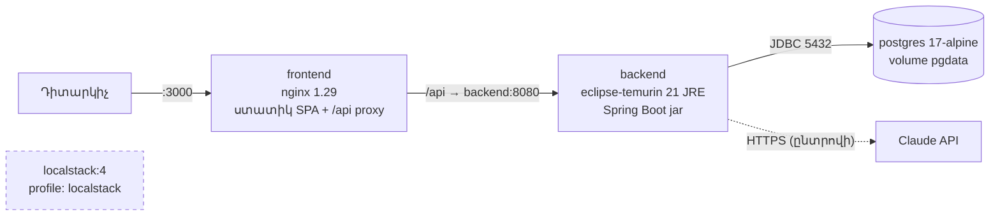

> Թարգմանություն՝ [English version](../en/12-deployment.md)

# 12 — Տեղակայում և տեղային միջավայր

## 1. Կոնտեյներային ճարտարապետություն

| Ծառայություն | Պատկեր / build | Պորտ | Նշումներ |
|---------|---------------|------|-------|
| `postgres` | `postgres:17-alpine` | 5432 | առողջության ստուգում `pg_isready`. տվյալները `pgdata` volume-ում |
| `backend` | `backend/Dockerfile` (բազմափուլ. JDK build → JRE runtime, ոչ root օգտատեր) | 8080 | գործարկվում է բազայի առողջանալուց հետո. Flyway-ը միգրացնում է գործարկման պահին |
| `frontend` | `frontend/Dockerfile` (Node build → nginx) | 3000 | սպասարկում է SPA-ն, proxy է անում `/api`-ն (նույն origin → CORS պետք չէ) |
| `localstack` | `localstack/localstack:4` | 4566 | միայն `--profile localstack`-ով. հիմնական հարթակը չի օգտագործում (ADR-7) |

### Որոշումներ
- **Բազմափուլ Dockerfile-ներ.** runtime պատկերները build գործիքներ կամ սկզբնական կոդ չեն պարունակում →
  ավելի փոքր և անվտանգ։
- **nginx հակադարձ proxy.** դիտարկիչը և API-ն կիսում են մեկ origin, ուստի JWT-ն երբեք origin-ներ չի հատում,
  իսկ backend-ի պորտը արտադրությունում կարող է հանրային չլինել։
- **Գաղտնիքները միայն `.env`-ից.** `docker-compose.yml`-ը պարտադիր գաղտնիքների համար օգտագործում է
  `${VAR:?message}` (`POSTGRES_PASSWORD`, `JWT_SECRET`) — առանց դրանց ստեկը հրաժարվում է գործարկվել՝
  լռելյայն արժեք օգտագործելու փոխարեն։

## 2. Միջավայրի փոփոխականներ

| Փոփոխական | Լռելյայն | Նշանակություն |
|----------|---------|---------|
| `POSTGRES_DB`, `POSTGRES_USER` | `cybersim` | բազայի անուն / օգտատեր |
| `POSTGRES_PASSWORD` | — (պարտադիր) | բազայի գաղտնաբառ |
| `JWT_SECRET` | — (պարտադիր Docker-ում. պատահական՝ տեղային մշակման ժամանակ) | HS256 ստորագրման բանալի, ≥ 32 նիշ |
| `JWT_EXPIRATION_MINUTES` | 60 | տոկենի կյանքի տևողություն |
| `CORS_ALLOWED_ORIGINS` | `http://localhost:3000` (Compose) / `http://localhost:5173` (հավելված) | SPA-ի մշակման սերվերը backend-ի հետ գործարկելու համար |
| `APP_DEMO_DATA_ENABLED` | `true` (Compose) / `false` (հավելված) | ստեղծել դեմո ադմինի հաշիվը |
| `DEMO_ADMIN_EMAIL` / `DEMO_ADMIN_PASSWORD` | էլ. փոստը նախադրված, գաղտնաբառը դատարկ | միակ ադմին հաշիվը. ստեղծվում է միայն, երբ գաղտնաբառը սահմանված է (ուսանողական հաշիվ և գրանցում չկան) |
| `AI_PROVIDER` | `mock` | `mock` կամ `claude` |
| `ANTHROPIC_API_KEY` | դատարկ | Claude API բանալի (երբեք չի կոմիտվում, երբեք չի գրանցվում մատյանում) |
| `AI_MODEL` | `claude-opus-5-5` | օր.՝ `claude-sonnet-5-5`, `claude-haiku-4-5`՝ ավելի ցածր արժեքի համար |
| `AI_EFFORT` | `low` | `low`/`medium`/`high`/`xhigh`/`max` |
| `AI_TIMEOUT_SECONDS` | 30 | ժամանակաչափ մեկ փորձի համար |
| `AI_MAX_TOKENS` | 2048 | AI պատասխանի ելքային տոկենների առավելագույն քանակ |
| `AI_SERVER_SIDE_FALLBACK` | `true` | API-ից խնդրել մերժված հարցումները կրկնել պահուստային մոդելով |
| `APP_SCENARIO_SEED_ENABLED` | `true` | գործարկման պահին ներմուծել և հրապարակել `resources/scenarios/*.json`-ը |
| `LEARNER_API_KEY` | դատարկ | ընդհանուր ծառայական բանալի, որը սովորողի մոդուլն ուղարկում է որպես `X-API-Key` `/api/learner/**`-ում. դատարկը անջատում է ինտեգրումը (503) |
| `POSTGRES_PORT`, `BACKEND_PORT`, `FRONTEND_PORT` | 5432 / 8080 / 3000 | հրապարակված host պորտեր |

## 3. Հրամաններ

| Նպատակ | Հրաման |
|---------|---------|
| Առաջին գործարկում | `cp .env.example .env` → խմբագրել գաղտնիքները → `docker compose up --build` |
| Արտադրությանը մոտ գործարկում (detached) | `docker compose up --build -d` |
| Մշակում. միայն բազան | `docker compose up -d postgres`, ապա backend-ը (`./mvnw spring-boot:run`) և frontend-ը (`npm run dev`) տեղային |
| Բազայի վերակայում | `docker compose down -v && docker compose up -d` (Flyway-ը վերստեղծում է սխեման, seeder-ը վերաներմուծում և հրապարակում է սցենարները) |
| Թեստեր | `cd backend && ./mvnw test` (Docker-ը պետք է աշխատի) |
| LocalStack-ով | `docker compose --profile localstack up -d` |
| Մատյաններ | `docker compose logs -f backend` |
| Կանգ | `docker compose down` |

> **Սխեմայի քաղաքականությունը մինչ-թողարկման փուլում.** նախագիծը պահում է մեկ միգրացիա՝
> `V1__initial_schema.sql`, և այն **վերագրվել է** ադմին-միայն ծավալի համար։ Flyway-ը ստուգում է
> checksum-ները, ուստի վերագրումից առաջ ստեղծված ցանկացած volume գործարկման պահին ձախողվում է (checksum-ի
> անհամապատասխանություն և կիրառված-բայց-բացակայող `V2`)։ Վերստեղծեք այն՝
> `docker compose down -v && docker compose up --build`։ Երբ հարթակը իրական տվյալներ ունենա, սխեմայի
> փոփոխություններն անցնում են հավելվող `V2, V3, …` միգրացիաների։

## 4. Ստուգման կարգավիճակ

- 2026-10-06/07 — ուսանողական հարթակը ամբողջությամբ ստուգվել է `docker compose`-ի միջոցով (պատմական. այդ
  runtime-ն այժմ ուսումնառուի մոդուլում է)։
- 2026-10-09 — `docker compose down -v && docker compose up --build -d` ադմին-միայն build-ով. բոլոր երեք
  կոնտեյներները գործարկվում են, վերագրված `V1`-ը միգրացվում է, երեք seed սցենարները ներմուծվում են **և
  հրապարակվում որպես տարբերակ 1**, ստեղծվում է դեմո ադմինը, SPA-ն սպասարկում է ադմինի ինտերֆեյսը —
  **VERIFIED** (այս սեսիայում)։
- LocalStack պրոֆիլ — **իրականացված է, բայց runtime-ում չստուգված** (ընտրովի, հավելվածի կոդը չի
  օգտագործում)։
- Իրական Claude մատակարարը Docker-ի ներսում — **իրականացված է, բայց runtime-ում չստուգված** (API բանալի
  հասանելի չէ)։

## 5. Արտադրական նշումներ (թեզի դեմոյի ծավալից դուրս)
- TLS-ն ավարտել nginx-ից առաջ (օր.՝ ամպային load balancer). `CORS_ALLOWED_ORIGINS`-ին տալ իրական դոմենը։
- Օգտագործել կառավարվող PostgreSQL՝ կրկնօրինակումներով. `JWT_SECRET`-ը և `ANTHROPIC_API_KEY`-ը պահել
  գաղտնիքների կառավարչում։
- Չհրապարակել 8080 և 5432 պորտերը. հասանելի պետք է լինի միայն frontend-ը։
- Դեմո հաշվի փոխարեն տրամադրել իրական ադմին հաշիվներ (ուժեղ `DEMO_ADMIN_*` արժեքներ կամ տողեր ուղղակիորեն).
  ինքնագրանցումը բացակայում է միտումնավոր։
