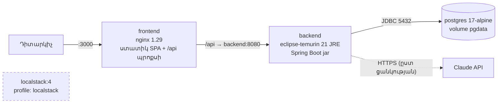

> Թարգմանություն՝ [English version](../en/12-deployment.md)

# 12 — Տեղակայում և տեղային միջավայր

## 1. Կոնտեյներային ճարտարապետություն

| Ծառայություն | Պատկեր / կառուցում | Պորտ | Նշումներ |
|---------|---------------|------|-------|
| `postgres` | `postgres:17-alpine` | 5432 | առողջության ստուգում `pg_isready`. տվյալները `pgdata` ծավալում (volume) |
| `backend` | `backend/Dockerfile` (բազմափուլ. JDK կառուցում → JRE գործարկում, ոչ-root օգտատեր) | 8080 | մեկնարկում է տվյալների բազայի առողջ դառնալուց հետո. Flyway-ը միգրացիաներ է կատարում մեկնարկի ժամանակ |
| `frontend` | `frontend/Dockerfile` (Node կառուցում → nginx) | 3000 | սպասարկում է SPA-ն, պրոքսիավորում է `/api`-ն (նույն ծագում → CORS պետք չէ) |
| `localstack` | `localstack/localstack:4` | 4566 | միայն `--profile localstack`-ով. չի օգտագործվում հիմնական հարթակի կողմից (ADR-7) |

### Որոշումներ
- **Բազմափուլ Dockerfile-ներ:** գործարկման պատկերները չեն պարունակում կառուցման գործիքներ կամ ելակետային կոդ → ավելի փոքր և ավելի անվտանգ են։
- **nginx հակադարձ պրոքսի (reverse proxy):** դիտարկիչը և API-ն կիսում են մեկ ծագում (origin), ուստի JWT-ն երբեք չի անցնում ծագումների միջև, և backend-ի
  պորտը արտադրական միջավայրում կարիք չունի հանրային լինելու։
- **Գաղտնիքները միայն `.env`-ից:** `docker-compose.yml`-ը պարտադիր գաղտնիքների համար օգտագործում է `${VAR:?message}`
  (`POSTGRES_PASSWORD`, `JWT_SECRET`) — առանց դրանց համակարգը հրաժարվում է մեկնարկել՝ լռելյայն արժեք օգտագործելու փոխարեն։

## 2. Միջավայրի փոփոխականներ

| Փոփոխական | Լռելյայն արժեք | Նպատակ |
|---------|---------|---------|
| `POSTGRES_DB`, `POSTGRES_USER` | `cybersim` | տվյալների բազայի անուն / օգտատեր |
| `POSTGRES_PASSWORD` | — (պարտադիր) | տվյալների բազայի գաղտնաբառ |
| `JWT_SECRET` | — (պարտադիր Docker-ում. պատահական՝ տեղային մշակման ժամանակ) | HS256 ստորագրման բանալի, ≥ 32 նիշ |
| `JWT_EXPIRATION_MINUTES` | 60 | թոքենի կյանքի տևողություն |
| `CORS_ALLOWED_ORIGINS` | `http://localhost:3000` (Compose) / `http://localhost:5173` (հավելված) | SPA-ի մշակման սերվերը backend-ի հետ գործարկելու համար |
| `APP_DEMO_DATA_ENABLED` | `true` (Compose) / `false` (հավելված) | ստեղծել ցուցադրական ադմինիստրատոր/ուսանող |
| `DEMO_ADMIN_EMAIL/PASSWORD`, `DEMO_STUDENT_EMAIL/PASSWORD` | էլ. փոստերը նախապես սահմանված են, գաղտնաբառերը՝ դատարկ | ցուցադրական հաշիվները ստեղծվում են միայն գաղտնաբառը սահմանված լինելու դեպքում |
| `AI_PROVIDER` | `mock` | `mock` կամ `claude` |
| `ANTHROPIC_API_KEY` | դատարկ | Claude API բանալի (երբեք չի ներառվում commit-ում, երբեք չի գրանցվում մատյանում) |
| `AI_MODEL` | `claude-opus-5-5` | օր.՝ `claude-sonnet-5-5`, `claude-haiku-4-5`՝ ավելի ցածր արժեքի համար |
| `AI_EFFORT` | `low` | `low`/`medium`/`high`/`xhigh`/`max` |
| `AI_TIMEOUT_SECONDS` | 30 | ժամանակի սահմանաչափ յուրաքանչյուր փորձի համար |
| `AI_MAX_TOKENS` | 2048 | ելքային տոկենների առավելագույն քանակ մեկ AI պատասխանի համար |
| `AI_SERVER_SIDE_FALLBACK` | `true` | API-ից խնդրել մերժված հարցումները կրկնել պահուստային մոդելով |
| `APP_SCENARIO_SEED_ENABLED` | `true` | գործարկման ժամանակ ներմուծել `resources/scenarios/*.json` ֆայլերը |
| `POSTGRES_PORT`, `BACKEND_PORT`, `FRONTEND_PORT` | 5432 / 8080 / 3000 | հրապարակված host պորտեր |

## 3. Հրամաններ

| Նպատակ | Հրաման |
|---------|---------|
| Առաջին մեկնարկ | `cp .env.example .env` → խմբագրել գաղտնիքները → `docker compose up --build` |
| Արտադրականին մոտ մեկնարկ (ֆոնային ռեժիմում) | `docker compose up --build -d` |
| Մշակում. միայն տվյալների բազա | `docker compose up -d postgres`, այնուհետև տեղայնորեն գործարկել backend-ը (`./mvnw spring-boot:run`) և frontend-ը (`npm run dev`) |
| Տվյալների բազայի վերակայում | `docker compose down -v && docker compose up -d` (Flyway-ը վերստեղծում է սխեման, seeder-ը նորից ներմուծում է սցենարները) |
| Թեստեր | `cd backend && ./mvnw test` (Docker-ը պետք է աշխատի) |
| LocalStack-ով | `docker compose --profile localstack up -d` |
| Մատյաններ | `docker compose logs -f backend` |
| Կանգնեցում | `docker compose down` |

## 4. Ստուգման կարգավիճակ (2026-10-06)
- `docker compose up --build -d` — **VERIFIED** (ստուգված). երեք կոնտեյներներն էլ մեկնարկում են, Flyway-ը կատարում է միգրացիաները, ստեղծվում են 3 սցենար և 2 ցուցադրական
  հաշիվ, ծայրից ծայր smoke թեստը հաջողությամբ անցնում է nginx-ի միջոցով։
- LocalStack պրոֆիլ — **իրականացված է, բայց գործարկման ժամանակ չի ստուգվել** (ըստ ցանկության, չի օգտագործվում հավելվածի կոդում)։
- Իրական Claude մատակարարը Docker-ի ներսում — **իրականացված է, բայց գործարկման ժամանակ չի ստուգվել** (API բանալի հասանելի չէ)։

## 5. Արտադրական միջավայրի նշումներ (թեզի ցուցադրության շրջանակից դուրս)
- TLS-ն ավարտել nginx-ից առաջ (օր.՝ ամպային բեռնվածության հավասարակշռիչում). `CORS_ALLOWED_ORIGINS`-ին տալ իրական դոմենը։
- Օգտագործել կառավարվող PostgreSQL՝ պահուստային պատճեններով. `JWT_SECRET`-ը և `ANTHROPIC_API_KEY`-ը պահել գաղտնիքների կառավարիչում (secret manager)։
- Չհրապարակել 8080 և 5432 պորտերը. հասանելի պետք է լինի միայն frontend-ը։
